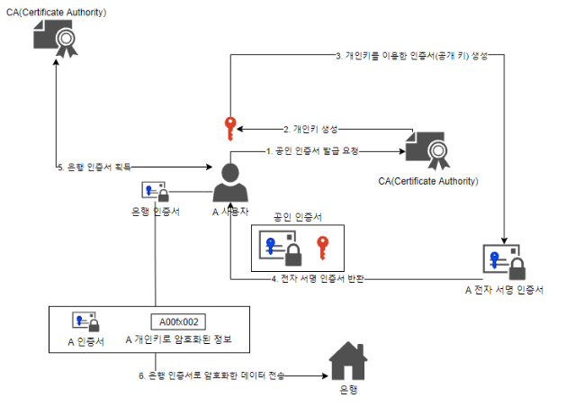

# PKI

PKI란 Public Key Infrastructure의 약자로 공개키 암호화와 전자서명을 사용할 수 있게 기반을 마련해둔 것이라고 합니다.

신뢰기간이 공개키들을 인증해주면 그 공개키에 대응되는 개인키도 인증되기 때문에 개인키를 갖고 있는 개인이 인증을 받습니다.

## 은행에서 공인인증서 인증 과정
---

은행에서 공인인증서 과정를 인증하는 과정이 있습니다.

### 생성 과정

1. 먼저 개인이 공인 인증서 발급을 CA에 요청합니다.

2. 그러면 CA에서 개인의 개인키, 공개키를 생성합니다.

3. 생성한 키들로 디지털 인증서를 발급합니다.

:::tip 디지털 인증서에 들어가는 것
`발급자 정보`,  `소유자 정보`, `인증서 권한`, `유효기간`, `발급자 전자 서명`, `일련번호`, `소유자 공개키 정보`
:::

4. 디지털 서명 생성을 생성합니다.

디지털 서명은 전송할 문서를 인증해주는 도구입니다.

:::tip 디지털 서명 생성 절차
1. 메시지 or 문서 선택
2. 메시지 or 문서에 해시 함수 적용 > `해시 값`
3. 사용자의 개인키로 `해시 값` 암호화 > `디지털 서명`
:::

### 확인 과정

1. `원본 메시지`와 `디지털 서명`을 받습니다.

2. 디지털 인증서에서 추출한 공개키로 `디지털 서명`을 복호화합니다. > `해시 값`

3. `원본 메시지` 해시해보며 복호화한 `해시 값`과 동일한지 확인하여 무결성 검사를 합니다.

4. 디지털 인증서의 유효기간을 확인합니다.

그러면 PKI 인증이 됩니다. 여기서 은행과 통신하고 싶다면 메시지 또는 문서가 은행의 인증서가 돼겠네요.