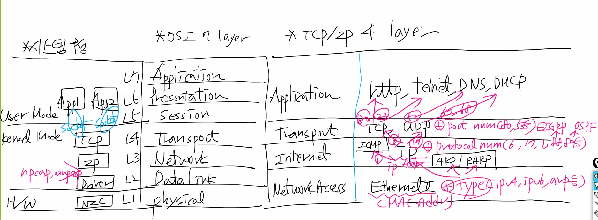
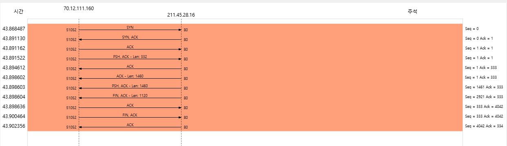

# [KOSTA] 와이어샤크 교육 1일차
---

## 와이어샤크 설치
---

[이곳](https://www.wireshark.org/)에서 진행할 수 있습니다.

## 컴퓨터 네트워크
---

데이터 통신은 MAC주소가 꼭 필요함. 이걸 논리적으로 바꾼 주소가 IP주소

### 물리주소 확인

```bash
arp -a
```

캐시 데이터다. 5분뒤에 지어짐 근데 지우려면

```bash
apr -d
```

캐시가 남는경우는 내가 상대방과 연결을 할 때도 있지만 상대방이 나와 연결할 때도 캐시가 남음.

그래서 패킷 분석할 때 캐시를 지워야 한다.


### dns가 알려준 ip 캐시 정보 확인
---

```bash
ipconfig/displaydns
```

지우기

```bash
ipconfig/flushdns
```

### 컴퓨터 이름으로 통신
---

```bash
nbtstat -n
```

캐시 확인

```bash
nbtstat -c
```

캐시 삭제

```bash
nbtstat -R
```

분석할 때 arp, dns, nbtstat 캐시 지워주고 하는게 좋다.


### OSI 7 계층

계층을 통과할 때는 관련 헤더가 추가된다. PDU가 있다.

PDU는 아래 정리..

`Presentation` : Message

`Transport` : Segment

`Network` : packet

`Datalink` : frame

---

`Application` : 통신 software

`Presentation` : 데이터 포맷 정의 (jpg,png 등)

`Session` : App 연결 유지 or 해제

`Transport` : 패킷 분리, 재전송, 에러 검출 (Segment가 전송 최소단위여서)

`Network` : Segment앞에 논리적 주소(IP)를 추가해서 목적 전달 가능하게 해줌 > Packet

`Datalink` : 물리 주소를 추가해서 전달(MAC,DLCI) > Frame

`Pyhsical` : bit를 전기신호로 변환, 전기적, 기능적 특성, 절차적 특성, 기계적 특성에 대한 약속


### TCP/IP 4 계층

`Application` : osi의 application, presentation, session을 합친 계층, http, telnet, dns, dhcp 프로토콜이 있음

`Transport` : TCP,UDP 프로토콜이 있음

    + 포트번호를 통해서 Application 어디로 보낼지 담겨있음


`Internet` : OSI의 network 계층, ICMP, IP, ARP RARP 있다. 
    
    + protocol Number 를 통해서 TCP,UDP.. 등 어디로 넘기지 담겨있음

`network access` : OSI의 datalink, physical 계층 ethernet2(MAC) 
    
    + Type(IPv4, IPv6)이 인터넷 계층 프로토콜 어디로 보낼지 구분해줌 




### 포트번호

`0 ~ 1023` : 잘 알려진 서비스 예약 포트

`1024 ~ 49151` : 추가 표준 상용 tool 예약 포트

`49152 ~ 65535` : 개인용 포트


:::tip
[도움이 되는 다양한 정보들이 담긴 url 1](https://www.iana.org/assignments/protocol-numbers/protocol-numbers.xhtml)  
[도움이 되는 다양한 정보들이 담긴 url 2](https://www.iana.org/assignments/service-names-port-numbers/service-names-port-numbers.xhtml)
:::


### 네트워크 연결 장치

1. HUB

허브는 다 확인해보고 해당 목적지인지 검사하고 아니면 다음 목적지로.. 반복

2. Switch

스위치는 목적지 주소가 포함되어 있어서 해당 목적지에만 방문 근데 FFFF가 목적지 주소이면 브로드캐스트 인데 모든 스위치에 전달(Flooding)하기 때문에 네트워크 부하가 옴 > 차단의 필요성이 있다.

:::tip 스위치 동작
1. Flooding

들어온 포트를 제외하고 모든 포트에 뿌림

2. Learning

맥주소를 학습해서 맥 테이블에 작성

3. Forwarding

목적지 맥주소에 그대로 프레임 보내는 것

4. Filtering

목적지 주소를 알고 있을 때 프레임 전송을 막는 것

:::


3. Router

라우터는 네트워크 별로 전송 차단할 수 있음. 브로드캐스트로 인한 네트워크 부하 방지

### TCP와 UDP

`TCP` : 헤더(20 ~ 60byte)

A >> 확인신호 >> B

B >> 응답 >> A

A >> 연결 확정 >> B

A >> 데이터 전달 >> B

B >> 응답 >> A

`UDP` : 헤더 (8byte)

A >> 데이터 전달 >> B

## wireshark
---

와이어샤크는 마지막 상태 설정이 저장된다.


캡처 옵션에서 모두 무작위를 끄면 나한테 들어오는 패킷만 확인할 수 있다.

### 숨김

캡처 > 옵션 > 인터페이스관리에서 표시를 체크 해제하면 인터페이스를 숨길 수 있다.

아니면 네트워크 설정에서 어댑터 사용안하면 안보임

아니면 라이브러리(npcap)가 삭제됐을 수도 있음.

아니면 가상 인터페이스를 추가하고 재부팅해야 보임


### 통계

필터에 `tcp.stream == 1` 등으로 필터링 후

통계 > 플로 그래프 > 표시 필터로 제한




### 스트림 확인

패킷에 우클릭 > 따라가기 > TCP 스트림 등..

한 눈에 보인다.

TCP는 최대 길이가 1514여서 잘려서 분석하기 어려울 수 있는데 한 눈에 확인 가능