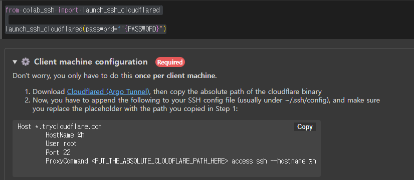

# colab GPU 로컬에서 사용하기
---

## 참조

[참조1](https://www.youtube.com/watch?v=oAKxxLy-G5g)
[참조2](https://www.youtube.com/watch?v=DVoPHNIKoRA)

## 준비물
---

colab 계정, ngrok 계정, vscode

### colab

edit > notebook settings에서 GPU 활성화 및 Connect 하기.

### vscode

`remote - ssh` Extension 설치하기


## workflow
---

colab에서 ngrok으로 서버 띄어서 vscode에서 서버에 접속해서 잡업

## colab code
---

colab code로 연결하려면

```bash
!pip install colabcode
```

colabcode를 다운로드하고

```python
from colabcode import ColabCode
import os
os.system(f'ngrok authtoken {NGROK_TOKEN}')

ColabCode(port=10000,password=PASSWORD)
```

이러면 서버 열림, 서버 들어가서 패스워드 치면 웹 IDE 나와서 할 수 있따.

## colab-ssh
---

```bash
!pip install --upgrade colab-ssh
```

colab ssh을 설치

```python
from colab_ssh import launch_ssh_cloudflared

launch_ssh_cloudflared(password=f"{PASSWORD}")
```

ngrok을 쓰고 싶었지만 문제가 있어서 cloudflared를 사용해야한다.

### cloudfared 설정



이렇게 설정하라고 나온다.

[다운로드 링크](https://developers.cloudflare.com/cloudflare-one/connections/connect-networks/downloads/)에서 다운로드해서 exe파일을 괜찮은 곳에 위치시킨다.

유저홈의 `.ssh\config` 파일에 위 사진과 같은 내용 넣고 exe파일 경로도 바꿔준다.

그러면 아래 나오는 명령어들을 통해서 ssh 접속할 수 있다.

vscode는 명령팔레트 켜서 Connect to Host.. 해서 url 넣으면 연결할 수 있다.
