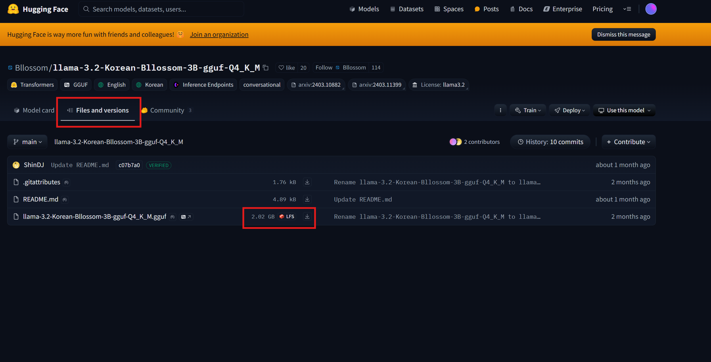

# Ollama에 Huggingface에서 다운로드 받은 모델 올리기
---

Ollama에 Huggingface에서 다운로드 받은 모델 올리는 경험을 기록합니다.


## Ollama
---

[Ollama 다운로드 링크](https://ollama.com/download/windows)

올라마를 다운로드 해줍니다. MacOS는 MacOS를 클릭해서 다운로드 하면 됩니다.

Ollama는 GUI APP이 아니여서 창이 나오진 않습니다.

cmd에서 설치 확인을 합니다.

```bash
ollama -h
```

도움말이 잘 나오면 설치가 잘 된것입니다.


## HugginhFace Model 다운로드
---

[모델 링크 예시](https://huggingface.co/Bllossom/llama-3.2-Korean-Bllossom-3B-gguf-Q4_K_M)

저는 Bllossom에서 제공하는 `llama-3.2-Korean-Bllossom-3B-gguf-Q4_K_M` 모델을 다운로드 하였습니다.

들어가셔서 아래 그림처럼 클릭하여 다운로드 할 수 있습니다.




## Ollama에 로드
---

### Modelfile

ollama에 모델을 만드려면 Modelfile이 필요합니다.

```txt
FROM llama-3.2-Korean-Bllossom-3B-gguf-Q4_K_M.gguf

PARAMETER temperature 0.6
PARAMETER top_p 0.9

TEMPLATE """<|start_header_id|>system<|end_header_id|>

Cutting Knowledge Date: December 2023

{{ if .System }}{{ .System }}
{{- end }}
{{- if .Tools }}When you receive a tool call response, use the output to format an answer to the orginal user question.

You are a helpful assistant with tool calling capabilities.
{{- end }}<|eot_id|>
{{- range $i, $_ := .Messages }}
{{- $last := eq (len (slice $.Messages $i)) 1 }}
{{- if eq .Role "user" }}<|start_header_id|>user<|end_header_id|>
{{- if and $.Tools $last }}

Given the following functions, please respond with a JSON for a function call with its proper arguments that best answers the given prompt.

Respond in the format {"name": function name, "parameters": dictionary of argument name and its value}. Do not use variables.

{{ range $.Tools }}
{{- . }}
{{ end }}
{{ .Content }}<|eot_id|>
{{- else }}

{{ .Content }}<|eot_id|>
{{- end }}{{ if $last }}<|start_header_id|>assistant<|end_header_id|>

{{ end }}
{{- else if eq .Role "assistant" }}<|start_header_id|>assistant<|end_header_id|>
{{- if .ToolCalls }}
{{ range .ToolCalls }}
{"name": "{{ .Function.Name }}", "parameters": {{ .Function.Arguments }}}{{ end }}
{{- else }}

{{ .Content }}
{{- end }}{{ if not $last }}<|eot_id|>{{ end }}
{{- else if eq .Role "tool" }}<|start_header_id|>ipython<|end_header_id|>

{{ .Content }}<|eot_id|>{{ if $last }}<|start_header_id|>assistant<|end_header_id|>

{{ end }}
{{- end }}
{{- end }}"""

SYSTEM """You are a helpful AI assistant. Please answer the user's questions kindly. 당신은 유능한 AI 어시스턴트 입니다. 사용자의 질문에 대해 친절하게 답변해주세요."""
```

위와 같은 모델파일을 생성해야합니다.

```bash
ollama create llama-3.2-korean-bllossom -f Modelfile
```


```bash
C:\Users\User\Desktop\AI Model\llama-3.2-korean-bllossom>ollama create llama-3.2-korean-bllossom -f Modelfile
gathering model components
copying file sha256:389f380bbfbe77d9171937b3d166a26ccc3e04201f3d9fb0ca1b5e01b6787621 100%
parsing GGUF
using existing layer sha256:389f380bbfbe77d9171937b3d166a26ccc3e04201f3d9fb0ca1b5e01b6787621
using existing layer sha256:f2c2dcc20dde5f8d5c09ed76abbf794b1d566104bf81c3e71e5514c729ba6f37
using existing layer sha256:a25a6d48d6611ea12c25544d43104f7a4bcc68da33459f80e9bd0b5835ce05a4
using existing layer sha256:fefc914e46e6024467471837a48a24251db2c6f3f58395943da7bf9dc6f70fb6
writing manifest
success
```

잘 성공하게 됩니다.

저는 `Modelfile`에서 `FROM ${모델명}`에 확장자를 붙이지 않았을 때 에러가 났습니다. 에러나시면 참고하시면 될 것 같습니다. 

### 파라미터

`temperature`는 값이 높을 수록 창의적으로, 낮을 수록 보수적으로 대답합니다.

`top_p`는 값이 높을 수록 보편적인 대답을 합니다.


## 모델 확인 및 실행
---

### 모델 확인

```bash
ollama list
```

위 명령어로 확인할 수 있습니다.

```bash
C:\Users\User\Desktop\AI Model\llama-3.2-korean-bllossom>ollama list
NAME                                ID              SIZE      MODIFIED
llama-3.2-korean-bllossom:latest    f2d0fbdd4a81    2.0 GB    11 minutes ago
```

### 모델 실행

```bash
ollama run llama-3.2-korean-bllossom
```

`ollama run`으로 실행할 수 있습니다.


```bash
C:\Users\User> ollama run llama-3.2-korean-bllossom
>>> 안녕
안녕하세요! 어떻게 도와드릴 수 있나요?

>>> 철수가 20개의 연필을 가지고 있었는데 영희가 절반을 가져가고 민수가 남은 5개를 가져갔으면 철수에게 남은
... 연필의 갯수는 몇개인가요?
영희가 절반이나 10개의 연필을 가져간 후, 철수가 남은 연필의 수를 계산하면 됩니다.

철수가 시작했을 때 20개의 연필을 가지고 있었고, 영희가 10개를 가져갔으므로:

20 - 10 = 10

이제 민수가 remaining 5개의 연필을 가져간 후, 철수에게 남은 연필의 수는 10개입니다.

따라서, 철수에게 남은 연필의 개수는 10개입니다.

>>> 민수가 가져간 5개는 왜 빼니?
전체 연필의 수를 계산하기 전에 영희가 가져간 10개의 연필을 빼야 합니다.

철수가 시작했을 때 20개의 연필을 가지고 있었고, 영희가 10개를 가져갔으므로:

20 - 10 = 10

이제 민수가 더 가져간 5개를 빼면:

10 - 5 = 5

따라서, 철수에게 남은 연필의 개수는 5개입니다.
```


[참고](https://hyunicecream.tistory.com/126)