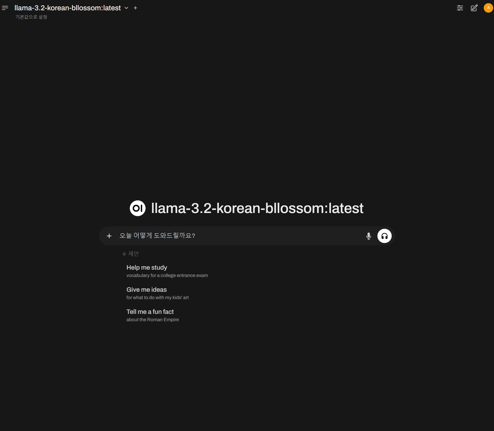

# Local LLM UI 사용하기 (Open-WebUI)
---


[Open-WebUI Github](https://github.com/open-webui/open-webui)

## 설치
---

파이썬이 설치돼있어야합니다.

```bash
pip install open-webui
```

## 실행
---

```bash
open-webui serve
```

Docker로도 사용가능합니다.

`localhost:8080`에 호스팅 되고 있습니다.



들어가면 ollama로 올려둔 모델을 탐지하네요

