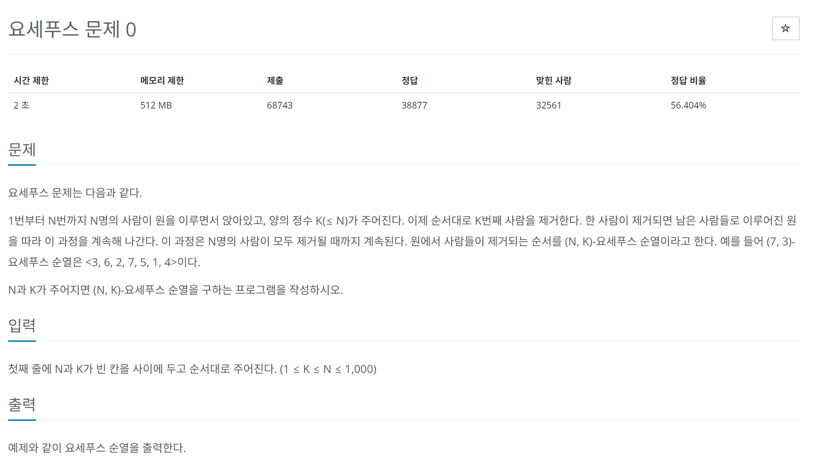

# [백준] 11866 요세푸스 문제 0

## 문제
---



## 코드
---

```python
import sys
from collections import deque

n,k = map(int, sys.stdin.readline().split())

arr = deque([x for x in range(1,n+1)])
result = []

while arr:
    arr.rotate(-(k-1))
    result.append(str(arr.popleft())) 

print("<",", ".join(result),">",sep="")
```


## 설명
---

사실 deque를 사용하지 않고 풀려했습니다.

기억이 가물가물 하기도하고 그래서 처음 생각난대로 코딩을 했더니 자꾸 런타임에러가 나서 deque로 풀었습니다.

deque.rotate는 양수면 오른쪽, 음수면 왼쪽으로 회전합니다. 이런 원리를 이용해서 삭제할 값을 0번 인덱스에 두고 popleft를 사용하여 하나하나 빼냈습니다.