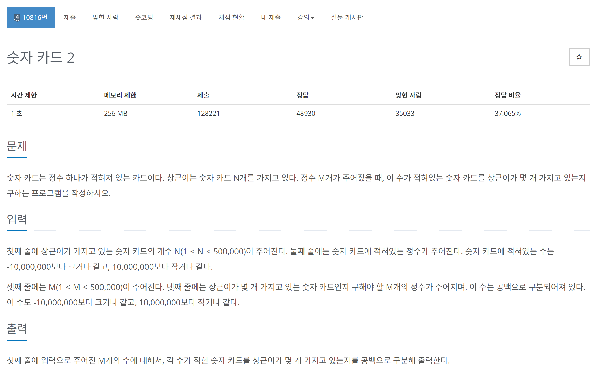

# [백준] 10816 숫자 카드 2

## 문제

---



## 코드

---

### 내 코드에서 다른 사람꺼 보고 만든 코드

```python
import sys

_ = int(sys.stdin.readline())
cards = map(int,sys.stdin.readline().split())
_ = int(sys.stdin.readline())
keys = map(int, sys.stdin.readline().split())

dic={}

for card in cards:
    if card in dic:
        dic[card] += 1
    else:
        dic[card] = 1

for key in keys:
    rst = dic.get(key)
    if rst == None:
        print(0,end=" ")
    else:
        print(rst,end=" ")
```

### 내가 다시 완성시킨 코드

```python
import sys

_ = int(sys.stdin.readline())
cards = map(int,sys.stdin.readline().split())
_ = int(sys.stdin.readline())
input_keys = map(int, sys.stdin.readline().split())

keys = list(input_keys).copy()

dic = {key:0 for key in keys}

for card in cards:
    if card in dic:
        dic[card] += 1


for key in keys:
    print(dic.get(key),end=" ")
```

## 설명

---

### 해결방법

먼저 갖고 있는 모든 값을 dictionary로 만들어서 값을 0으로 세팅했고

반복문을 사용해서 1씩 증가한 이후

잘 정렬되게 출력했습니다.

### 일기

기존에 dictionary를 이용해서 해결해보려고 했다.

처음에 잘 코딩했다고 생각했는데 틀렸다고 나오는 거에요 그래가지구 멘붕이와서틀린 반례를 찾지 못하였는데 어쩔 수 없이 다른 사람의 코드를 보며 인사이트를 얻고 좀 고쳐봤는데 아무리봐도 이해가 안가서 하다보니

어느 순간 깨달은 것이 하나 있습니다.

`map()`을 사용해서 input()을 받아온 변수는 영원히 메모리에 있는게 아니더군요? 이 부분에 뭔가 버그가 걸려서 틀렸다고 나온 것 같아요. map을 잘 사용해 봐야 겠네요.
