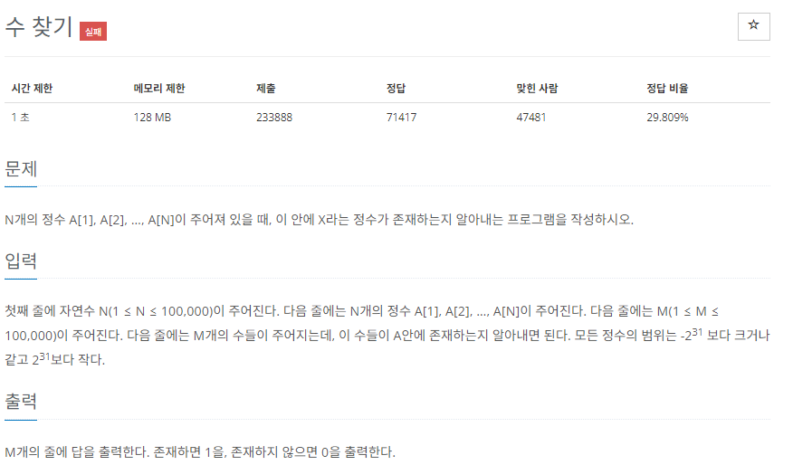

# [백준] 1920 수 찾기

## 문제

---



## 코드

---

### 내가 다시 완성시킨 코드

```python
import sys

_ = int(sys.stdin.readline())
nums = map(int, sys.stdin.readline().split())
_ = int(sys.stdin.readline())
checks = map(int, sys.stdin.readline().split())

keys = list(nums).copy()

dic = {key:0 for key in keys}

for check in checks:
    if dic.get(check) == None:
        print(0)
    else:
        print(1)
```

## 설명

---

이 문제를 풀어봄으로 딕셔너리 관련한 문제를 마스터한 기분 ㅎㅎ
