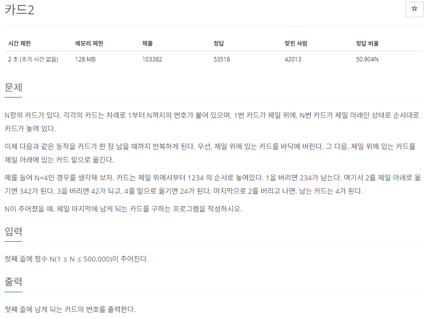

# [백준] 2164 카드2

## 문제

---



## 코드

---

```python
from collections import deque

n = int(input())
cards = deque([x for x in range(1,n+1)])


while len(cards) != 1:
    cards.popleft()
    if len(cards) == 1:
        print(cards[0])
        break
    cards.rotate(-1)
else:
    print(cards[0])
```

## 설명

---

deque를 사용해서 해결할 수 있습니다.

rotate(음수를 한다면) 왼쪽에 있던 수가 가장 오른쪽으로 이동합니다.

while ~ else를 사용한 이유는 1이 들어오면 대응이 안되서 사용했습니다.
