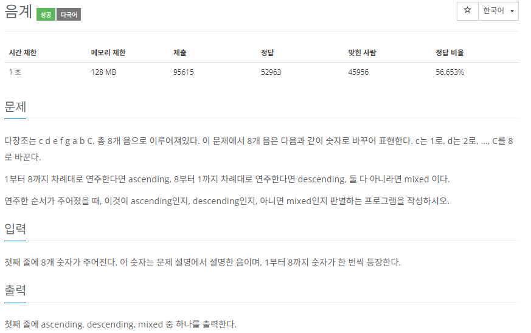

# [백준] 2164 카드2

## 문제

---



## 코드

---

```python
arr = map(int,input().split())

intervals = list(arr).copy()

s_intervals = sorted(intervals)
r_intervals = sorted(intervals,reverse=True)

if intervals == s_intervals:
    print("ascending")
elif intervals == r_intervals:
    print("descending")
else:
    print("mixed")
```

## 설명

---

설명할게 없습니다.

정렬한 리스트와 일치하면 ascending

역정렬한 리스트와 일치하면 descending

아니면 mixed
