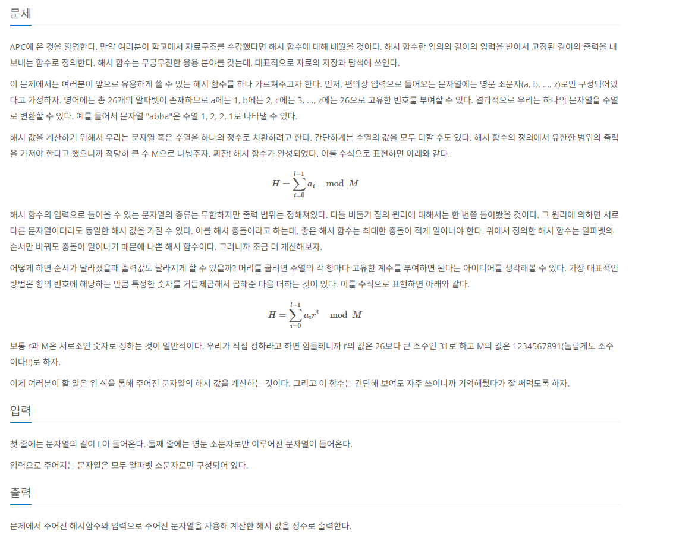

# [백준] 15829 Hashing

## 문제

---



## 코드

---

```python
L = int(input())

arr = list(input())

r=31
M=1234567891
hashSum=0

for i,v in enumerate(arr):
    hashSum += (ord(v)-96) * (r**(i))

print(hashSum%M)
```

## 설명

---

문제가 길어서 어려워보이지만 그냥 계산기 만드는 문제다.
