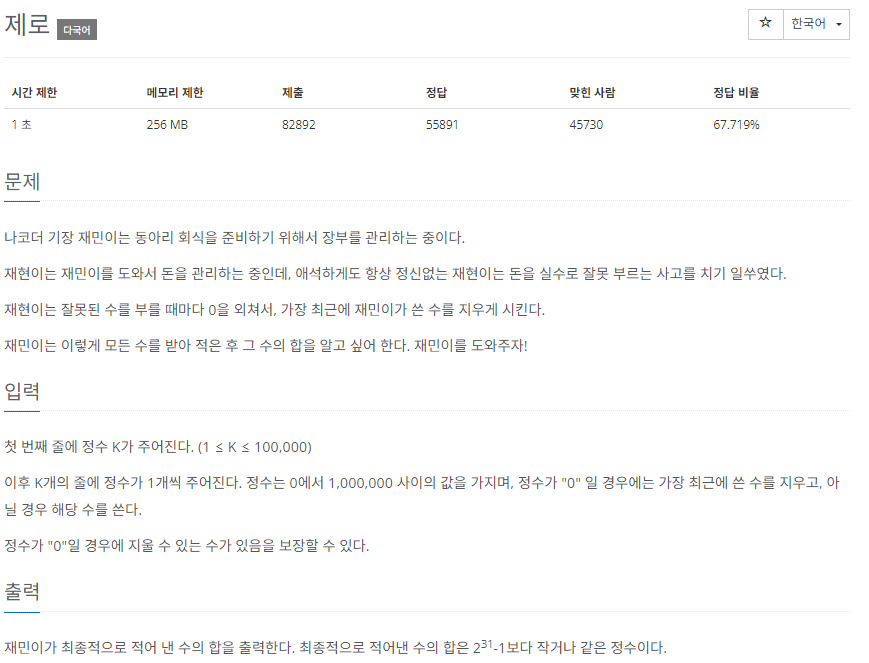

# [백준] 10773 제로

## 문제

---



## 코드

---

```python
arr = []
k=int(input())

for i in range(k):
    n = int(input())
    if n != 0:
        arr.append(n)
    else:
        if len(arr) != 0:
            arr.pop()

if len(arr) != 0:
    print(sum(arr))
else:
    print(0)
```

## 설명

---

간단하게 입력받으면서 입력값 검증을 통해 해결했습니다.

0이면 전에꺼 삭제 아니면 append
