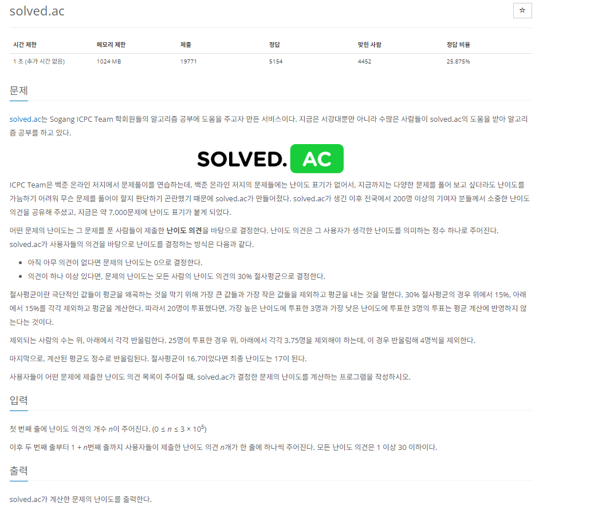

# [백준] 18110 solved.ac

## 문제

---



## 코드

---

```python
def roundTraditional(val, digits):
    return round(val+10**(-len(str(val))-1), digits)

from collections import deque
import sys

arr = []
n = int(sys.stdin.readline())

if n != 0:
    for i in range(n):
        arr.append(int(sys.stdin.readline()))

    arr.sort()
    deq = deque(arr)

    cut = int(roundTraditional(n / 100 * 15,0))


    for i in range(cut):
        deq.popleft()
        deq.pop()
    rst = roundTraditional(sum(deq) / (n-cut*2),0)

    print(int(rst))
else:
    print(0)
```

## 설명

---

다 풀었었는데 반올림 관련한 이슈가 있어서 해당 함수를 사용하니 해결됐습니다.
