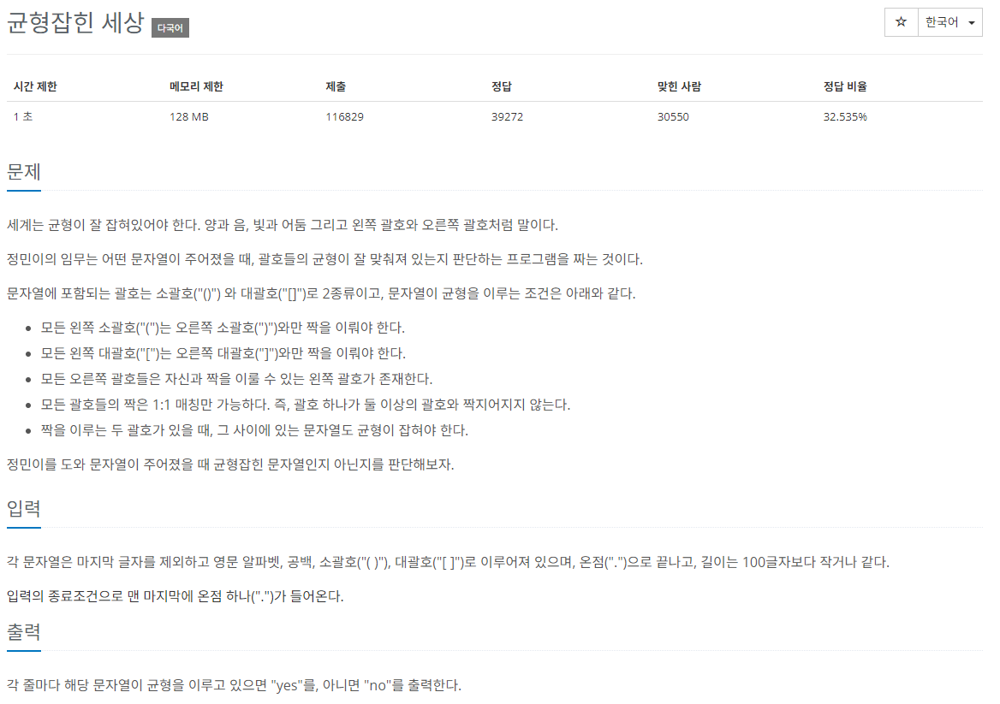

# [백준] 4949 균현잡힌 세상

## 문제

---



## 코드

---

```python
rst = []

while True:
    stack=[]

    context = input()
    if context == '.':
        break

    for ch in context:
        if ch not in ['(','[',')',']']:
            continue
        else:
            if ch in ['(','['] :
                stack.append(ch)
            elif ch == ')':
                if len(stack) != 0 and stack[-1] == '(':
                    stack.pop()
                else:
                    stack.append(ch)
                    break
            elif ch == ']':
                if len(stack) != 0 and stack[-1] == '[':
                    stack.pop()
                else:
                    stack.append(ch)
                    break

    if len(stack) == 0:
        rst.append("yes")
    else:
        rst.append("no")

for i in rst:
    print(i)
```

## 설명

---

스택을 사용하여 해결할 수 있는 문제입니다.
