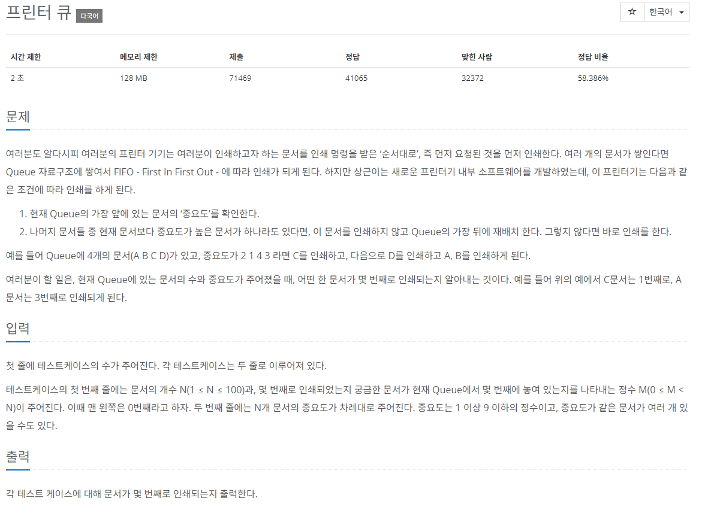

# [백준] 1966 프린터 큐

## 문제

---



## 코드

---

```python
from collections import deque

rst=[]
test_case = int(input())

for i in range(test_case):
    cnt=0

    n,m = map(int,input().split())
    queue = deque()

    arr = map(int, input().split())
    arr_r = list(arr).copy()

    for i in range(n):
        queue.append((i,arr_r[i]))

    while queue:
        maxVal = max(queue, key=lambda q:q[1] )
        # 최대값과 데크 맨앞 값이 같은 경우
        if maxVal[1] == queue[0][1]:
            cnt+=1
            # 이 값이 찾고 있는 순서의 문서인 경우
            if m == queue[0][0]:

                rst.append(cnt)
                break
            else:
                queue.popleft()
        # 최대값이 아니면 회전
        else:
            queue.rotate(-1)

for i in rst:
    print(i)
```

## 설명

---

생각보다 힘들었습니다.

처음한 구상은 데크에 값들을 넣고 최대값인지 비교해서 최대값이 아니면 rotate해버리고 출력할 때마다 값을 count해서 원하는 값이 몇 번째로 나갔는지 체크해야지! 하고 풀었는데

첫 번째 난관은 rotate하면 순서가 바뀌기 때문에 할 수 없었습니다.

그래서 튜플로 값을 바꿔줘서 데크에 넣어줬습니다.

두 번째 난관은 최대값을 찾는 것인데 이게 튜플로 값을 바꿔서 넣어서 최대값 찾는 방법에 애를 먹었는데 람다식을 사용하니 너무나도 쉽게 해결이 됐습니다.
