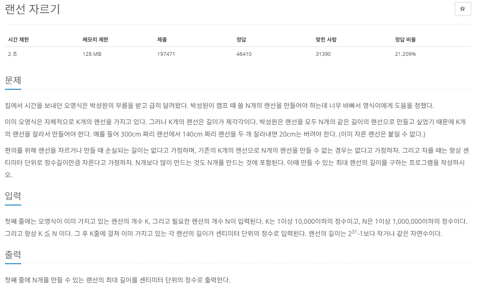

# [백준] 1966 프린터 큐

## 문제

---



## 코드

---

```python
import sys

def calc(start,end,lans,n):
    if end-start <= 1:
        return start
    mid = (start + end) // 2
    count = 0
    for lan in lans:
        count += (lan//mid)
    if count < n:
        return calc(start,mid,lans,n)
    else:
        return calc(mid,end,lans,n)

lans = []
big=0
k, n = map(int, sys.stdin.readline().rstrip().split())

for _ in range(k):
    x = int(sys.stdin.readline().rstrip())
    big = max(big,x)
    lans.append(x)

print(calc(1,big+1,lans,n))
```

## 설명

---

이분탐색은 처음이라 처음에 혼자서 구현해보고 유튜버 분의 강의대로 했다.

```python
import sys

lans = []
k, n = map(int, sys.stdin.readline().rstrip().split())

for _ in range(k):
    lans.append(int(sys.stdin.readline().rstrip()))

pivot = sum(lans) // n

while True:
    count=0
    # pivot이 최소값보다 작을 때
    if pivot < min(lans):
        for lan in lans:
            count += lan // pivot
        if count == n:
            print(pivot)
            break
        else:
            pivot-=1
    else:
        for lan in lans:
            count += lan // pivot
        if count == n:
            print(pivot)
            break
        else:
            pivot+=1
```

문제가 많은 코드다. 1씩 탐색이라니 ㅋㅋ 이러니 시간초과가 나지 !!!!
