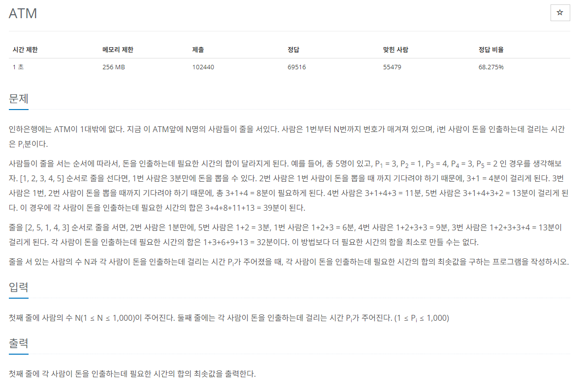

# [백준] 11399 ATM

## 문제

---



## 코드

---

```python
import sys

n = int(sys.stdin.readline().rstrip())
arr = list(map(int, sys.stdin.readline().rstrip().split()))

arr.sort()
rst=0

for i in range(len(arr)+1):
    for j in range(i):
        rst+=arr[j]

print(rst)
```

## 설명

---

그냥 풀면 됩니다.

정렬한 후 별찍기 때 해봤던 for문 지식을 이용하면 풀 수 있습니다
