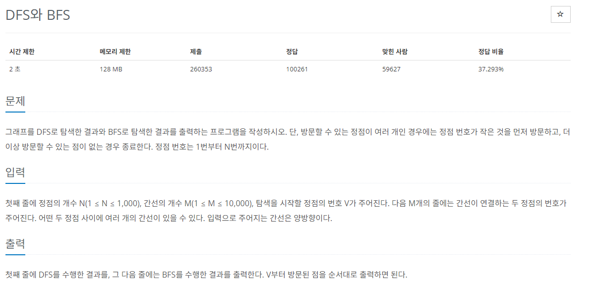

# [백준] 1260 DFS와 BFS

## 문제

---



## 코드

---

```python
import sys

def dfs(start):
    rst_dfs.append(start)
    visited[start]=True

    for num in arr[start]:
        if not visited[num]:
            dfs(num)

def bfs(start):
    q=[]
    q.append(start)
    rst_bfs.append(start)
    visited[start]=True

    while q:
        now = q.pop(0)
        for next in arr[now]:
            if not visited[next]:
                q.append(next)
                rst_bfs.append(next)
                visited[next]=True


n,m,v = map(int, sys.stdin.readline().rstrip().split())

arr = [ [] for _ in range(n+1)]

for _ in range(m):
    start, end = map(int, sys.stdin.readline().rstrip().split())
    # 양방향이라 두번 append
    arr[start].append(end)
    arr[end].append(start)

for i in range(1,n+1):
    arr[i].sort()


visited = [False]*(n+1)
rst_dfs=[]
dfs(v)

print(*rst_dfs)


visited = [False]*(n+1)
rst_bfs=[]
bfs(v)

print(*rst_bfs)
```

## 설명

---

문제푸는 방법은 먼저 손으로 해보는 것입니다.

그리고 필요한 변수들, 값들을 알아보고 정리해놓고 시작하면 편리합니다.

dfs는 깊이 우선 탐색입니다. 보통 스택을 사용해서 구현합니다.

visited를 사용해서 방문하지 않은 노드라면 끝까지 가봅니다.

bfs는 너비우선 탐색입니다. 큐를 이용해서 구현합니다.

기본적인 메커니즘은 먼저 start가 들어오고 start와 연결된 간선들을 q에 넣고 start 빼고 다음 값을 검사하며 q의 길이가 0이 될때까지 반복하면 됩니다.
