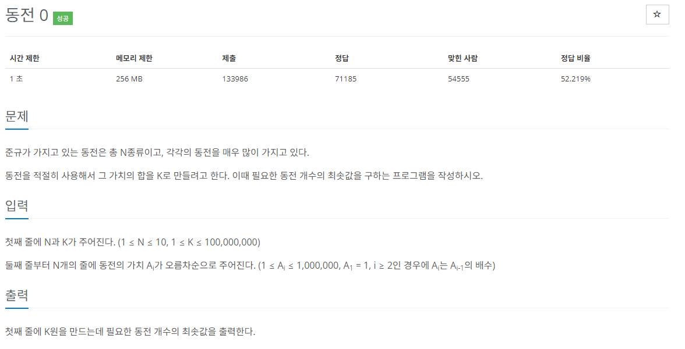

# [백준] 11047 동전 0

## 문제

---



## 코드

---

```python
import sys
from collections import deque

arr = deque([])
count=0
n,k = map(int,sys.stdin.readline().rstrip().split())

for _ in range(n):
    x = int(sys.stdin.readline().rstrip())
    arr.appendleft(x)

for i in arr:
    if k == 0:
        break
    if k >= i:
        count += (k//i)
        k %= i
    else:
        continue

print(count)
```

## 설명

---

어렵지 않은 동전문제다.

deque를 이용해서 입력받아서 편하게 했다.

k가 목표 금액이라고 하고

k가 0이 될 때까지 모든 동전들을 순회하며 몫만큼 계속 더해주고 나머지 값을 다음 k값으로 바꿔줘서 풀 수 있었다.
