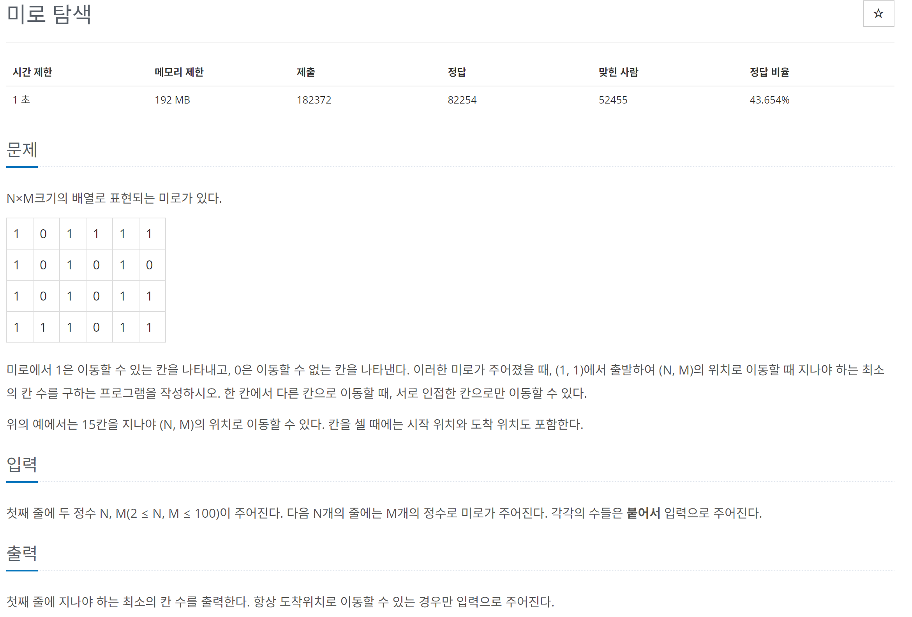

# [백준] 2178 미로 탐색

## 문제

---



## 코드

---

### 디버깅용 코드

```python
import sys


def bfs(si,sj,ei,ej):
    q=[]
    q.append([si,sj])
    ans[si][sj]=1
    # maze[start_i][start_j]=0

    while q:
        now = q.pop(0)
        si,sj = now
        if si==ei and sj==ej:
            break
        # 우
        if si+1 < n and maze[si+1][sj] == 1:
            q.append([si+1,sj])
            maze[si+1][sj]=2
            ans[si+1][sj]= ans[si][sj] + 1
        # 좌
        if si-1 >= 0 and maze[si-1][sj] == 1:
            q.append([si-1,sj])
            maze[si-1][sj]=2
            ans[si-1][sj]= ans[si][sj]+1
        # 하
        if sj+1 < m and maze[si][sj+1] == 1:
            q.append([si,sj+1])
            maze[si][sj+1]=2
            ans[si][sj+1]=ans[si][sj]+1
        # 상
        if sj-1 >= 0 and maze[si][sj-1] == 1:
            q.append([si,sj-1])
            maze[si][sj-1]=2
            ans[si][sj-1]=ans[si][sj]+1
        print("now is",now)
        print("q is ",q)
        print("\n====answer is====")
        for i in ans:
            print(i)
        print("===============")
        print("\n")


n,m = map(int, sys.stdin.readline().rstrip().split())

maze = [[] for _ in range(n)]
ans = [[0 for _ in range(m)] for _ in range(n)]

for i in range(n):
    x = list(map(int, list(sys.stdin.readline().rstrip())))
    maze[i] = x

cnt = bfs(0,0,n,m)

print(ans[n-1][m-1])
```

### 제출 코드

```python
import sys


def bfs(si,sj,ei,ej):
    q=[]
    q.append([si,sj])
    ans[si][sj]=1
    maze[si][sj]=0

    while q:
        now = q.pop(0)
        si,sj = now
        if si==ei and sj==ej:
            break
        # 우
        if si+1 < n and maze[si+1][sj] == 1:
            q.append([si+1,sj])
            maze[si+1][sj]=2
            ans[si+1][sj]= ans[si][sj] + 1
        # 좌
        if si-1 >= 0 and maze[si-1][sj] == 1:
            q.append([si-1,sj])
            maze[si-1][sj]=2
            ans[si-1][sj]= ans[si][sj]+1
        # 하
        if sj+1 < m and maze[si][sj+1] == 1:
            q.append([si,sj+1])
            maze[si][sj+1]=2
            ans[si][sj+1]=ans[si][sj]+1
        # 상
        if sj-1 >= 0 and maze[si][sj-1] == 1:
            q.append([si,sj-1])
            maze[si][sj-1]=2
            ans[si][sj-1]=ans[si][sj]+1

n,m = map(int, sys.stdin.readline().rstrip().split())

maze = [[] for _ in range(n)]
ans = [[0 for _ in range(m)] for _ in range(n)]

for i in range(n):
    x = list(map(int, list(sys.stdin.readline().rstrip())))
    maze[i] = x

cnt = bfs(0,0,n,m)

print(ans[n-1][m-1])
```

## 설명

---

미로를 입력 받았습니다.

그리고 같은 크기의 ans 배열을 만들었습니다.

제가 사용한 방식은 q에 좌표를 넣을 때 좌표를 넣는 기준으로 넣는 좌표에 ans 배열에서 +1을 하여 쉽게 구할 수 있었습니다.
