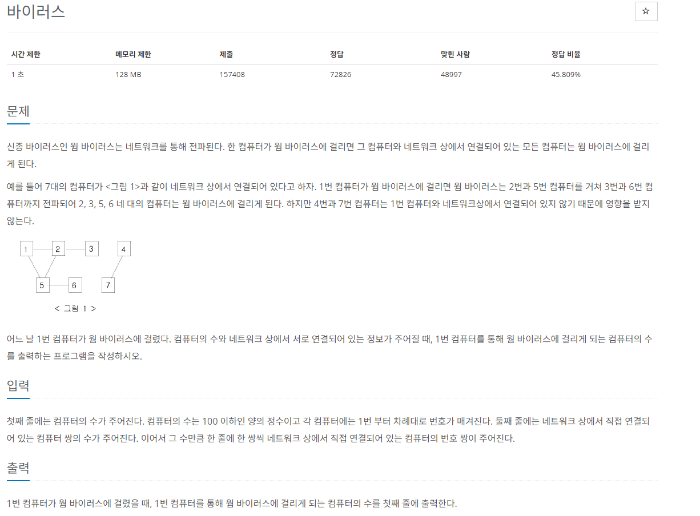

# [백준] 2606 바이러스

## 문제

---



## 코드

---

### 디버깅 코드

```python
import sys

def bfs(s):
    q=[]
    q.append(s)
    visited[s]=True

    while q:
        print("q is ",q)
        print("visited is",visited)
        now = q.pop(0)
        print("now is",now)

        for next in arr[now]:
            if not visited[next]:
                q.append(next)
                visited[next]=True

        print("---------")

n = int(sys.stdin.readline().rstrip())
m = int(sys.stdin.readline().rstrip())


arr = [[] for _ in range(n+1)]
for _ in range(m):
    start,end = map(int, sys.stdin.readline().rstrip().split())
    arr[start].append(end)
    arr[end].append(start)

visited=[False]*(n+1)
bfs(1)

# 시작값도 포함이 되어 추후에 1을 빼기 싫어서 빼진상태로 시작
cnt = -1

for v in visited:
    if v:
        cnt+=1

print(cnt)
```

### 제출 코드

```python
import sys

def bfs(s):
    q=[]
    q.append(s)
    visited[s]=True

    while q:
        now = q.pop(0)
        for next in arr[now]:
            if not visited[next]:
                q.append(next)
                visited[next]=True

n = int(sys.stdin.readline().rstrip())
m = int(sys.stdin.readline().rstrip())

arr = [[] for _ in range(n+1)]
for _ in range(m):
    start,end = map(int, sys.stdin.readline().rstrip().split())
    arr[start].append(end)
    arr[end].append(start)

visited=[False]*(n+1)
bfs(1)

# 시작값도 포함이 되어 추후에 1을 빼기 싫어서 빼진상태로 시작
cnt = -1

for v in visited:
    if v:
        cnt+=1

print(cnt)
```

## 설명

---

그냥 bfs문제

이젠 설명할게 없다.

visited로 방문한 컴퓨터 기록하고 추후에 cnt+=1로 계산하여 해결
