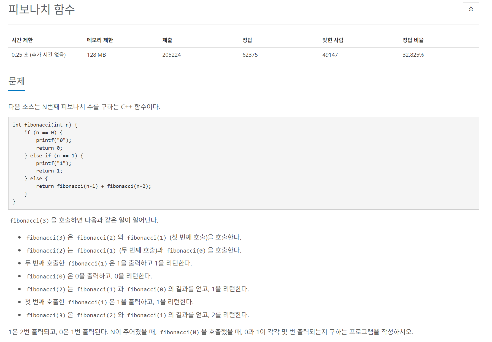

# [백준] 1003 피보나치 함수

## 문제

---




## 코드

---

```python
import sys

def fibonacci(n,index):
    if n==0:
        ans[i][0] += 1
        return 0
    elif n==1:
        ans[i][1] += 1
        return 1
    else:
        return fibonacci(n-1,index)+fibonacci(n-2,index)


cases = int(sys.stdin.readline().rstrip())
ans = [[0,0] for _ in range(cases)]

for i in range(cases):
    x = int(sys.stdin.readline().rstrip())
    fibonacci(x,i)

for i in ans:
    print(i)
```


## 설명

---

