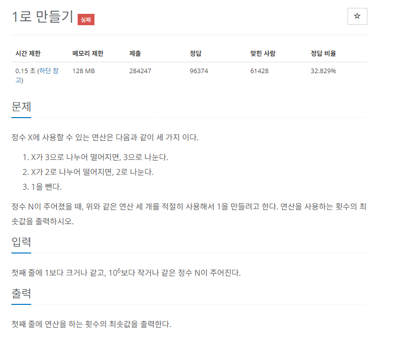

# [백준]

## 문제 1463 1로 만들기

---



## 코드

---

### 디버깅 코드

```python
import sys

n = int(sys.stdin.readline().rstrip())

dp = [0 for _ in range(n+1)]

for i in range(2,n+1):
    ans=[]
    ans.append(dp[i-1]+1)
    if i%2==0:
        ans.append(dp[i//2]+1)
    if i%3==0:
        ans.append(dp[i//3]+1)
    dp[i]=min(ans)
    print("i is",i)
    print("ans is",ans)
    print("dp[i] is ",dp[i])
    print("===========")

print(dp[n])
```

### 제출 코드

```python
import sys

n = int(sys.stdin.readline().rstrip())

dp = [0 for _ in range(n+1)]

for i in range(2,n+1):
    ans=[]
    ans.append(dp[i-1]+1)
    if i%2==0:
        ans.append(dp[i//2]+1)
    if i%3==0:
        ans.append(dp[i//3]+1)
    dp[i]=min(ans)

print(dp[n])
```

## 설명

---

그냥 했다가 된통 당한 문제

dp에 대해서 공부하면서 쉽게 풀 수 있게 된 문제입니다.

디버깅 코드로 10을 넣어보면 이해가 빠르실 겁니다.

예시를 들어보면

`dp[1]`일 때는 0이죠

`dp[2]`일 때는 1입니다. 왜냐하면 `dp[1]`+1이거나 `dp[1]`x2로 되기 때문이죠

`dp[3]`일 때도 1입니다. `dp[2]`+1이거나 `dp[1]`x3으로 되기 때문입니다.

`dp[4]`는 `dp[3]`+1 or `dp[2]`x2 이기 때문에 2입니다. 왜냐하면 `dp[3]`은 1이고 여기에 1을 더하면 2가 되기도 하고 `dp[2]`는 1인데 2를 곱해도 4가 되기 때문에 2입니다.

`dp[5]`는 3입니다. `dp[4]`+1밖에 없습니다.

`dp[6]`은 2입니다. `dp[5]+1`은 4이지만 `dp[3]`x2 또는 `dp[2]`x3을 만족하기 때문에 2입니다.

이제 규칙을 아시겠죠?
