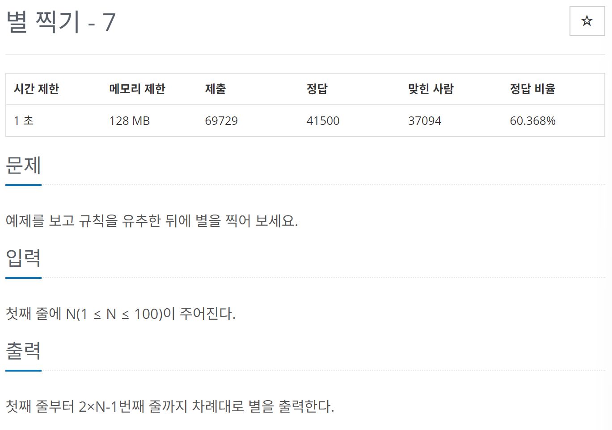

# [백준] 2444 별 찍기 - 7

## 문제
---



## 코드
---

```python
n = int(input())

for i in range(1,n):
    print(" "*(n-i)+"*"*(i*2 - 1))

for i in range(n,0,-1):
    print(" "*(n-i)+"*"*(i*2 - 1))
```


## 설명
---

원래는 다른 방식으로 풀었는데 출력 형식이 안맞는다고 하여 다른 방법으로 풀었습니다.