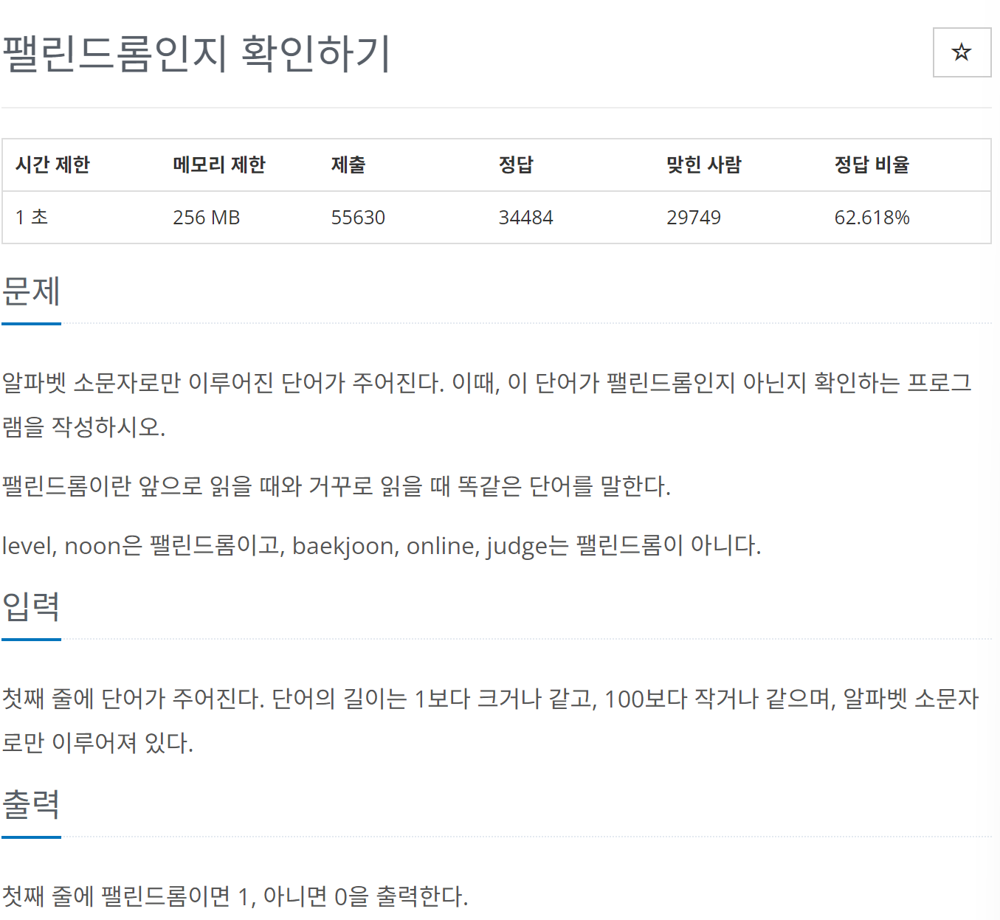

# [백준] 10988 팰린드롬인지 확인하기

## 문제
---



## 코드
---

```python
s = input()
isPrint = False

for i in range(1,len(s)//2 + 1):
    if s[i-1] != s[-i]:
        print(0)
        isPrint=True
        break

if not isPrint:
    print(1)
```


## 설명
---

문자열의 가운데를 가른 기준으로 앞 뒤를 검사해서 틀린 부분이 있다면 0을 호출하고 종료하게 하고 그렇지 않다면 for문 검사 이후 1을 출력하도록 했습니다.