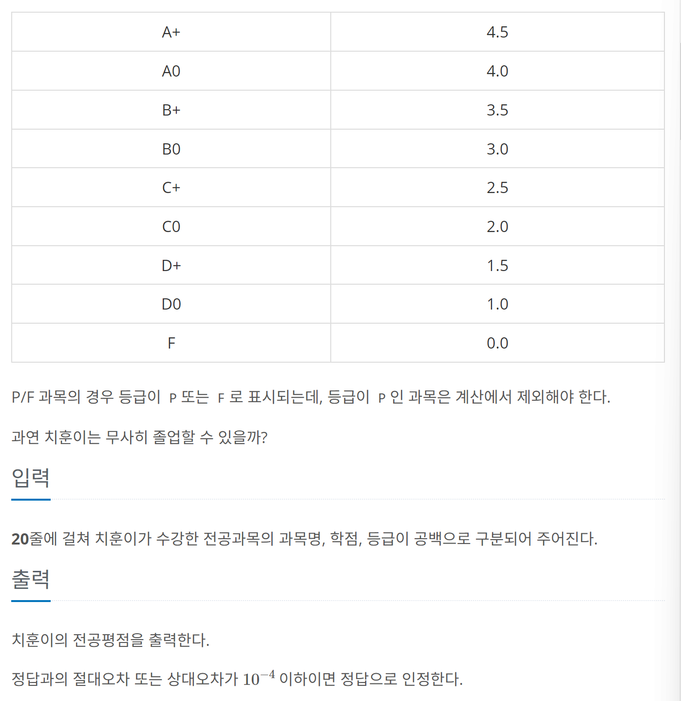

# [백준] 25206 너의 평점은 

## 문제
---




## 코드
---

```python
gradeMap = {
    "A+":4.5,
    "A0":4.0,
    "B+":3.5,
    "B0":3.0,
    "C+":2.5,
    "C0":2.0,
    "D+":1.5,
    "D0":1.0,
    "F":0.0
}
gp=0.0
p=0.0

all = [list(input().split()) for _ in range(20)]


for subject in all:
    if subject[2] != 'P':
        p += float(subject[1])
        gp += float(subject[1]) * gradeMap[subject[2]] 

print(gp/p)
```


## 설명
---

띄어쓰기를 통해서 과목명, 학점, 등급을 받는다.

과목명은 중요하지 않고 학점 * 등급을 잘 해야 한다.

등급표 map을 정의해놓고 사용해보자.. 파이썬에선 dictionary !

그리고 P에 대한 경우 계산에서 제외시켜주면 해결할 수 있다.
