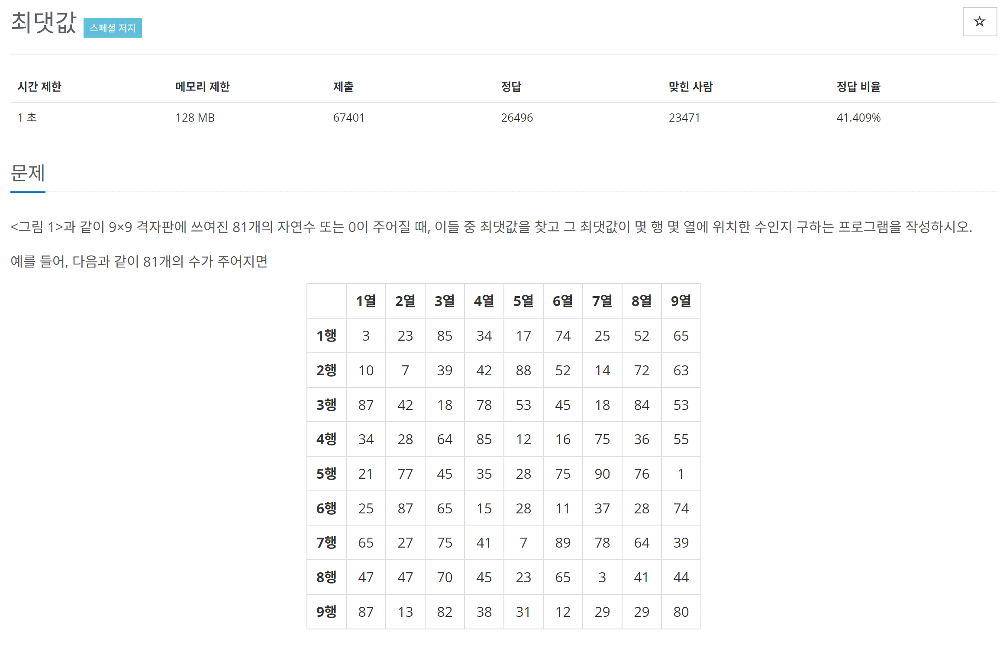
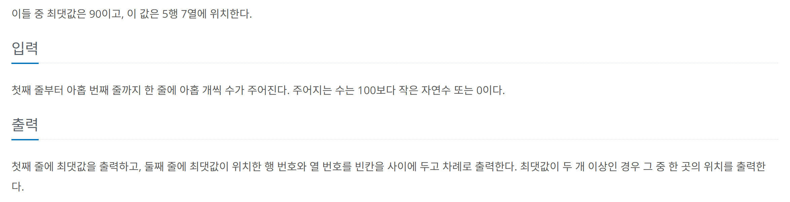

# [백준] 2566 최댓값 

## 문제
---






## 코드
---

```python
pc = [list(map(int,input().split())) for _ in range(9)]

maxNum = -1
maxIndex=[0,0]

for colIndex, row in enumerate(pc):
    maxInRow = max(row)
    if maxNum < maxInRow:
        maxIndex = [colIndex+1, row.index(maxInRow)+1]
        maxNum = maxInRow

print(maxNum)
print(" ".join(str(v) for v in maxIndex))
```


## 설명
---

파이썬에서의 enumerate를 사용하여 `칼럼 인덱스`와 `행 리스트`를 동시에 받아올 수 있었습니다.

그리고 `행 리스트`에서 최대값과 설정된 최대값을 비교하여 최대값과 그 최대값이 존재하는 위치에 대해 알아갔습니다.

초기에 최대값을 0으로 설정했다가 모두 0이 들어오면 값이 이상해지는 버그가 있었습니다. 초기 최대값을 -1로 하던지 초기 최대값 위치를 1,1로 하던지 하면 해결할 수 있습니다.
