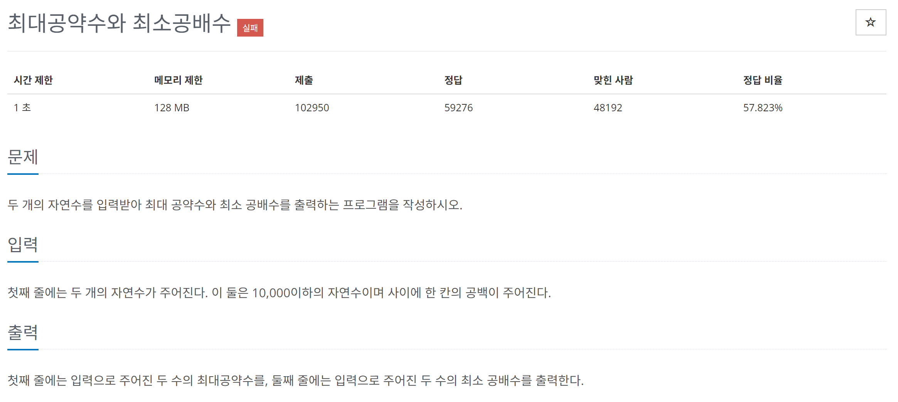

# [백준] 2609 최대공약수와 최소공배수

## 문제
---




## 코드
---

```python
init_a,init_b = map(int,input().split())

a,b = init_a,init_b

while(True):
    if a > b:
        if a%b==0:
            print(b)
            print(init_a*init_b // b)
            break
        else:
            a %= b
    else:
        if b%a==0:
            print(a)
            print(init_a*init_b // a)
            break
        else:
            b %= a

```


## 설명
---

과거에 실패했던 문제네요.

다시 공부하니 풀렸습니다.

먼저 유클리드 호제법에 대한 이해가 안됐었는데 이해를 했습니다.

최대공약수를 구하기 위해서는 두 수의 나머지를 구하고 나눈수와 나머지의 나머지를 또 구하고.. 해서 나머지가 0이 되게 하는 나누는 수가 `최대공약수`이고

최소공배수는 `A * B = 최대공약수 * 최소공배수` 법칙을 이용해서 구할 수 있습니다.
