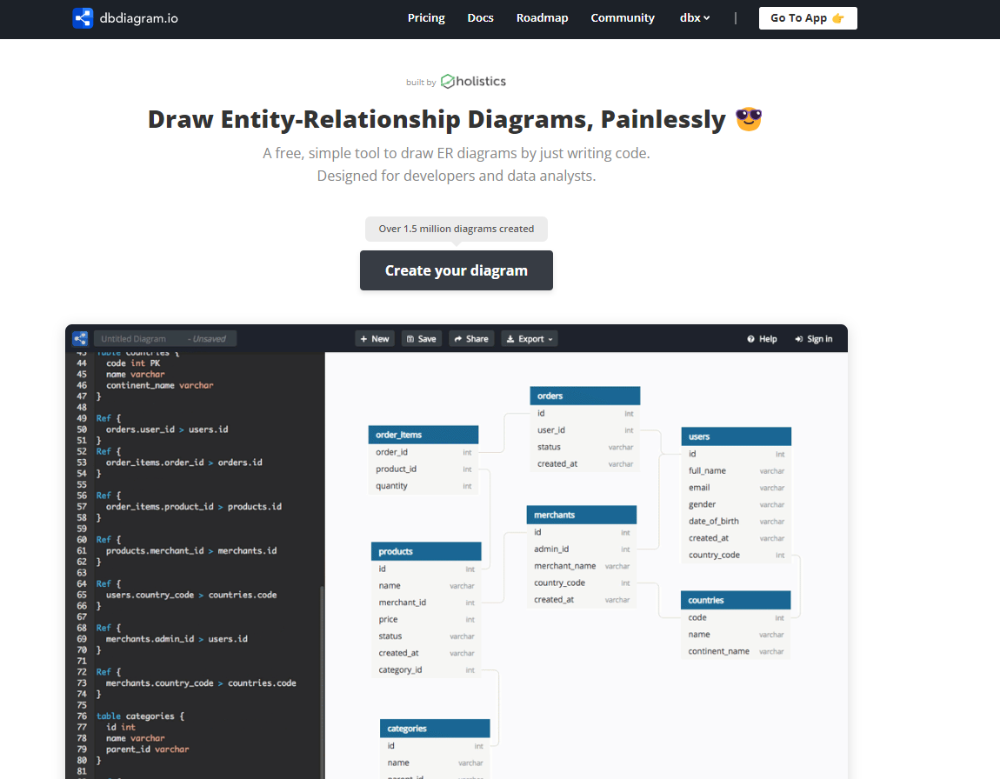
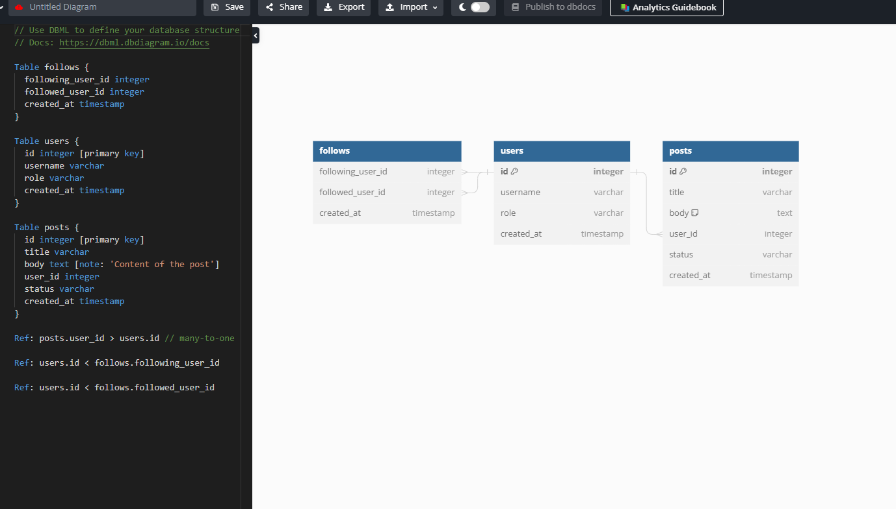
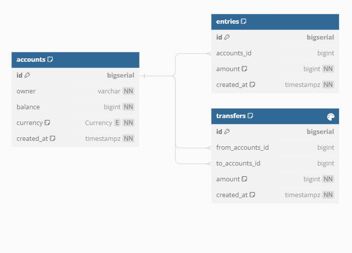
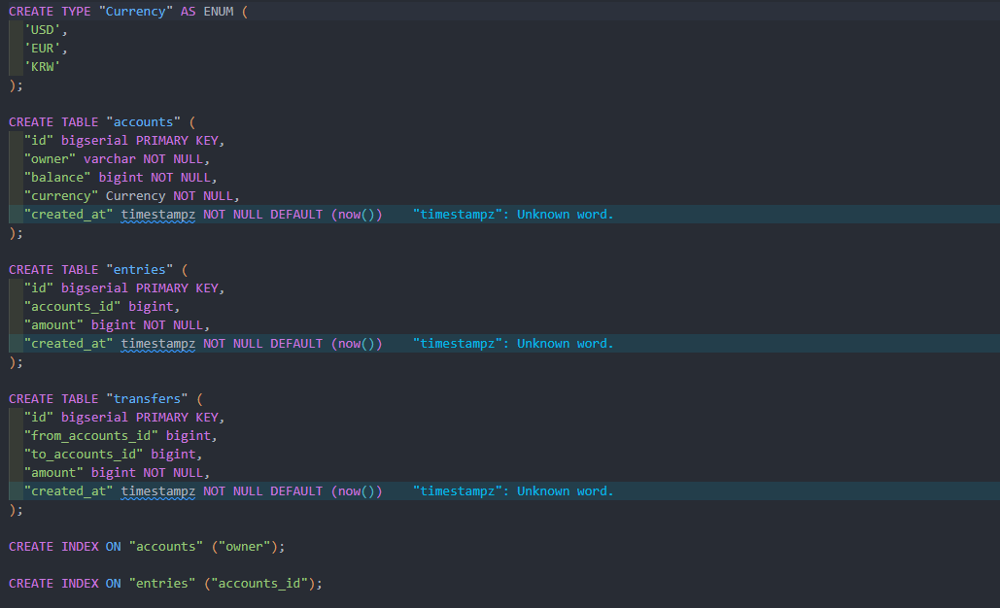

# 01. [BackEnd] 시작하기

`PostgreSQL`, `Golang`, `Docker`를 이용해서 디자인, 개발, 배포에 관한 백엔드 학습을 진행한다.

## 앞으로 할 API 명세

1. Create and mange account

2. Record all balance changes

3. Money transfer transaction


## 오늘 배울 내용

DB 디자인에 대해서 배울 예정이다.

1. [dbdiagram.io](https://dbdiagram.io/home)에서 DB schema 디자인에 대해 배울 것이다.

2. 생성한 DB 다이어그램을 PDF나 PNG로 저장해서 공유하는 방법

3. 생성한 DB 다이어그램에 따른 SQL 생성


## dbdiagram.io

### 메인 페이지




### Go to app



좌측은 간단한 문법으로 테이블이 작성되어 있고

오른쪽은 보여지는 테이블입니다.

Export 버튼을 통해서 `PDF`, `PNG`를 생성할 수도 있고 `PostgreSQL`, `MySQL`, `SQL server`의 SQL을 생성할 수도 있습니다.


### 문법


1. **as**
---


```sql
Table accounts as A{

}
```

accounts 테이블의 별명을 `as`로 붙여줄 수 있다.

2. **auto increment * pk**
---

```sql
Table accounts as A{
    id int[pk, increment]
}
```

increment 설정을 하면 키 값을 자동으로 정할 수 있다.

pk 키워드를 설정하면 primary key다.


`PostgreSQL`의 경우에는 bigserial type을 사용하여 auto increment를 할 수 있다.

```sql
Table accounts as A{
    id bigserial [pk]
}
```

3. **varchar & bigint**
---

```sql
Table accounts as A{
    id bigserial [pk]
    owner varchar
    balance bigint
    currency varchar
}
```

varchar는 문자열, bigint는 큰 정수다. int만 쓰지 않기에 이를 고려할 필요가 있다.

4. **timestamptz**
---

```sql
Table accounts as A{
    id bigserial [pk]
    owner varchar
    balance bigint
    currency varchar
    created_at timestamptz
}
```

타임존 정보가 더 좋게 포함되어있다.


5. **default 키워드**
---

```sql
Table accounts as A{
  id bigserial [pk]
  owner varchar
  balance bigint
  currency varchar
  created_at timestamptz [default: `now()`]
}
```


default 키워드를 설정하면 디비에서 자동으로 설정해준다.

백틱으로 감싸줬다.


6. **외래키**
---

```sql
Table entries{
    id bigserial [pk]
    accounts_id bigint [ref: > A.id]
}
```

위처럼 외래키 참조할 수 있음.

accounts 테이블 입장에서 일대다 관계다.


```sql
Table entries{
  id bigserial [pk]
  accounts_id bigint 
  amount bigint
  created_at timestamptz [default: `now()`]
}

Ref: entries.accounts_id > A.id
```

위처럼도 가능하다.


7. **not null**
---

```sql
Table accounts as A{
    id bigserial [pk]
    owner varchar [not null]
    balance bigint [not null]
    currency varchar [not null]
    created_at timestamptz [not null, default: `now()`]
}
```

not null이 붙으면 무조건 값이 들어와야 한다.

8. **note**
---

```sql
    amount bigint [not null, note:'can be negative or positive']
```

위처럼 메모도 가능

9. **Enum**
---

```sql
Enum Currency{
    USD
    EUR
    KRW
}
```

위처럼 Enum을 정의할 수 있고

```sql
Table accounts as A{
    id bigserial [pk]
    owner varchar [not null]
    balance bigint [not null]
    currency Currency [not null]
    created_at timestamptz [not null, default: `now()`]
}
```

위처럼 적용한 Enum을 타입으로 사용할 수 있다.


10. **index**
---

```sql
Table accounts as A{
    id bigserial [pk]
    owner varchar [not null]
    balance bigint [not null]
    currency Currency [not null]
    created_at timestamptz [not null, default: `now()`]

    Indexes{
        owner
    }
}
```

인덱스를 설정해주면 인덱스로 값을 검색할 수 있다.

위의 경우에는 FindByOwner가 가능하다.

```sql
    Indexes{
        from_accounts_id
        to_accounts_id
        (from_accounts_id, to_accounts_id)
    }
```

위처럼 인덱스를 설정한다면 여러개의 필드를 기준으로 검색할 수 있다.


## 테이블 정보

`accounts` : 사용자 계정
- **owner** : 계정 주인
- **balance** : 잔고
- **currency** : 통화

`entries` : 계정의 잔고 변화 기록
- **amount** : 잔고 변화 ( 양수, 음수 가능 )

`transfer` : 두 계좌의 이체를 기록
- **amount** : 금액의 이동 ( 무조건 양수만 )




## Export SQL



SQL로 바꿔준다 !