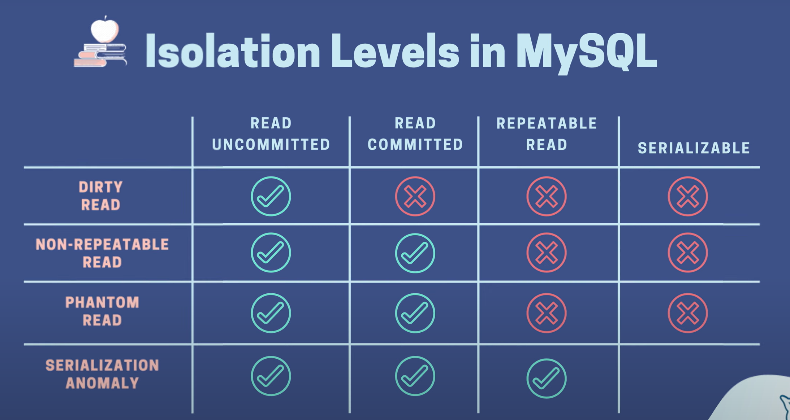
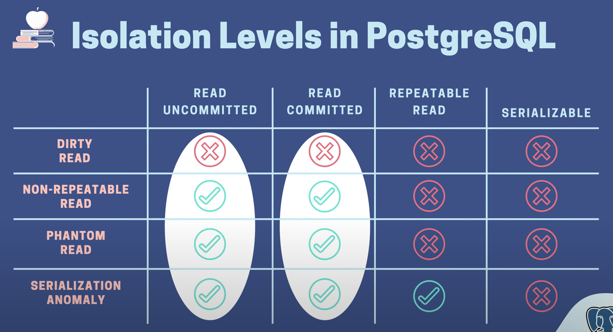

# 10. [BackEnd] transaction isolation level


## Read Phenomena
---

읽기 이상 현상이란 트랜잭션을 사용할 때 발생할 수 있는 이상 현상들

### Dirty Read

동시에 진행되고 있는 다른 트랜잭션(아직 커밋하지 않은 상태)에서 변경한 데이터를 현재 진행 중인 트랜잭션에서 읽어 들이는 것


###  Non-repeatable Reads

하나의 트랜잭션 중 읽었던 특정 row의 값을 같은 트랜잭션 내에서 다시 읽어 들이는데 중간에 변경사항이 생겨 (실제로 COMMIT이 된 변경사항) 결괏값이 다르게 나오는 현상을 뜻합니다.


### Phantom Reads

트랜잭션 시작 시점 데이터를 읽었을 때 존재하지 않았던 데이터가 다시 같은 조건으로 데이터를 읽어 들였을 때 존재해 (유령처럼) INCONSISTENT 한 결괏값을 반환하는 현상을 뜻합니다.

### Serialization Anomaly

동시 커밋된 트랜잭션 그룹의 결과는 겹치지 않고 어떤 순서로든 순차적으로 실행하려고 하면 달성할 수 없습니다.


## Isolation level
---

### Read Uncommitted

트랜잭션이 격리 되지 않은 Isolation level

`dirty read`가 일어난다.

### Read Committed

트랜잭션 내 모든 쿼리는 다른 트랜잭션을 통해 정상적으로 commit된 데이터만 볼 수 있다.

`dirty read` 해결

### Repeatable Read

트랜잭션 중 특정 row를 읽어 들이는 쿼리를 실행한다면 해당 트랜잭션이 끝날 때까지 읽어들인 row의 데이터는 변하지 않음

`Non-repeatable Read`, `Phantom Read` 해결

### Serializable

제일 엄격한 Isolation level이다. 트랜젝션이 진행되는 동안 특정 테이블을 읽으면 동시에 진행되는 다른 트랜잭션은 해당 테이블에 데이터를 추가, 변경, 삭제할 수 없음.

모든 `Read Phenomena` 해결


## MySQL
---

### Isolation level 확인

```bash
select @@transaction_isolation;
```

위 처럼 하면 isolation level을 볼 수 있습니다.

```bash
select @@global.transaction_isolation;
```

이렇게 하면 전역 레벨 확인 가능

### Isolation 변경

```bash
set session transaction isolation level <Isolation 레벨>;
```

위가 기본 형태입니다.

### read uncommitted

```bash
set session transaction isolation level read uncommitted;
```

위처럼 작성하면 read uncommitted로 isolation level을 변경합니다.

이렇게 하면 현재 세션의 transaction만 영향을 미칩니다.

`read uncommitted`에서는 Commit하지 않아도 변경된 값이 조회되는 현상이 있습니다. 이것이 `dirty read`라고 합니다.


### read committed

```bash
set session transaction isolation level read committed;
```

`read committed` 레벨에서는 `dirty read`가 방지된다.

- `dirty read` 확인하는 예시
	두 개의 같은 isolation level을 가진 세션을 열고 둘 다 `begin;`으로 시작한다.

	하나는 account balance 업데이트를 하고 다른 하나에서 그 account를 조회할 때 update된 값인지 아닌지 확인하면 된다.

- `Non-repeatable Reads` 확인하는 예시
	위 상황에서 2번 세션에서 account1에 대한 정보를 조회하고 1번 세션(account 변경한)에서 `Commit;`한 후 다시 2번 세션에서 account1에 대한 정보를 조회하면 변경사항이 저장됐기 때문에 값이 달라져있습니다.

	같은 sql이더라도 다른 곳에서 커밋 때문에 다른 결과값이 나오는 이 현상을 Non-repeatable reads 라고 합니다.

- `Phantom Read` 확인하는 예시
	위의 상황과 같습니다. 위의 상황에서 조건문을 통한 `select` sql을 날렸을 때 다른 곳에서 커밋으로 인해 값이 변경되어 조건에 만족되지 않는 순간 2번 세션 사용자 입장에서는 갑자기 `select`결과가 3개 나오던 것이 2개만 나오는 현상입니다.


### repeatable read

```bash
set session transaction isolation level repeatable read;
```

- `Non-repeatable Reads`,`Phantom Read` 가 방지됩니다. 세션 1에서 커밋을 해도 변경사항이 저장되지 않습니다.

- `Serialization Anomaly` 확인하는 법
	위의 상황을 모두 마치고 세션2에서 account1의 값을 `update`한다면 세션1에서 `commit`한 것이 적용되어서 세션2 입장에서는 다른 값으로 `update`되는 것입니다. 이것이 `Serialization Anomaly`입니다.


### Serializable

```bash
set session transaction isolation level serializable;
```

이렇게하면 세션1에서 accounts 테이블을 조회하고 세션2에서 accounts 테이블을 조회하고 세션1에서 account를 업데이트하면 차단됩니다.

세션2의 `SELECT` 쿼리가 세션1의 `UPDATE`쿼리를 차단합니다.

이유는 `isolation level`이 `serializable`일 때 MySQL은 `SELECT`를 `SELECT FOR SHARE`로 변환한다고 합니다. 이러면 다른 트랜잭션은 읽기만 가능하고 `UPDATE`, `DELETE`를 할 수 없습니다.


만약 세션2에서 `SELECT`하고 세션1에서 `UPDATE`를 시도한 이후 세션2에서 `Commit`이나 `Rollback`을 하지 않았다면 에러가 나면서 트랜잭션을 다시 시도해야 한다고 한다.

이 때 트랜잭션 재시도 전략을 잘 짜야 한다고 하네요.

왜냐하면 교착상태에 빠질 수도 있어서( 서로 업데이트하려는 경우 ) 

그래서 한 쪽에서 update한다면 반대편에서 commit이 되도록 짜야한다.


## Postgres
---

### isolation level 확인

db 콘솔에서

```bash
show transaction isolation level;
```

기본적으로 read committed 입니다. (MySQL은 기본이 repeatable read임.)


### isolation level 설정

postgres는 한 트랜잭션의 isolation level만 설정할 수 있다. (global 설정 불가능)

```bash
set transaction isolation level <isolation 수준>;
```


### read uncommitted

```bash
set transaction isolation level read uncommitted;
```

MySQL과 다른점은 read uncommitted에서도 `dirty read`가 방지된다.

그래서 isolation level이 3개만 있다고 생각하라고 하네요. read uncommitted는 없는 겁니다.

### read committed

```bash
set transaction isolation level read committed;
```

MySQL같이 `Phantom Reads`는 방어되지 못함.

### repeatable read

```bash
set transaction isolation level repeatable read;
```

`Non-repeatable Reads`,`Phantom Reads` 방어된다.

그리고 MySQL과 차이점은 `Serialization Anomaly`도 방어된다. 커밋된 값을 변경하려하면 차단된다.

하지만 다른 방법으로 `Serialization Anomaly`가 나타난다.

- `Serialization Anomaly` 확인하는 방법
	세션1에서 모든 계정을 조회하고 모든 값을 합한 계정을 만듭니다.
	세션2에서도 같은 행동을 합니다.  
	둘다 `Commit`하면 모든 값을 합한 계정이 2개 생깁니다. 근데 하나는 100이라면 다른 하나는 100을 포함한 값이 생겨야 하는데 그렇지 않고 둘 다 100으로 생깁니다. 이것이 Serialization Anomaly입니다.


### Serializable

```bash
set transaction isolation level Serializable;
```

이렇게 하면 세션2에서 계정을 추가한 후 세션1 `Commit`까지는 성공적으로 오지만 세션2에서 `Commit`하려고 하면 읽기/쓰기 종속성으로 인한 액세스할 수 없다는 오류가 발생합니다.

그리고 다시 트랜잭션을 하라고 합니다. 이러면 중복 레코드를 생성하지 않게 됩니다.


## 다시 MySQL
---

MySQL에서는 잠금 메커니즘을 통해서 위의 상황을 해결해줍니다.

트랜잭션 1이 끝날때까지 다른 세션의 트랜잭션은 잠겨있습니다. 

다른 방식으로 생성한다면 교착상태를 일으킵니다. 근데 교착상태를 일으켜서 다른 트랜잭션이 성공하도록 짜여져있습니다. 


## 정리
---







`MySQL` : 
	Locking Mechanism 사용
	Repeatable read가 기본

`Postgres` : 
	Dependencies Detection 사용
	Read Committed가 기본


주의할 점은 
1. error, timeout, deadlock으로 인한 이슈로 재시도 메커니즘을 잘 짜야한다.

2. db 엔진마다 isolation level 구현이 달라서 문서를 잘 읽어봐라.