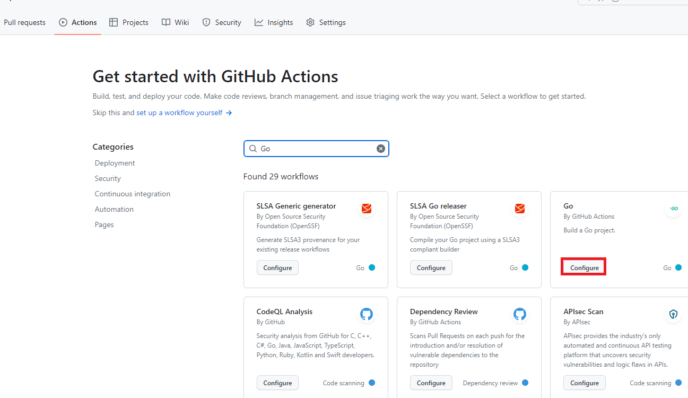
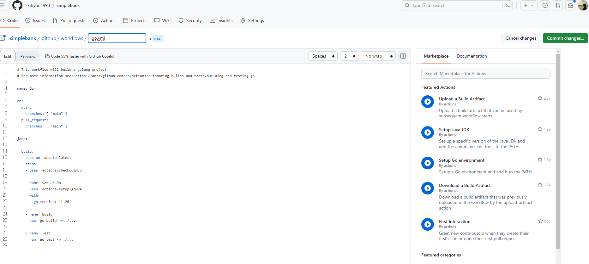

# 11. [BackEnd] Github Action + Go + Postgres to unit test


## 학습 목표
---

GitHub Action을 사용해서 golang 단위 테스트를 자동으로 빌드하고 실행하는 프로세스 설정하는 법

## Github Actions

Jenkins, Travis, Circle CI 같이 CI 기능을 갖춘 서비스

Github Action을 사용하려면 워크플로우 정의해야함.

### 3가지 Trigger

1. 이벤트

2. 반복 일정

3. 수동 클릭

워크 플로우는 `yaml` 파일만 추가하면 된다.

작업 실행을 위해서 실행자를 지정해줘야 합니다.

### 워크플로 (workflow)

워크플로는 하나 이상의 작업으로 되어있다.


### 작업 ( Job )

일반적으로 작업은 병렬로 실행되지만 의존성 있는거는 순차적으로

### 실행자 ( Runner )

실행자는 작업을 수신하는 단순한 서버다. 한 번에 하나의 작업만 실행한다. 진행상황, 로그를 GitHub에 report 한다.


### 단계 ( Step )

개별의 작업 작업 안에서 순차적으로 실행된다.

step 안에는 하나 이상의 action 들어간다.

### 액션 (Action)

standalone 명령어다. 그리고 재사용이 가능하다.

:::tip 키워드
`name`: 워크플로 이름  
`on`: 트리거되는 방법 정의 ( 이벤트, 반복 일정( schedule ) 등)
`jobs`: 작업
`runs-on`: 실행자 지정
`needs`: 의존성
`steps`: step들 나열
:::


## Github Action 사용
---

1. 이동 및 클릭



Repository에서 Actions 탭으로 이동합니다.

상황에 맞는 yaml 파일을 작성해야하는데 현재 프로젝트는 `Go`언어이기 때문에 `Go`로 추천해주는 yaml 설정.

2. 편집하기



이렇게 나오는데 편집하면 됩니다.

3. 다른방법

다른 방법으로는 그냥 위 이미지에 나오는 경로를 만들어서 vs code에서 만들어도 됩니다.


### 코드

```yaml
name: CI-test

on:
  push:
    branches: [ "main" ]
  pull_request:
    branches: [ "main" ]

jobs:

  build:
    runs-on: ubuntu-latest
    steps:
    - uses: actions/checkout@v3

    - name: Set up Go
      uses: actions/setup-go@v4
      with:
        go-version: '1.20'

    - name: Build
      run: go build -v ./...

    - name: Test
      run: go test -v ./...
```

이름은 `CI-test`인 작업입니다.

main 브랜치에 push 되거나 pull request 된다면 이 작업을 실행합니다.

test만 목적으로 하기에 Build step은 지워도됩니다. 그리고 test 코드도 makefile에 정의해놨기 때문에 make test로 바꿔줍니다.


```yaml
name: CI-test

on:
  push:
    branches: [ "main" ]
  pull_request:
    branches: [ "main" ]

jobs:

  test:
    runs-on: ubuntu-latest
    steps:
    - uses: actions/checkout@v3

    - name: Set up Go
      uses: actions/setup-go@v4
      with:
        go-version: '맞는 go 버전'

    - name: Test
      run: make test
```

해당 파일을 푸쉬해보겠습니다. 실패합니다. postgres 서버가 없기 때문인데요

```yaml
    services:
      postgres:
        image: postgres:15-alpine
        env:
          POSTGRES_USER: root
          POSTGRES_PASSWORD: secret
          POSTGRES_DB: simple_bank
		ports:
          - 5432:5432
        options: >-
          --health-cmd pg_isready
          --health-interval 10s
          --health-timeout 5s
          --health-retries 5
```

해당 서비스를 추가합니다. 

먼저 image를 docker에 설치하면 image로 작성합니다.

우리가 설정한 POSTGRES_USER와 DB까지 추가하고 PASSWORD는 설정한 것으로 변경합니다.

`ports`를 통해서 포트를 설정하고

`options`들을 통해서 db를 잘 띄울 수 있게 됩니다.

그리고 migration 해줘야 합니다.

그 전에 golang-migrate를 설치해줘야 합니다.

명령어는 [여기](https://github.com/golang-migrate/migrate/tree/master/cmd/migrate)에서 찾을 수 있습니다.

그리고 알맞은 릴리즈를 찾아서 링크 복사를 해서 링크를 대체해주면 됩니다.

```yaml
    - name: Install golang-migrate
      run: |
        curl -L https://github.com/golang-migrate/migrate/releases/download/v4.16.2/migrate.linux-amd64.tar.gz | tar xvz
        sudo mv migrate /usr/bin
        which migrate
```

그리고 이 압축 해제한 파일을 /usr/bin으로 옮겨야 하기 때문에 run 뒤에 `|`로 시작해서 멀티라인이 되도록 합니다.

/usr/bin은 super user가 와야하기에 sudo로 실행하고 which migrate는 어딨는지 확인하는 것입니다.

:::caution 꼭 압축해제 해보세요
파일을 다운로드 받는다는 가정이 들어가 있는 경우에는 파일을 다운로드해보고 압축해제 한다면 어떤 이름으로 남는지 알아놓을 필요가 있습니다.
:::


```yaml
    - name: run migrations
      run: make migrateup
```

마이그레이트 up도 해줘야 db 생기고 테스트할 수 있기 때문에 넣어야 합니다.

## 최종
---

```yaml
# This workflow will build a golang project
# For more information see: https://docs.github.com/en/actions/automating-builds-and-tests/building-and-testing-go

name: CI-test

on:
  push:
    branches: [ "main" ]
  pull_request:
    branches: [ "main" ]

jobs:

  test:
    runs-on: ubuntu-latest
    services:
      postgres:
        image: postgres:15-alpine
        env:
          POSTGRES_USER: root
          POSTGRES_PASSWORD: secret
          POSTGRES_DB: simple_bank
        ports:
          - 5432:5432
        options: >-
          --health-cmd pg_isready
          --health-interval 10s
          --health-timeout 5s
          --health-retries 5
    steps:
    - uses: actions/checkout@v3

    - name: Set up Go
      uses: actions/setup-go@v4
      with:
        go-version: '1.21.3'

    - name: Install golang-migrate
      run: |
        curl -L https://github.com/golang-migrate/migrate/releases/download/v4.16.2/migrate.linux-amd64.tar.gz | tar xvz
        sudo mv migrate /usr/bin
        which migrate

    - name: run migrations
      run: make migrateup


    - name: Test
      run: make test
```

환경마다 다를 수 있다는 점을 기억하고 있자.