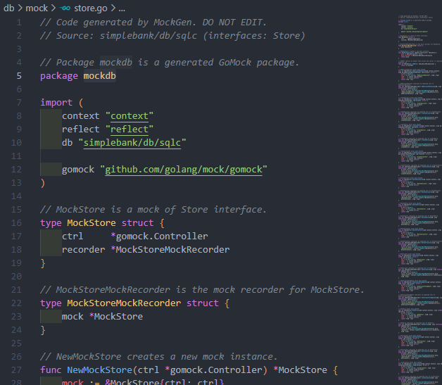

# 14. [BackEnd] HTTP API test in golang use Mock DB

## 학습 목표

---

test를 위한 Mock DB 사용

## Mock DB

---

### 장점

1. 독립적인 테스트를 쉽게 작성하는데 도움이 된다. 모두가 같은 환경의 DB에서 읽고 쓰는 테스트를 할 수 있기 때문이다.

2. 속도가 빠르다. 실제 db를 사용하면 db와 통신하는데 시간이 걸리지만 Mock DB를 사용하면 그렇지 않다.

3. 100% test coverage할 수 있다. 실제 DB는 예상치 못한 에러를 만날 수 있기 때문

4. 주의할 점은 실제 DB와도 테스트를 어느정도 마쳐야함

### 구현 방법

1. 메모리에 데이터 저장하는 가짜 db 구현 ( 구현이 쉽지만 테스트 코드가 너무 길어진다. )

2. stub을 사용하는 MOCK DB ( GoMock을 사용한다. )

## GoMock 사용

---

### GoMock 설치

[여기](https://github.com/golang/mock)에서 다운로드 받을 수 있습니다.

```bash
go install github.com/golang/mock/mockgen@v1.6.0
```

### 환경변수 설정

mockgen을 사용해야 하는데 global 설정이 되어있지 않아서 사용할 수 없다. 환경 변수 설정을 해줘야 한다.

먼저 mockgen이 잘 있나 확인

```bash
ls -al ~/go/bin
```

이거 했을 때 안나오면 잘못한거다.

시스템 환경변수에서 `~/go/bin`을 추가한다.

```bash
which mockgen
```

위 코드로 다시 확인한다. 어무폴더에서 경로가 잘 나온다면 잘 설정이 된 것

### 코드 변경

1. `store.go`

기존 store를 변경해야 하고.. 구조가 많이 달라집니다.

sqlc 설정 중 `emit_interface`를 true로 하여 queries 구조체의 모든 기능을 포함하여 인터페이스를 생성하도록 해줍니다.

다시 sqlc하면

```go
type Querier interface {
	AddAccountBalance(ctx context.Context, arg AddAccountBalanceParams) (Account, error)
	CreateAccount(ctx context.Context, arg CreateAccountParams) (Account, error)
	CreateEntry(ctx context.Context, arg CreateEntryParams) (Entry, error)
	CreateTransfer(ctx context.Context, arg CreateTransferParams) (Transfer, error)
	DeleteAccount(ctx context.Context, id int64) error
	DeleteEntry(ctx context.Context, id int64) error
	DeleteTransfer(ctx context.Context, id int64) error
	GetAccount(ctx context.Context, id int64) (Account, error)
	GetAccountForUpdate(ctx context.Context, id int64) (Account, error)
	GetEntry(ctx context.Context, id int64) (Entry, error)
	GetTransfer(ctx context.Context, id int64) (Transfer, error)
	ListAccounts(ctx context.Context, arg ListAccountsParams) ([]Account, error)
	ListEntries(ctx context.Context, arg ListEntriesParams) ([]Entry, error)
	ListTransfers(ctx context.Context, arg ListTransfersParams) ([]Transfer, error)
	UpdateAccount(ctx context.Context, arg UpdateAccountParams) (Account, error)
	UpdateEntry(ctx context.Context, arg UpdateEntryParams) (Entry, error)
	UpdateTransfer(ctx context.Context, arg UpdateTransferParams) (Transfer, error)
}

var _ Querier = (*Queries)(nil)
```

이전에 만든 query들이 다 모여있고

이 인터페이스를 새로운 인터페이스에 입력한다.

```go
type Store interface {
	Querier
	TransferTx(ctx context.Context, arg TransferTxParams) (TransferTxResult, error)
}
```

이게 새로운 mock을 위한 store고 기존 store는

```go
type SQLStore struct {
	*Queries         // 상속
	db       *sql.DB // db 만드는데 필수
}
```

이름을 바꿔주고 관련된 것들도 바꿔준다.

그리고 Store는 인터페이스이기 때문에 포인터 없앤다.

2. `server.go`

store가 인터페이스가 됐기에 포인터는 빼준다.

### gomock 생성

db 밑에 mock 폴더 생성한다.

source 모드와 reflect 모드가 있다. source 모드는 단일 소스 파일에서 모의 인터페이스 생성하고 reflect는 이름과 인터페이스만 제공하고 mockgen이 리플렉션해서 자동으로 파악함

```bash
mockgen <store 경로> <인터페이스 이름>
```

위처럼 입력할 수 있습니다.

```bash
mockgen -package mockdb -destination db/mock/store.go simplebank/db/sqlc Store
```

위는 실제 입력 명령어다.

`-destination` : mockgen 생성된 코드 경로 지정
`-package` : package이름을 정할 수 있습니다.



이렇게 자동 코드 생성됩니다.

## API Test 코드 작성

1. 준비

```go
func TestGetAccountAPI(t *testing.T) {
	account := randomAccount()

	ctrl := gomock.NewController(t)
	defer ctrl.Finish()

	store := mockdb.NewMockStore(ctrl)
}
```

stub을 생성할 준비를 마쳤습니다.

2. stub 생성

```go
store.EXPECT().
	GetAccount(gomock.Any(), gomock.Eq(account.ID)).
	Times(1).
	Return(account, nil)
```

account에 대한 stub을 생성합니다.

3. 서버에 요청 보내기

```go
server := NewServer(store)
recoder := httptest.NewRecorder()

url := fmt.Sprintf("/accounts/%d", account.ID)
request, err := http.NewRequest(http.MethodGet, url, nil)
require.NoError(t, err)

server.router.ServeHTTP(recoder, request)
```

테스트를 위해서 실제 서버를 열 필요가 없기에 httptest 패키지를 사용해서 api 요청의 응답만 기록합니다.

`httptest.NewRecorder`를 이용해서 recoder를 만들고

`http.NewRequest`를 사용해서 GET 요청을 보냅니다 !

4. 응답이 잘 왔나 확인

```go
require.Equal(t, http.StatusOK, recoder.Code)
```

recoder의 코드가 200인지 확인합니다.

그리고 조회한 값도 확인할 수 있습니다.

```go
{
	...
	requireBodyMatchAccount(t, recoder.Body, account)
}

func requireBodyMatchAccount(t *testing.T, body *bytes.Buffer, account db.Account) {
	data, err := io.ReadAll(body)
	require.NoError(t, err)

	var gotAccount db.Account
	err = json.Unmarshal(data, &gotAccount)
	require.NoError(t, err)
	// account : 만든 계정
	// gotAccount : GET으로 얻은 계정
	require.Equal(t, account, gotAccount)
}
```

recoder.Body를 통해서 bytes.Buffer로 반환되는 값을 읽을 수 있는데 체크할 수 있습니다.

## 적용 범위 100%를 위해

테이블 기반 테스트 세트로 변환해야 한다.

그러려면 test case가 필요하다.

.
.
.

( test case를 적용하는 과정은 정말 어지러웠습니다. 그래도 정리를 해보려 합니다. )

```go
func TestGetAccountAPI(t *testing.T) {
	account := randomAccount()

	testCases := []struct {
		name          string                        // 테스트 케이스 이름
		accountID     int64                         // 얻고자하는 계정 ID
		buildStubs    func(store *mockdb.MockStore) //테스트 사례의 목적에 맞는 스텁 생성
		checkResponse func(t *testing.T, recoder *httptest.ResponseRecorder)
	}{
		{
			name:      "OK",
			accountID: account.ID,
			buildStubs: func(store *mockdb.MockStore) {
				//build stubs
				store.EXPECT().
					GetAccount(gomock.Any(), gomock.Eq(account.ID)).
					Times(1).
					Return(account, nil)
			},
			checkResponse: func(t *testing.T, recoder *httptest.ResponseRecorder) {
				// check response
				require.Equal(t, http.StatusOK, recoder.Code)
				requireBodyMatchAccount(t, recoder.Body, account)
			},
		},
		// CAN ADD MORE CASE
	}

	for i := range testCases {

		// 테스트 케이스
		tc := testCases[i]
		t.Run(tc.name, func(t *testing.T) {
			ctrl := gomock.NewController(t)
			defer ctrl.Finish()

			store := mockdb.NewMockStore(ctrl)
			// build stub
			tc.buildStubs(store)

			// start server and send requests
			// 테스트를 위해 실제 서버를 열 필요는 없다
			// httptest 패키지를 사용해서 api 요청의 응답을 기록하면 된다.
			server := NewServer(store)
			recoder := httptest.NewRecorder()

			url := fmt.Sprintf("/accounts/%d", account.ID)
			request, err := http.NewRequest(http.MethodGet, url, nil)
			require.NoError(t, err)

			server.router.ServeHTTP(recoder, request)
			tc.checkResponse(t, recoder)
		})
	}
}
```

코드가 이렇게 바뀌는데요 다시 천천히 살펴보면

크게 추가된 부분은 `testCases` 구조체 입니다.
`name`은 테스트 케이스 이름 `accountID`는 당연히 계정 아이디 `buildStubs`는 이전에 stub을 빌드하게 해준 함수 `checkResponse`는 이전에 응답값 검증한 로직입니다.

기존 테스트 코드에서 해당 구조체에 해당하는 함수로 교체를 해준다면 다양한 테스트 케이스들을 추가해서 한번에 테스트할 수 있습니다. 예를 들어 계정이 없는 경우라던지, ID값이 이상하다던지 등등..

```go
{
	name:      "NotFound",
	accountID: account.ID,
	buildStubs: func(store *mockdb.MockStore) {
		//build stubs
		store.EXPECT().
			GetAccount(gomock.Any(), gomock.Eq(account.ID)).
			Times(1).
			Return(db.Account{}, sql.ErrNoRows)
	},
	checkResponse: func(t *testing.T, recoder *httptest.ResponseRecorder) {
		// check response
		require.Equal(t, http.StatusNotFound, recoder.Code)
	},
},
```

그래서 위와 같이 새로운 테스트 케이스를 추가할 수 있는데 `OK` 테스트 케이스와 차이점을 적자면 buildStubs 부분과 checkResponse 부분이 바뀝니다.

store.EXPECT()로 만든 stub의 Return을 없는 계정을 반환한다던지 에러 코드가 NotFound인지 등을 확인합니다.

```go
{
		{
			name:      "OK",
			accountID: account.ID,
			buildStubs: func(store *mockdb.MockStore) {
				//build stubs
				store.EXPECT().
					GetAccount(gomock.Any(), gomock.Eq(account.ID)).
					Times(1).
					Return(account, nil)
			},
			checkResponse: func(t *testing.T, recoder *httptest.ResponseRecorder) {
				// check response
				require.Equal(t, http.StatusOK, recoder.Code)
				requireBodyMatchAccount(t, recoder.Body, account)
			},
		}, {
			name:      "NotFound",
			accountID: account.ID,
			buildStubs: func(store *mockdb.MockStore) {
				//build stubs
				store.EXPECT().
					GetAccount(gomock.Any(), gomock.Eq(account.ID)).
					Times(1).
					Return(db.Account{}, sql.ErrNoRows)
			},
			checkResponse: func(t *testing.T, recoder *httptest.ResponseRecorder) {
				// check response
				require.Equal(t, http.StatusNotFound, recoder.Code)
			},
		}, {
			name:      "InternalError",
			accountID: account.ID,
			buildStubs: func(store *mockdb.MockStore) {
				//build stubs
				store.EXPECT().
					GetAccount(gomock.Any(), gomock.Eq(account.ID)).
					Times(1).
					Return(db.Account{}, sql.ErrConnDone)
			},
			checkResponse: func(t *testing.T, recoder *httptest.ResponseRecorder) {
				// check response
				require.Equal(t, http.StatusInternalServerError, recoder.Code)
			},
		}, {
			name:      "BadRequest",
			accountID: 0,
			buildStubs: func(store *mockdb.MockStore) {
				//build stubs
				store.EXPECT().
					GetAccount(gomock.Any(), gomock.Any()).
					Times(0)
			},
			checkResponse: func(t *testing.T, recoder *httptest.ResponseRecorder) {
				// check response
				require.Equal(t, http.StatusBadRequest, recoder.Code)
			},
		},

		// CAN ADD MORE CASE
}
```

지금까지 작성한 테스트코드는 이러한데 각각의 특징을 보면서 익혀야할 것 같다.

## main-test.go 작성

---

```go
func TestMain(m *testing.M) {
	gin.SetMode(gin.TestMode)
	// 테스트 시작
	os.Exit(m.Run())
}
```

디버깅을 위해서 gin을 test모드로 설정한다.

## 숙제

---

### createAccountAPI 테스트 코드

```go
func TestCreateAccountAPI(t *testing.T) {
	account := randomAccount()

	testCases := []struct {
		name       string
		body       gin.H
		buildStubs func(store *mockdb.MockStore)
		statusCode int
	}{
		{
			name: "OK",
			body: gin.H{
				"owner":    account.Owner,
				"currency": account.Currency,
			},
			buildStubs: func(store *mockdb.MockStore) {
				arg := db.CreateAccountParams{
					Owner:    account.Owner,
					Balance:  0,
					Currency: account.Currency,
				}
				//build stubs
				store.EXPECT().
					CreateAccount(gomock.Any(), gomock.Eq(arg)).
					Times(1).
					Return(account, nil)
			},
			statusCode: http.StatusOK,
		}, {
			name: "BadRequest",
			body: gin.H{
				"owner":    account.Owner,
				"currency": "KRW",
			},
			buildStubs: func(store *mockdb.MockStore) {
				//build stubs
				store.EXPECT().
					CreateAccount(gomock.Any(), gomock.Any()).
					Times(0)
			},
			statusCode: http.StatusBadRequest,
		}, {
			name: "InternalError",
			body: gin.H{
				"owner":    account.Owner,
				"currency": account.Currency,
			},
			buildStubs: func(store *mockdb.MockStore) {
				arg := db.CreateAccountParams{
					Owner:    account.Owner,
					Balance:  0,
					Currency: account.Currency,
				}
				//build stubs
				store.EXPECT().
					CreateAccount(gomock.Any(), gomock.Eq(arg)).
					Times(1).
					Return(db.Account{}, sql.ErrConnDone)
			},
			statusCode: http.StatusInternalServerError,
		},
	}

	for i := range testCases {
		// 테스트 케이스
		tc := testCases[i]
		t.Run(tc.name, func(t *testing.T) {
			ctrl := gomock.NewController(t)
			defer ctrl.Finish()

			store := mockdb.NewMockStore(ctrl)
			// build stub
			tc.buildStubs(store)

			server := NewServer(store)
			recoder := httptest.NewRecorder()

			data, err := json.Marshal(tc.body)
			require.NoError(t, err)

			url := "/accounts"
			request, err := http.NewRequest(http.MethodPost, url, bytes.NewReader(data))
			require.NoError(t, err)

			server.router.ServeHTTP(recoder, request)
			require.Equal(t, tc.statusCode, recoder.Code)
		})
	}
}
```

따라해보면서 익히는 구간이였다.

### listAccountAPI 테스트 코드

```go
func TestListAccountAPI(t *testing.T) {
	n := 5
	accounts := make([]db.Account, n)
	for i := 0; i < n; i++ {
		accounts[i] = randomAccount()
	}

	type Query struct {
		pageID   int32
		pageSize int32
	}

	testCases := []struct {
		name          string                        // 테스트 케이스 이름
		query         Query                         // 얻고자하는 계정 ID
		buildStubs    func(store *mockdb.MockStore) //테스트 사례의 목적에 맞는 스텁 생성
		checkResponse func(t *testing.T, recoder *httptest.ResponseRecorder)
	}{
		{
			name: "OK",
			query: Query{
				pageID:   1,
				pageSize: int32(n),
			},
			buildStubs: func(store *mockdb.MockStore) {
				arg := db.ListAccountsParams{
					Limit:  int32(n),
					Offset: 0,
				}
				store.EXPECT().
					ListAccounts(gomock.Any(), gomock.Eq(arg)).
					Times(1).
					Return(accounts, nil)
			},
			checkResponse: func(t *testing.T, recoder *httptest.ResponseRecorder) {
				require.Equal(t, http.StatusOK, recoder.Code)
				requireBodyMatchAccounts(t, recoder.Body, accounts)
			},
		}, {
			name: "InternalError",
			query: Query{
				pageID:   1,
				pageSize: int32(n),
			},
			buildStubs: func(store *mockdb.MockStore) {
				arg := db.ListAccountsParams{
					Limit:  int32(n),
					Offset: 0,
				}
				store.EXPECT().
					ListAccounts(gomock.Any(), gomock.Eq(arg)).
					Times(1).
					Return(accounts, sql.ErrConnDone)
			},
			checkResponse: func(t *testing.T, recoder *httptest.ResponseRecorder) {
				require.Equal(t, http.StatusInternalServerError, recoder.Code)
			},
		}, {
			name: "BadRequest",
			query: Query{
				pageID:   0,
				pageSize: int32(n),
			},
			buildStubs: func(store *mockdb.MockStore) {
				store.EXPECT().
					ListAccounts(gomock.Any(), gomock.Any()).
					Times(0)
			},
			checkResponse: func(t *testing.T, recoder *httptest.ResponseRecorder) {
				require.Equal(t, http.StatusBadRequest, recoder.Code)
			},
		},
	}

	for i := range testCases {
		tc := testCases[i]

		t.Run(tc.name, func(t *testing.T) {
			ctrl := gomock.NewController(t)
			defer ctrl.Finish()

			store := mockdb.NewMockStore(ctrl)
			// build stub
			tc.buildStubs(store)

			server := NewServer(store)
			recoder := httptest.NewRecorder()

			url := "/accounts"
			request, err := http.NewRequest(http.MethodGet, url, nil)
			require.NoError(t, err)

			q := request.URL.Query()
			q.Add("page_id", fmt.Sprintf("%d", tc.query.pageID))
			q.Add("page_size", fmt.Sprintf("%d", tc.query.pageSize))
			request.URL.RawQuery = q.Encode()

			server.router.ServeHTTP(recoder, request)
			tc.checkResponse(t, recoder)
		})
	}
}

func requireBodyMatchAccounts(t *testing.T, body *bytes.Buffer, accounts []db.Account) {
	data, err := io.ReadAll(body)
	require.NoError(t, err)

	var gotAccounts []db.Account
	err = json.Unmarshal(data, &gotAccounts)
	require.NoError(t, err)
	// accounts : 만든 계정들
	// gotAccounts : GET으로 얻은 계정들
	require.Equal(t, accounts, gotAccounts)
}
```

따라해보면서 익히는 구간

### updateAccountAPI 테스트 코드

```go
func TestUpdateAccountAPI(t *testing.T) {
	account := randomAccount()

	testCases := []struct {
		name       string
		accountID  int64
		body       gin.H
		buildStubs func(store *mockdb.MockStore)
		statusCode int
	}{
		{
			name:      "OK",
			accountID: account.ID,
			body: gin.H{
				"balance": account.Balance + 100,
			},
			buildStubs: func(store *mockdb.MockStore) {
				arg := db.UpdateAccountParams{
					ID:      account.ID,
					Balance: account.Balance + 100,
				}
				store.EXPECT().
					UpdateAccount(gomock.Any(), gomock.Eq(arg)).
					Times(1).
					Return(account, nil)
			},
			statusCode: http.StatusOK,
		},
		{
			name:      "InternalError",
			accountID: account.ID,
			body: gin.H{
				"balance": account.Balance + 100,
			},
			buildStubs: func(store *mockdb.MockStore) {
				arg := db.UpdateAccountParams{
					ID:      account.ID,
					Balance: account.Balance + 100,
				}
				store.EXPECT().
					UpdateAccount(gomock.Any(), gomock.Eq(arg)).
					Times(1).
					Return(db.Account{}, sql.ErrConnDone)
			},
			statusCode: http.StatusInternalServerError,
		}, {
			name:      "BadRequestByID",
			accountID: 0,
			body: gin.H{
				"balance": account.Balance + 100,
			},
			buildStubs: func(store *mockdb.MockStore) {
				store.EXPECT().
					UpdateAccount(gomock.Any(), gomock.Any()).
					Times(0)
			},
			statusCode: http.StatusBadRequest,
		},
		{
			name:      "BadRequestByBalance",
			accountID: account.ID,
			body: gin.H{
				"balance": 0,
			},
			buildStubs: func(store *mockdb.MockStore) {
				store.EXPECT().
					UpdateAccount(gomock.Any(), gomock.Any()).
					Times(0)
			},
			statusCode: http.StatusBadRequest,
		},
	}

	for i := range testCases {
		// 테스트 케이스
		tc := testCases[i]
		t.Run(tc.name, func(t *testing.T) {
			ctrl := gomock.NewController(t)
			defer ctrl.Finish()

			store := mockdb.NewMockStore(ctrl)
			// build stub
			tc.buildStubs(store)

			server := NewServer(store)
			recoder := httptest.NewRecorder()

			data, err := json.Marshal(tc.body)
			require.NoError(t, err)

			url := fmt.Sprintf("/accounts/%d", tc.accountID)
			request, err := http.NewRequest(http.MethodPut, url, bytes.NewReader(data))
			require.NoError(t, err)

			server.router.ServeHTTP(recoder, request)
			require.Equal(t, tc.statusCode, recoder.Code)
		})
	}
}
```

update account는 개선사항이 보인다. 수정한 account와 recoder 값을 비교해볼 필요가 있음

### deleteAccountAPI 테스트 코드

```go
func TestDeleteAccountAPI(t *testing.T) {
	account := randomAccount()
	testCases := []struct {
		name             string
		accountID        int64
		buildStubsGet    func(store *mockdb.MockStore)
		buildStubsDelete func(store *mockdb.MockStore)
		statusCode       int
	}{
		{
			name:      "OK",
			accountID: account.ID,
			buildStubsGet: func(store *mockdb.MockStore) {
				store.EXPECT().
					GetAccount(gomock.Any(), gomock.Eq(account.ID)).
					Times(1).
					Return(account, nil)
			},
			buildStubsDelete: func(store *mockdb.MockStore) {
				store.EXPECT().
					DeleteAccount(gomock.Any(), gomock.Eq(account.ID)).
					Times(1).
					Return(nil)
			},
			statusCode: http.StatusOK,
		}, {
			name:      "InternalErrorInGET",
			accountID: account.ID,
			buildStubsGet: func(store *mockdb.MockStore) {
				store.EXPECT().
					GetAccount(gomock.Any(), gomock.Eq(account.ID)).
					Times(1).
					Return(db.Account{}, sql.ErrConnDone)
			},
			buildStubsDelete: func(store *mockdb.MockStore) {
				store.EXPECT().
					DeleteAccount(gomock.Any(), gomock.Eq(account.ID)).
					Times(0)
			},
			statusCode: http.StatusInternalServerError,
		}, {
			name:      "InternalErrorInDelete",
			accountID: account.ID,
			buildStubsGet: func(store *mockdb.MockStore) {
				store.EXPECT().
					GetAccount(gomock.Any(), gomock.Eq(account.ID)).
					Times(1).
					Return(account, nil)
			},
			buildStubsDelete: func(store *mockdb.MockStore) {
				store.EXPECT().
					DeleteAccount(gomock.Any(), gomock.Eq(account.ID)).
					Times(1).
					Return(sql.ErrConnDone)
			},
			statusCode: http.StatusInternalServerError,
		}, {
			name:      "BadRequest",
			accountID: 0,
			buildStubsGet: func(store *mockdb.MockStore) {
				store.EXPECT().
					GetAccount(gomock.Any(), gomock.Any()).
					Times(0)
			},
			buildStubsDelete: func(store *mockdb.MockStore) {
				store.EXPECT().
					DeleteAccount(gomock.Any(), gomock.Eq(account.ID)).
					Times(0)
			},
			statusCode: http.StatusBadRequest,
		}, {
			name:      "NotFound",
			accountID: account.ID,
			buildStubsGet: func(store *mockdb.MockStore) {
				store.EXPECT().
					GetAccount(gomock.Any(), gomock.Eq(account.ID)).
					Times(1).
					Return(db.Account{}, sql.ErrNoRows)
			},
			buildStubsDelete: func(store *mockdb.MockStore) {
				store.EXPECT().
					DeleteAccount(gomock.Any(), gomock.Eq(account.ID)).
					Times(0)
			},
			statusCode: http.StatusNotFound,
		},
	}

	for i := range testCases {
		// 테스트 케이스
		tc := testCases[i]
		t.Run(tc.name, func(t *testing.T) {
			ctrl := gomock.NewController(t)
			defer ctrl.Finish()

			store := mockdb.NewMockStore(ctrl)
			// build stub
			tc.buildStubsGet(store)
			tc.buildStubsDelete(store)

			server := NewServer(store)
			recoder := httptest.NewRecorder()

			url := fmt.Sprintf("/accounts/%d", tc.accountID)
			request, err := http.NewRequest(http.MethodDelete, url, nil)
			require.NoError(t, err)

			server.router.ServeHTTP(recoder, request)
			require.Equal(t, tc.statusCode, recoder.Code)
		})
	}
}
```

deleteAccountAPI 테스트 코드 작성할 때 특이했던 부분은 `GetAccount`함수와 `DeleteAccount` 함수 2개를 사용하기 때문에 약간 혼돈이 있었다.

### deleteAccountAPI 테스트 코드 개선

```go
func TestDeleteAccountAPI(t *testing.T) {
	account := randomAccount()
	testCases := []struct {
		name       string
		accountID  int64
		buildStubs func(store *mockdb.MockStore)
		statusCode int
	}{
		{
			name:      "OK",
			accountID: account.ID,
			buildStubs: func(store *mockdb.MockStore) {
				store.EXPECT().
					GetAccount(gomock.Any(), gomock.Eq(account.ID)).
					Times(1).
					Return(account, nil)
				store.EXPECT().
					DeleteAccount(gomock.Any(), gomock.Eq(account.ID)).
					Times(1).
					Return(nil)
			},
			statusCode: http.StatusOK,
		}, {
			name:      "InternalErrorInGET",
			accountID: account.ID,
			buildStubs: func(store *mockdb.MockStore) {
				store.EXPECT().
					GetAccount(gomock.Any(), gomock.Eq(account.ID)).
					Times(1).
					Return(db.Account{}, sql.ErrConnDone)
				store.EXPECT().
					DeleteAccount(gomock.Any(), gomock.Eq(account.ID)).
					Times(0)
			},
			statusCode: http.StatusInternalServerError,
		}, {
			name:      "InternalErrorInDelete",
			accountID: account.ID,
			buildStubs: func(store *mockdb.MockStore) {
				store.EXPECT().
					GetAccount(gomock.Any(), gomock.Eq(account.ID)).
					Times(1).
					Return(account, nil)
				store.EXPECT().
					DeleteAccount(gomock.Any(), gomock.Eq(account.ID)).
					Times(1).
					Return(sql.ErrConnDone)
			},
			statusCode: http.StatusInternalServerError,
		}, {
			name:      "BadRequest",
			accountID: 0,
			buildStubs: func(store *mockdb.MockStore) {
				store.EXPECT().
					GetAccount(gomock.Any(), gomock.Any()).
					Times(0)
				store.EXPECT().
					DeleteAccount(gomock.Any(), gomock.Eq(account.ID)).
					Times(0)
			},
			statusCode: http.StatusBadRequest,
		}, {
			name:      "NotFound",
			accountID: account.ID,
			buildStubs: func(store *mockdb.MockStore) {
				store.EXPECT().
					GetAccount(gomock.Any(), gomock.Eq(account.ID)).
					Times(1).
					Return(db.Account{}, sql.ErrNoRows)
				store.EXPECT().
					DeleteAccount(gomock.Any(), gomock.Eq(account.ID)).
					Times(0)
			},
			statusCode: http.StatusNotFound,
		},
	}

	for i := range testCases {
		// 테스트 케이스
		tc := testCases[i]
		t.Run(tc.name, func(t *testing.T) {
			ctrl := gomock.NewController(t)
			defer ctrl.Finish()

			store := mockdb.NewMockStore(ctrl)
			// build stub
			tc.buildStubs(store)

			server := NewServer(store)
			recoder := httptest.NewRecorder()

			url := fmt.Sprintf("/accounts/%d", tc.accountID)
			request, err := http.NewRequest(http.MethodDelete, url, nil)
			require.NoError(t, err)

			server.router.ServeHTTP(recoder, request)
			require.Equal(t, tc.statusCode, recoder.Code)
		})
	}
}
```

stub을 하나에 하나만 가능한 줄 알았는데 여러개 할 수 있더라는 것을 알아서 개선했다.


## 리눅스 환경변수 설정
---

리눅스 환경 변수를 설정해야한다.

~/go/bin에 mockgen이 있다.

~/.bash_profile 이나 ~/.bashrc 파일을 수정해야 한다.

vi, vim으로 들어가서 

```bash
export PATH=$PATH:~/go/bin
```

이걸 입력하고

```bash
source ~/.bashrc
```

를 해주면 끝

확인방법은

```bash
which mockgen
```

해서 경로나오면 된다.