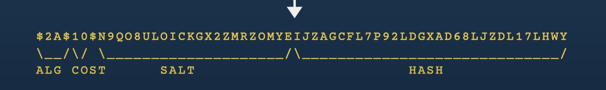
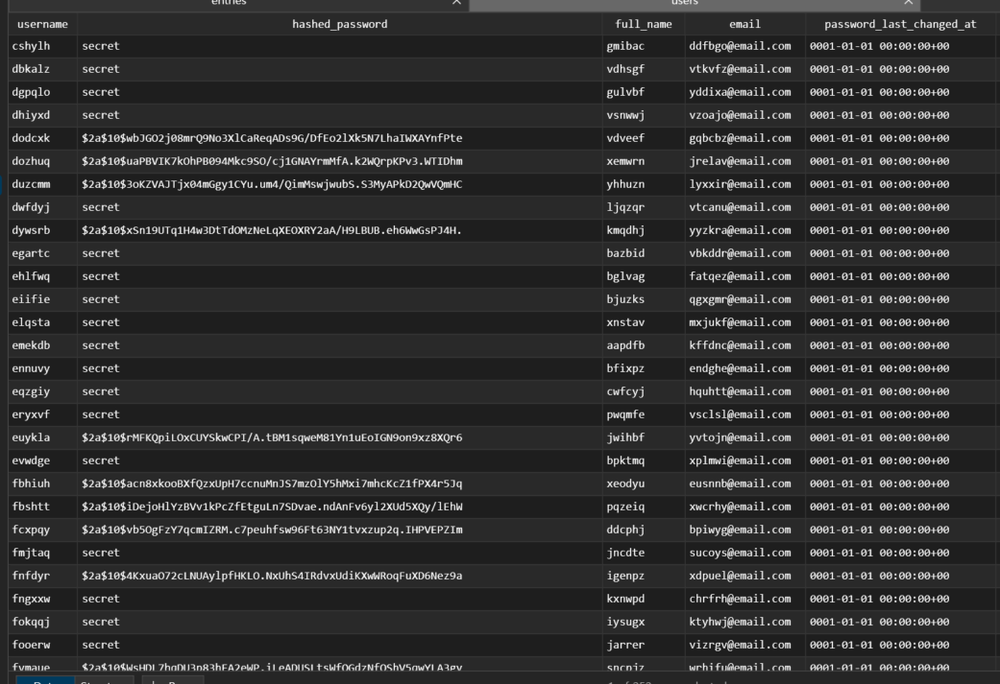
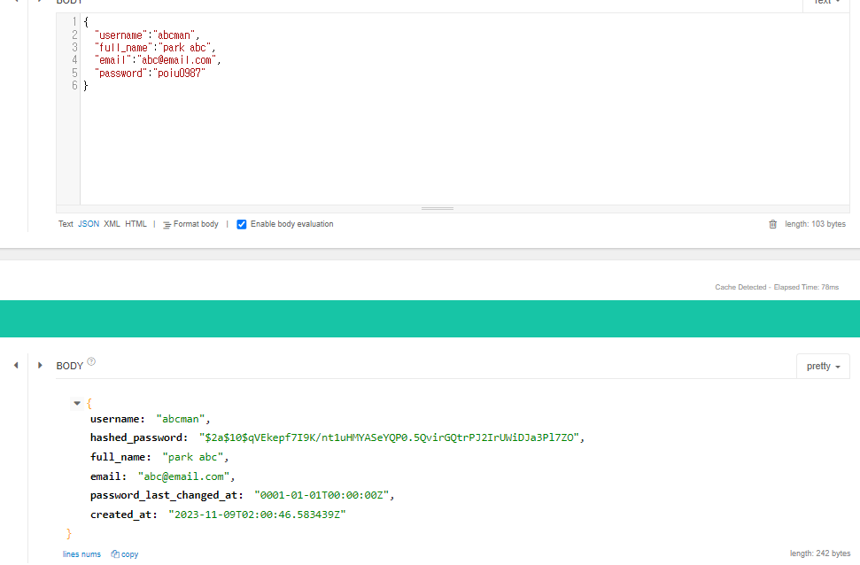

# 18. [BackEnd] password hash & implement request user api

## 학습 목표
---

비밀번호 해시

## 비밀번호 저장 방법
---

비밀번호는 평문으로 넣는 경우는 없습니다. bcrypt를 사용하여 해시 합니다.

매개변수로 라운드 수, 알고리즘 반복 수 등이 필요합니다.

무작위 솔트 기능도 제공하여 레인보우 테이블 공격에 대응이 됩니다. 이 솔트가 해시 문자열에 포함되어서 생성되기에 보안이 강화됩니다.




`ALG` : 알고리즘 식별자, bcrypt 알고리즘은 `2A`라고 하네요.

`COST` : 10이라면 2^10회의 키 확장 라운드가 있다는 의미

`SALT` : 16바이트이고 128비트인 솔트 22자의 문자열을 base64 형식으로 인코딩된다.

`HASH` : 31글자 24바이트 값


로직은 

저장 로직 >> 비밀번호 입력 > cost, salt 적용해서 저장

비밀번호 비교 >> 비밀번호 입력 > cost, salt 적용, 저장된 비밀번호와 비교

## golang에서 적용
---

```go
func HashPassword(password string) (string, error) {
	hashPassword, err := bcrypt.GenerateFromPassword([]byte(password), bcrypt.DefaultCost)
	if err != nil {
		return "", fmt.Errorf("[ERR] FAILED TO HASH PASSWORD:%w", err)
	}
	return string(hashPassword), nil
}

func CheckPassword(password string, hashedPassword string) error {
	return bcrypt.CompareHashAndPassword([]byte(hashedPassword), []byte(password))
}
```

bcrypt 패키지에 다 들어있기 때문에 그거 사용하면 됩니다.

### 테스트 코드 변경

```go
func createRandomUser(t *testing.T) User {
	hashedPassword, err := util.HashPassword(util.RandomStr(6))
	require.NoError(t, err)
	arg := CreateUserParams{
		Username:       util.RandomOwner(),
		HashedPassword: hashedPassword,
		FullName:       util.RandomOwner(),
		Email:          util.RandomEmail(),
	}
	.
	.
	.
}
```

만들어둔 함수를 사용해서 비밀번호를 적용합니다.



잘 저장되는 모습


```go
func TestPassword(t *testing.T) {
	password := RandomStr(6)

	// 올바른 비밀번호 체크
	hashPassword1, err := HashPassword(password)
	require.NoError(t, err)
	require.NotEmpty(t, hashPassword1)

	err = CheckPassword(password, hashPassword1)
	require.NoError(t, err)

	hashPassword2, err := HashPassword(password)
	require.NoError(t, err)
	require.NotEmpty(t, hashPassword2)
	require.NotEqual(t, hashPassword1, hashPassword2)
}
```

같은 비밀번호를 해시 했을 때 다른 해시 값이 저장됨을 확인하기도 했습니다.

어떤 동작 원리가 있나요?

무작위 솔트 때문에 생성된 해시 값이 매번 달라진다고 합니다.

## create user API 생성

```go
type CreateUserRequest struct {
	Username string `json:"username" binding:"required,alphanum"`
	Password string `json:"password" binding:"required,min=6"`
	FullName string `json:"full_name" binding:"required"`
	Email    string `json:"email" binding:"required,email"`
}
```

특이한 부분이 몇가지 있습니다.

`alphanum` : 아스키코드상 알파벳과 숫자만 가능하도록 제한하는 바인딩입니다.

`email` : 이메일 문자열인지 확인하는 태그입니다.

[여기](https://github.com/go-playground/validator)에서 다양한 태그들을 만나볼 수 있다.


```go
func (server *Server) createUser(ctx *gin.Context) {
	var req CreateUserRequest

	// 입력값 유효성 검사
	if err := ctx.ShouldBindJSON(&req); err != nil {
		ctx.JSON(http.StatusBadRequest, errorResponse(err))
		return
	}

	hashedPassword, err := util.HashPassword(req.Password)
	if err != nil {
		ctx.JSON(http.StatusInternalServerError, errorResponse(err))
		return
	}

	// 인자 생성
	arg := db.CreateUserParams{
		Username:       req.Username,
		HashedPassword: hashedPassword,
		FullName:       req.FullName,
		Email:          req.Email,
	}

	// 유저 생성
	user, err := server.store.CreateUser(ctx, arg)
	if err != nil {
		if pqErr, ok := err.(*pq.Error); ok {
			switch pqErr.Code.Name() {
			case "unique_violation":
				ctx.JSON(http.StatusForbidden, errorResponse(err))
				return
			}
		}
		ctx.JSON(http.StatusInternalServerError, errorResponse(err)) // 서버 에러
		return
	}

	// 성공 시
	ctx.JSON(http.StatusOK, user)
}
```

그냥 하던대로 api 만들 수 있었고 다른 코드와 신경써야 하는 부분은 users 테이블에는 2개(username,email)의 unique 제약조건이 있기 때문에 해당 조건에 대해서 403 처리를 해주는 코드를 작성해야 하는 점이다.

마지막으로 server.go에 api 등록만 하면 된다.



등록하고 api 쏘면 잘된다! 근데 해시 비밀번호가 노출되니 이를 제거해야 할 필요가 있다.

1. 아래와 같이 정의하고

```go
type CreateUserResponse struct {
	Username              string    `json:"username"`
	FullName              string    `json:"full_name"`
	Email                 string    `json:"email"`
	PasswordLastChangedAt time.Time `json:"password_last_changed_at"`
	CreatedAt             time.Time `json:"created_at"`
}
```

2. 응답하는 코드를 수정하면 된다.


```go
{
	.
	.
	.
	res := CreateUserResponse{
		Username:              user.Username,
		FullName:              user.FullName,
		Email:                 user.Email,
		PasswordLastChangedAt: user.PasswordLastChangedAt,
		CreatedAt:             user.CreatedAt,
	}
	// 성공 시
	ctx.JSON(http.StatusOK, res)
}
```

이로써 응답값도 원하는 값만 보낼 수 있는 것을 확인했다.