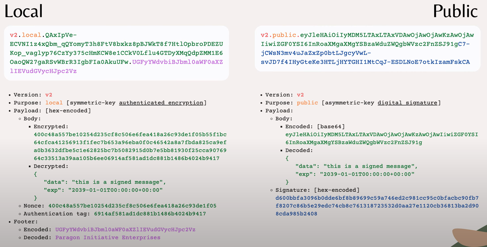

# 20. [BackEnd] PASETO

요즘 JWT가 유행이다. 근데 보안 문제가 발견되어 JWT보다 PASETO를 사용하려 한다.

## 토큰 기반 인증
---

1. [클라이언트]아이디와 패스워드로 로그인 요청

2. [서버] 아이디 패스워드 검증하고 토큰 서명(액세스 토큰)해서 200 ok 응답이랑 함께 클라이언트로 응답

3. [클라이언트] 액세스 토큰을 갖고 서버의 자원에 요청

4. [서버] 토큰 유효성검사하고 유효하다면 200 ok 응답

## JWT
---

JSon Web Token은 토큰 헤더, 페이로드, 시그니처로 구성됩니다.

헤더를 디코딩하면 서명 알고리즘과 타입을 알 수 있습니다.

페이로드는 토큰에 관한 정보들이 담겨있습니다. 사용자 이름, 만료시간, 토큰 아이디가 담겨있습니다. custom해서 다른 정보를 담을수도 있습니다.

JWT 단점은 base64 인코딩으로만 되어 있습니다. 그냥 디코딩할 수 있습니다.

그래서 [여기](https://jwt.io/)에서 간단하게 디코딩할 수 있더라구요. 그리고 인코딩도 할 수 있습니다. 그러면 인가받지 않은 jwt를 만들어서 로그인할 수도 있겠네요.

.
.
.
아니요 ! 마지막 시그니처로 인해서 인가받지 않은 jwt는 서버에서 걸러줍니다.

### 알고리즘

대칭키, 비대칭키 알고리즘이 있고 다양한 표준이 있습니다.

### 문제점

1. 약한 서명 알고리즘이라는 것 - 이미 취약한 알고리즘도 사용할 수 있도록 함. > 잘 모르는 개발자는 모르고 사용하게 되어 보안에 취약

2. 잘못된 라이브러리 선택하면 위조가 쉬워짐 왜냐하면 토큰 헤더에 서명 알고리즘에 포함되기 때문

그래서 알고리즘 헤더를 위조하여 인증 우회하는 공격이 가능합니다.

## PASETO
---

Platform-Agnostic Security Tokens입니다.

### 장점

JWT 문제를 다 해결한다고 합니다.

1. 강력한 알고리즘 서명

PASETO는 서명 알고리즘이 정해져있고 버전만 선택하면 된다고 합니다.

AEAD 알고리즘을 사용해서 모든 데이터를 비밀키로 암호화하고 인증합니다.

2. 토큰을 위조하기 어렵습니다.

암호화 되어있기 때문

### 설명

4가지 부분으로 나눠져있는데 버전, 토큰의 목적 ( local, public ) 페이로드( 본문, Nonce값, 인증태그 ) footer,

footer는 없어도 됩니다.

이런식입니다.