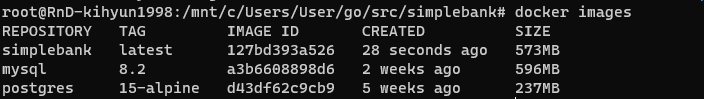

# 24. [BackEnd] 도커와 AWS 배포 - 1

## Git 브랜치 사용
---

Github를 사용할 때 master나 main에 바로 commit push하는 것이 아니라 테스트 브랜치에서 충분히 테스트 후 merge하는게 좋다고 합니다.

(그런데 불편함도 있어서 회사에서는 다양한 전략을 사용합니다.)


### 브랜치 생성 명령어

```bash
git checkout -b <브랜치명>
```

### [여담] 만약 Golang 버전이 업데이트 됐다면

1. go.mod에서 go version 변경

2. ci.yml 파일에서 go-version 변경


### Git commit 후 push

```bash
git add .
git commit -m "커밋메시지"
git push origin <브랜치명>
```


나오는 링크로 가서 pull request를 할 수 있습니다.

### Pull request란

pull request는 main으로 합치기 위한 과정입니다. merge가 main으로 합치는 것이라면 pull request는 merge전 심사입니다.


### Git Desktop

그런데 위 과정을 GUI로 할 수 있는 어플리케이션이 있는데 바로 Git Desktop입니다.


## Dockerfile 작성하기
---

### base image 다운로드

예를 들어 golang으로 개발한 어플을 배포하려면 go 이미지가 필요합니다.

[이곳](https://hub.docker.com/)에서 검색할 수 있습니다.


### 작성


```bash
FROM golang:1.21-alpine3.18
WORKDIR /app
COPY . .
RUN go build -o main main.go

EXPOSE 8080
CMD ["/app/main"]
```
`FROM` 은 위에서 찾은 기본 이미지 버전을 설정합니다.

`WORKDIR` 은 도커 내부의 현재 작업 디렉토리를 선언합니다.

`COPY` 명령어를 사용해서 필요한 모든 파일을 복사합니다. 첫 번째 값은 현재 폴더에 대한 값이고 `.`을 입력한다면 현재 root에서 시작하기 때문에 모든 하위 항목들을 복사합니다. 두 번째 값은 파일과 폴더가 복사되는 이미지 내부의 현재 작업 디렉토리 입니다. WORKDIR에서 설정한 값입니다.

`RUN`은 뒤에 작성한 명령어를 실행하는건데 지금 예시는 golang 파일을 바이너리로 만들어주는 명령어 입니다.

`EXPOSE` 포트 번호 지정할 수 있습니다. 근데 기능적인 지정은 아니고 그냥 이렇게 열린다는 알림만 하는 문서적인 역할만 합니다.

`CMD` 컨테이너가 시작할 때 실행할 기본 명령어

## 빌드
---

```bash
docker build -t simplebank:latest .
```

이름과 태그를 정해서 만들 수 있습니다. `이름:태그` 입니다.

```bash
docker images
```

를 통해서 만들어진 이미지를 확인할 수 있습니다.



그런데 이미지 크기가 너무 큽니다.

그러면 multistage로 빌드할 수 있습니다.

### multistage 빌드

```bash
# Build stage
FROM golang:1.21-alpine3.18 AS builder
WORKDIR /app
COPY . .
RUN go build -o main main.go

# Run stage
FROM alpine:3.18
WORKDIR /app
COPY --from=builder /app/main .

EXPOSE 8080
CMD ["/app/main"]
```

기존에 FROM한 이미지 이름을 지정해주고

Run stage를 만드는데 이 때 FROM은 build stage에서 사용한 리눅스 이미지를 사용해야 한다.

그리고 run stage에서 copy는 위에서 만든 ./app/main이라는 바이너리만 사용할 것이기에 저렇게 설정해 줍니다.

다시 위에서 했던 docker build하면 잘 생성이 됩니다.

### 지우는 방법

```bash
docker rmi <이미지 아이디>
```

같은 이름으로 또 생성하면 기존에 있던 이미지는 `<none>`으로 바뀝니다 그래서 지울 필요가 있습니다
