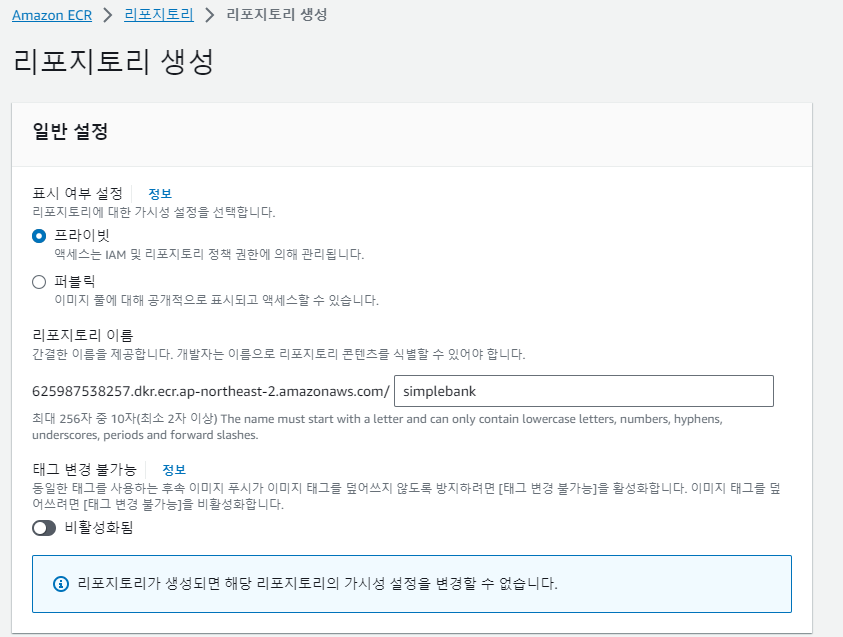
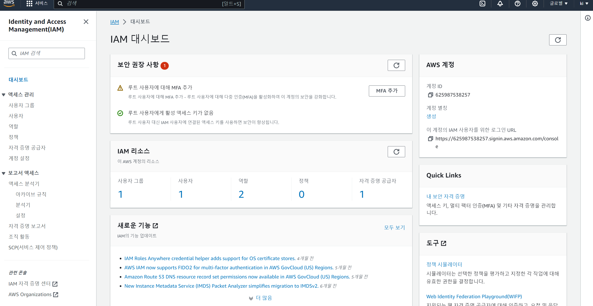

# 27. [BackEnd] GitHub Action으로 도커 이미지 AWS에 자동 빌드

## Elastic Container Registry
---


이미지 저장소를 위해 AWS의 Elastic Container Registry를 사용합니다.

지역은 서울로 변경하구요 


aws에 들어가서 Elastic Container Registry를 검색해서 들어간 다음에 새 저장소를 만듭니다.



특별한 설정을 하지 않고 생성합니다.


## ci.yaml 파일 변경
---

aws-cli를 사용해서 docker 이미지를 push하는 명령어는 있지만 github actions를 사용해서 자동 빌드하도록 하겠다고 하네요.

기존 ci.yaml은 test.yaml로 바꾸고 deploy.yaml을 만듭니다.

### check out

```yaml
      - name: ✅ Check out code
        uses: actions/checkout@v3
```


### AWS credential 설정

2가지 버전이 있는데 먼저 영상에서 소개하는 방법을 정리하겠습니다.

```yaml
      - name: Configure AWS credentials
        uses: aws-actions/configure-aws-credentials@v1
        with:
          aws-access-key-id: ${{ secrets.AWS_ACCESS_KEY_ID }}
          aws-secret-acess-key: ${{ secrets.AWS_SECRET_ACCESS_KEY }}
          aws-region: ap-northeast-2
```

AWS에 올리기 위해서 로그인을 해야하는데 로그인을 위한 credentials 설정입니다.

액세스 키와 비밀키를 받기 위한 여정을 떠나야 합니다.


1. AWS에서 검색 창에 IAM 검색해서 들어갑니다.



2. [사용자 생성하기] 사용자 > 사용자 생성 > 사용자 이름 작성 > 다음 > 그룹 생성 > 그룹 이름  > 권한 정책 검색(amazonEC2ContainerRegistryFullAccess) > 설정 후 사용자 그룹 생성 > 권한 정책 > 권한 경계를 사용하여 최대 권한 제어 활성화 > 다음 > 사용자 생성 > 액세스 키 만들기

3. [비밀키 생성하기] 저장소 > 설정 > Secret and variables > Actions

Environment secrets과 Repository secrets이 있습니다.

`Environment secrets`은 특정 환경에서만 사용 가능합니다. 테슽, 스테이징, 프로덕션 등 다양한 환경에서 다른 비밀키 갖고 싶을 때 사용

`Repository secrets`는 전체 저장소에서 사용 가능

4. [Repository secrets] New repository secrets를 클릭 > 이름 작성(AWS_ACCESS_KEY_ID,AWS_SECRET_ACCESS_KEY) > 값에 AWS 액세스 키 복붙


### AWS Login 설정

```yaml
      - name: Login to Amazon ECR
        id: login-ecr
        uses: aws-actions/amazon-ecr-login@v2
```


### Build 설정

```yaml
      - name: Build, tag, and push docker image to Amazon ECR
        env:
          REGISTRY: ${{ steps.login-ecr.outputs.registry }}
          REPOSITORY: simplebank
          IMAGE_TAG: ${{ github.sha }}
        run: |
          docker build -t $REGISTRY/$REPOSITORY:$IMAGE_TAG .
          docker push $REGISTRY/$REPOSITORY:$IMAGE_TAG
```

env.REPOSITORY는 ecr에서 만든 저장소 이름으로 하면 됩니다.

## 확인하기
---

ECR에서 만든 저장소에 들어가보면 이미지가 생긴 것을 알 수 있습니다.

