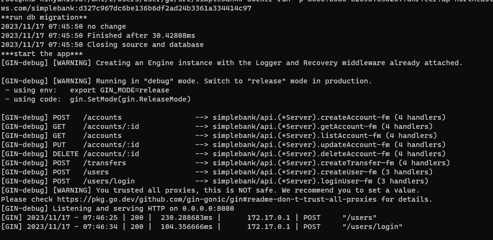

# 29. [BackEnd] AWS Secret Manager

## AWS Secret Manager
---

환경변수들을 깃허브 저장소에 저장하면 안전하지 않으니 사용해야 한다.

돈을 내야 한다고 하는데 저는 Other type으로 설정합니다.

app.env 환경 변수들을 모두 추가합니다.

TOKEN_SYMMETRIC_KEY 는 32자리 암호키인데 이는 openssl로 설정할 수 있다고 하네요

## symmetric key 설정
---

```bash
openssl rand -hex 64 | head -c 32
```


## 보안 암호 설정
---

그냥 만들면 끝

## app.env로 가져오기
---

이걸 하려면 aws cli를 설치해야 한다고 하네요.

### AWS CLI 설치

[여기](https://docs.aws.amazon.com/ko_kr/cli/latest/userguide/getting-started-install.html)에서 설치할 수 있습니다.

### 자격 증명 설정

```bash
aws configure
```

aws IAM에서 설정한 ACCESS KEY와 secret key 입력하라고 나옴

저는 생성할 때 저장해놓고 네이버 메일에 보내놨네요.

region은 ap-northeast-2

output format은 json으로 해서 설정하면 끝입니다.

경로는 `~/.aws/credentials`에서 확인할 수 있습니다.


### aws secret manager 사용

```bash
aws secretsmanager help
```

로 도움말 확인할 수 있다.

```bash
aws secretsmanager get-secret-value --secret-id simple_bank
```

이런식으로 했는데 안된다고 합니다. 권한 추가 해야합니다.

### 권한 추가

IAM > 사용자 그룹 > 권한 > 권한 추가 > SecretsManagerReadWrite 정책 연결

조금 기다리시면 될겁니다.

권한 추가를 하지 않더라도 ARN으로 입력하시면 됩니다.


### 조회

```bash
aws secretsmanager get-secret-value --secret-id simple_bank --query SecretString --output text
```

이렇게 하면 비밀 값을 json으로 조회할 수 있습니다.

근데 어떻게 이걸 받아올지..

jq를 사용한다고 한다.

### jq 설치

우분투에서는 아래 명령어로 설치할 수 있다.

```bash
apt-get install jq
```

사용법은 [이곳](https://jqlang.github.io/jq/manual/)에 있습니다.


### jq를 활용해서 json 만들기

```bash
aws secretsmanager get-secret-value --secret-id simple_bank --query SecretString --output text | jq 'to_entries'
```

위처럼 jq를 to_entries하면 json으로 받아와집니다.


아래 명령어는 키만 나오고

```bash
aws secretsmanager get-secret-value --secret-id simple_bank --query SecretString --output text | jq 'to_entries|map(.key)'
```

아래 명령어는 값만 나옵니다.

```bash
aws secretsmanager get-secret-value --secret-id simple_bank --query SecretString --output text | jq 'to_entries|map(.value)'
```

아래처럼 string format을 해서 app.env에 들어가는 값을 만들 수 있습니다.

```bash
aws secretsmanager get-secret-value --secret-id simple_bank --query SecretString --output text | jq 'to_entries|map("\(.key)=\(.value)")'
```

그리고 마지막으로 `.[]`를 추가하여 배열적인 부분을 제거할 수 있습니다.

```bash
aws secretsmanager get-secret-value --secret-id simple_bank --query SecretString --output text | jq 'to_entries|map("\(.key)=\(.value)")|.[]'
```

진짜 마지막으로 `-r` 옵션을 사용하여 따옴표를 제거합니다.

```bash
aws secretsmanager get-secret-value --secret-id simple_bank --query SecretString --output text | jq -r 'to_entries|map("\(.key)=\(.value)")|.[]'
```

이제 이 출력을 redirection 해서 app.env에 덮어쓰기 하는 것이 남았습니다.


### app.env에 덮어쓰기

app.env와 동일한 디렉토리에서 진행한다는 가정하에 아래 명령어를 사용하면 됩니다.

```bash
aws secretsmanager get-secret-value --secret-id simple_bank --query SecretString --output text | jq -r 'to_entries|map("\(.key)=\(.value)")|.[]' > app.env
```


## deploy.yaml 수정
---


```yaml
...
      - name: 📀 Load secrets and save to app.env
        run: aws secretsmanager get-secret-value --secret-id simple_bank --query SecretString --output text | jq -r 'to_entries|map("\(.key)=\(.value)")|.[]' > app.env
...
```

deploy.yaml에 위 부분을 추가합니다.

## 배포한 이미지 테스트
---


### ecr 로그인

자세한 설명은 [이곳](https://docs.aws.amazon.com/cli/latest/reference/ecr/get-login-password.html)에서 확인할 수 있습니다.


```bash
aws ecr get-login-password | docker login --username AWS --password-stdin <ECR 저장소 URL에서 뒤에 / 뒤에 뺀 부분>
```

### docker pull

```bash
docker pull <이미지 URL>
```

확인해볼 이미지 `URL`을 복사해서 붙여넣습니다. 태그가 아니라 **`URL`**


근데 바로 안될 것입니다.

start.sh에 아래 추가해줘야 합니다.

```bash
source /app/app.env
```

그래야 app.env 동기화된다.

### docker run

```bash
docker run -p 8080:8080 <이미지 URL>
```

이러면 원래 실행이 되야 합니다.

근데 저는 실행이 안됐었습니다.

```bash
docker: Error response from daemon: failed to create task for container: failed to create shim task: OCI runtime create failed: runc create failed: unable to start container process: exec: "/app/start.sh": permission denied: unknown.
```

이런 에러가 났었습니다.

Dockerfile을 수정해서 해결했습니다.

```bash
...
RUN chmod +x /app/start.sh
...
```

이 코드를 ENTRYPOINT하기 전전전에 넣어주니 해결했습니다.

