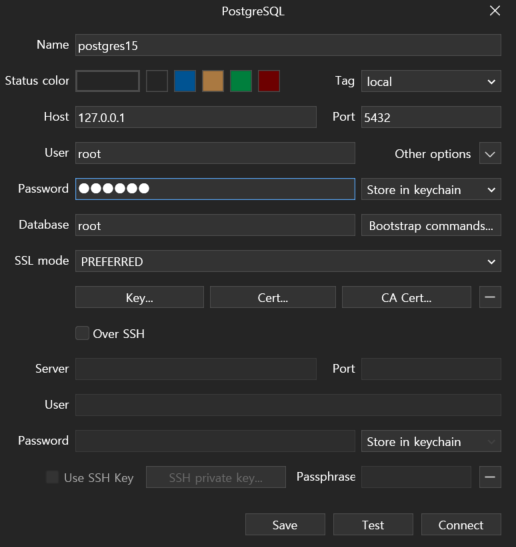

# 03. [BackEnd] Docker + Postgres + TablePlus


## Docker 설치
---

이전 게시물에서 함

## Postgres: Docker 이미지 다운로드
---

1. [여기](https://hub.docker.com/)에서 검색

2. docker official images를 다운로드

```bash
docker pull postgres:15-alpine
```

영상에선 `12-alpine`을 다운받았지만 일단 15로 다운해보기

**Docker pull Image 하는 법**

```bash
docker pull <이미지>:<태그>
```
3. 확인하기

```bash
docker images
```

## Postgres: Start a Container
---


### 실행 명령어 구조

```bash
docker run --name <컨테이너이름> -e <환경 변수 값> -p <호스트포트:컨테이너포트> -d <이미지>:<태그>
```

위의 법칙을 따라야함

### 예시 실행 명령어

```bash
docker run --name some-postgres -e POSTGRES_PASSWORD=mysecretpassword -d postgres
```

한 컨테이너에서 여러 이미지를 run 할 수 있다.


## Container Customize
---

### 환경변수에 대해서

문서에 나와있는 Environment Variables를 통해서 컨테이너를 Customizing 할 수 있다.

`POSTGRES_USER`: 접속 아이디 설정

`POSTGRES_DB`: db 이름 설정 / 디폴트 db 이름은 username과 동일하다.


### 실제 실행 명령어

```bash
docker run --name postgres15 -p 5432:5432 -e POSTGRES_USER=root -e POSTGRES_PASSWORD=secret -d postgres:15-alpine
```

### 실행한 것 확인

```bash
docker ps
```

여기까지하면 Postgres 서버는 준비가 됐다.


## Access to Postgres console
---

### Run command in container

```bash
docker exec -it <컨테이너이름 or 컨테이너아이디> <명령어> [args]
```

### 실제 코드

```bash
docker exec -it postgres15 psql -U root
```

:::tip 옵션 설명
`psql`: postgres 들어가는 명령어

`-U`: 로그인 아이디 옵션

`root`: root로 로그인
:::

### shell을 사용해서 진입

```bash
docker exec -it postgres15 /bin/sh
```

위 명령어로 진입하면 /bin/sh을 사용해서 postgres 서버에 직접적으로 명령어를 사용할 수 있습니다.


### 진입 시 비밀번호를 물어보지 않는 이유

기본적으로 postgres 컨테이너는 trust authentication locally라고 합니다.

그래서 localhost에서 연결할 때는 비밀번호 입력하지 않아도 된다고 하네요.

### 나갈때는

```bash
\q
```


## 로그 보기
---

### 로그 보는 명령어

```bash
docker logs <컨테이너이름 또는 컨테이너아이디>
```

## 도커를 멈추려면
---

### 멈추는 명령어

```bash
docker stop <컨테이너아이디 또는 이름>
```

### 멈춘거 확인

```bash
docker ps -a
```

`docker ps -a` 는 실행중이든 꺼져있든 모든 컨테이너 보여줌


## TablePlus

위는 어려운 방법이였다고 한다. TablePlus를 사용하면 쉬운 방법을 사용할 수 있다.

### 다운로드

[여기](https://tableplus.com/download)에서 다운로드 할 수 있다.

그리고 설치하기

### PostgreSQL로 설정




위처럼 설정한다. test 버튼을 누르면 연결 테스트를 진행한다.

### SQL 실행

SQL을 실행할 때 `ctrl+a`를 누르고 해야한다. 한 블럭씩 실행되기 때문이다.


