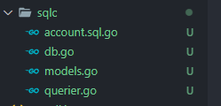

# 05. [BackEnd] Golang CRUD

## CRUD란

C는 Create

R은 Read

U는 Update

D는 Delete의 약자다.


## 사용할 수 있는 라이브러리

1. database/sql

빠르고 똑바르지만, 실수하기 쉽고 런타임 전에 에러가 안남

로우레벨임

2. gorm

CRUD 함수들 이미 구현되어있음 그래서 코드 짧아짐

단점은 gorm 함수들을 배워야한다는 점, 트래픽 많아지면 느리다.

3. SQLX

빠르고 배우기 쉬움

하지만 런타임 전에 에러가 안남

4. sqlc

쉽고 빠름 sql만 있어도 코드 자동 생성해줌

쿼리 에러도 빌드 전에 발견 가능

단점은 postgres만 지원한다.


## sqlc 설치

1. [여기](https://docs.sqlc.dev/en/latest/overview/install.html)로 이동

2. 설치 하기

```bash
sudo snap install sqlc
```

3. 설치 버전 확인

```bash
sqlc version
```

4. 초기화 하기

git init과 같음

```bash
sqlc init
```

[해당 경로](https://docs.sqlc.dev/en/latest/reference/config.html#version-2)에서 설정 파일 예시를 받을 수 있다.

```yaml
version: "2"
cloud:
  project: "<PROJECT_ID>"
sql:
- schema: "postgresql/schema.sql"
  queries: "postgresql/query.sql"
  engine: "postgresql"
  gen:
    go: 
      package: "authors"
      out: "postgresql"
  database:
    managed: true
  rules:
    - sqlc/db-prepare
- schema: "mysql/schema.sql"
  queries: "mysql/query.sql"
  engine: "mysql"
  gen:
    go:
      package: "authors"
      out: "mysql"
```

위에서 mysql은 당장은 사용하지 않을 것이니 mysql을 지운다.

:::tip 필드 설명
`schema`: single SQL 파일이 포함된 폴더 / migration 폴더 설정  
`queries`: SQL query파일을 포함하는 폴더  
`engine`: 엔진은 mysql 할지 postgresql 할지  
`gen`: 어떤 언어 사용할지  
`package`: db로 설정해야함
`out`: 어디에 out할지
`emit_json_tags`: DB Model 구조를 Json으로 가질지
`emit_interface`: 테스트에 사용
`emit_empty_slices`: 슬라이스를 반환
:::

완성된 설정파일은 아래와 같다.

```yaml
version: "2"
sql:
- schema: "db/migration"
  queries: "db/query"
  engine: "postgresql"
  gen:
    go: 
      package: "db"
      out: "db/sqlc"
      emit_json_tags: true
      emit_interface: true
      emit_empty_slices: true
```


지금은 query폴더 안에 쿼리가 없기 때문에 `sqlc generate` 해도 작동하지 않을 것이다.


## 쿼리 작성
---

### 설명

- `-- name: CreateAccount :one`

CreateAccount는 함수명이고 :one은 하나의 객체를 반환할 것이기에 :one을 사용한다.


VALUES (
    $1, $2, $3
)

```sql
INSERT INTO accounts(
    owner,
    balance,
    currency
) VALUES (
    $1, $2, $3
) RETURNING *;
```

- `INSERT INTO`

그냥 SQL

- `VALUES`

INSERT INTO안에 3개니까 VALUES안에도 3개

참고로 $1, $2, $3 이것들은 다 인자값이다.


- `RETURNING *;`

모든 칼럼을 반환한다. 왜쓰냐면 자동 생성되는 칼럼은 이렇게 안하면 반환이 안되기 대문


## sqlc generate하기

```yaml
sqlc:
	sqlc generate
```

Makefile에 위 명령어를 추가했다.

그리고 

```bash
make sqlc
```

하면 4개의 파일이 생긴다. 




### models.go

```go
// Code generated by sqlc. DO NOT EDIT.
// versions:
//   sqlc v1.23.0

package db

import (
	"time"
)

type Account struct {
	ID        int64     `json:"id"`
	Owner     string    `json:"owner"`
	Balance   int64     `json:"balance"`
	Currency  string    `json:"currency"`
	CreatedAt time.Time `json:"created_at"`
}

type Entry struct {
	ID         int64 `json:"id"`
	AccountsID int64 `json:"accounts_id"`
	// can be negative or positive
	Amount    int64     `json:"amount"`
	CreatedAt time.Time `json:"created_at"`
}

type Transfer struct {
	ID             int64 `json:"id"`
	FromAccountsID int64 `json:"from_accounts_id"`
	ToAccountsID   int64 `json:"to_accounts_id"`
	// must be positive
	Amount    int64     `json:"amount"`
	CreatedAt time.Time `json:"created_at"`
}
```

코드는 위처럼 생겼다. 생성한 테이블대로 나오고 json 태그도 있다.

`Amount` 필드는 위에 주석도 생긴다. 왜냐하면 예전에 note 설정을 해줘서


### db.go

```go
// Code generated by sqlc. DO NOT EDIT.
// versions:
//   sqlc v1.23.0

package db

import (
	"context"
	"database/sql"
)

type DBTX interface {
	ExecContext(context.Context, string, ...interface{}) (sql.Result, error)
	PrepareContext(context.Context, string) (*sql.Stmt, error)
	QueryContext(context.Context, string, ...interface{}) (*sql.Rows, error)
	QueryRowContext(context.Context, string, ...interface{}) *sql.Row
}

func New(db DBTX) *Queries {
	return &Queries{db: db}
}

type Queries struct {
	db DBTX
}

func (q *Queries) WithTx(tx *sql.Tx) *Queries {
	return &Queries{
		db: tx,
	}
}
```

이 파일은 DBTX 인터페이스가 포함돼있다.

트랜잭션 관련된 기능들이 있다고 하네요.


### account.sql.go

```go
// Code generated by sqlc. DO NOT EDIT.
// versions:
//   sqlc v1.23.0
// source: account.sql

package db

import (
	"context"
)

const createAccount = `-- name: CreateAccount :one
INSERT INTO accounts(
    owner,
    balance,
    currency
) VALUES (
    $1, $2, $3
) RETURNING id, owner, balance, currency, created_at
`

type CreateAccountParams struct {
	Owner    string `json:"owner"`
	Balance  int64  `json:"balance"`
	Currency string `json:"currency"`
}

func (q *Queries) CreateAccount(ctx context.Context, arg CreateAccountParams) (Account, error) {
	row := q.db.QueryRowContext(ctx, createAccount, arg.Owner, arg.Balance, arg.Currency)
	var i Account
	err := row.Scan(
		&i.ID,
		&i.Owner,
		&i.Balance,
		&i.Currency,
		&i.CreatedAt,
	)
	return i, err
}
```

package이름이 db인 것은 우리가 yaml파일에서 설정했기 때문이고

CreateAccount 함수는 query 폴더 안에 있던 파일의 쿼리를 함수화 한 것이다.

### go mod init

go mod init을 해줘야 한다.

근데 난 안해도된다. 왜냐하면 vs code 확장 프로그램을 설치했기 때문이다 !


## 읽기 하기
---

### 하나 읽기

```sql
-- name: GetAccount :one
SELECT * FROM accounts
WHERE id = $1 LIMIT 1;
```

첫번째 만나는 계정 하나만 리턴하는 것이다.

`LIMIT`을 사용하면 출력 수의 제한을 줄 수 있다.

### 여러개 읽기

```sql
-- name: ListAccounts :many
SELECT * FROM accounts
ORDER BY id
LIMIT $1
OFFSET $2;
```

여러개를 읽으려면 many를 사용한다

그리고 `LIMIT`과 `OFFSET`을 같이 사용했는데 `OFFSET`은 **시작 행**을 의미한다.

간단하게 풀어말하면 `OFFSET`부터 `LIMIT` 수만큼 반환하는거다.

`LIMIT`을 사용하는 이유는 페이징을 위해서이다.


`sqlc generate`하면 역시 accounts.sql.go가 업데이트 된다.

## 업데이트 하기
---


```sql
-- name: UpdateAccount :exec
UPDATE accounts 
SET balance = $2
WHERE id = $1;
```

`exec` 태그는 아무런 데이터도 반환하지 않는다.

업데이트된 값을 받아보고 싶다면 아래와 같이 작성하면 된다.

```sql
-- name: UpdateAccount :one
UPDATE accounts 
SET balance = $2
WHERE id = $1
RETURNING *;
```

그리고 sqlc generate하면 생성된다.


## 삭제 하기
---

```sql
-- name: DeleteAccount :exec
DELETE FROM accounts 
WHERE id = $1;
```

끝