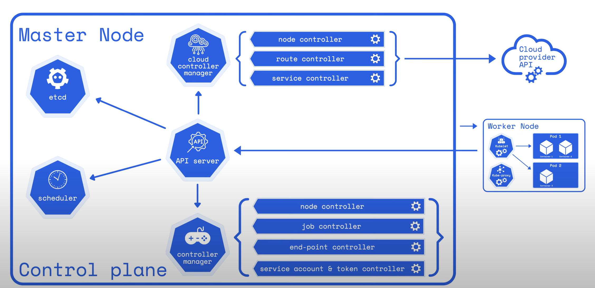
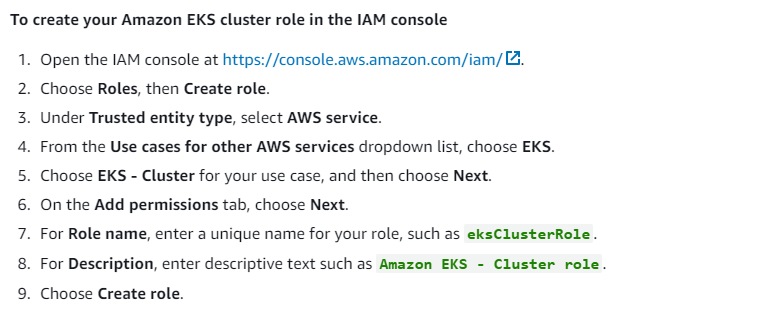

# 30. [BackEnd] 쿠버네티스 + EKS

## 쿠버네티스란
---

컨테이너화된 어플리케이션의 배포, 관리 드을 위한 오픈소스 컨테이너 조정 엔진

2개로 구성할 수 있습니다.

1. Worker Node

Worker Node에는 Kubelet이 있는데 쿠버네티스 Pod 내에서 제대로 실행되는지 확인하는 에이전트 입니다.

2. Master Node

Worker Node와 Pod를 관리

[대신 정리된 글](https://www.opsnow.com/%EC%BF%A0%EB%B2%84%EB%84%A4%ED%8B%B0%EC%8A%A4-%EC%9D%B4%ED%95%B4%ED%95%98%EA%B8%B0-3%EB%8B%A8%EA%B3%84/)

쿠버네티스 아키텍처 그림

## AWS EKS
---

쿠버네티스 아키텍처가 복잡해서 AWS EKS가 나옴.

따로 설치 없이 쿠버네티스를 이용할 수 있습니다.

## 클러스터 생성 및 워커 노드 추가
---

### 클러스터 생성

클러스터 > 

클러스터 추가(생성) > 

클러스터 이름, 버전 설정 > 역할 생성 ( 아래 사진처럼 ) > 

새로고침 후 추가한 역할로 설정 > 

(선택사항-암호화,태그설정) > 

VPC와 서브넷이 설정되어있어서 그냥 사용 > 

보안 그룹은 추후 설정 >

클러스터 엔드포인트 접근 설정은 public & private >

control plane logging은 실제 제품에서는 사용하는 것이 좋음 > 

추가 기능은 기본 세팅으로 > 생성 끝.

### 워크 노드 추가

EKS - 클러스터 - 클러스터이름 > 

노드 그룹 > 노드 그룹 추가 > 이름 설정

노드 IAM 역할 추가 ( 이거 하려면 새 IAM 역할 추가해야 한다. )

    [새 IAM 역할 추가] 역할추가 > AWS Service > EC2 > 권한 추가 >
    `AmazonEKS_CNI_Policy`(worker node의 IP 주소 수정 가능),

    `AmazonEKS_WorkerNodePolicy`(worker node가 EKS에 연결 가능),

    `AmazonEC2ContainerRegistryReadOnly`(ECR에 접근 가능)

    태그 추가(선택사항이라 패스) > 

    노드 이름 설정 > 생성완료 >

지금은 모두 패스 >

노드 그룹 컴퓨팅 구성 (AMI 유형 = 아마존 리눅스2) > 그리고 인스턴스와 디스크 크기 설정 >

노드 그룹 수는 1 1 2로 설정 > 다음 다음 하면 생성 끝

## 스케일링 up과 스케일링 down
---

노드 그룹에서 수정하면 된다.