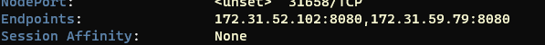

# 32. [BackEnd] EKS 쿠버네티스 클러스터에 배포

## 배포 파일 예시

```yaml
apiVersion: apps/v1
kind: Deployment
metadata:
  name: nginx-deployment
  labels:
    app: nginx
spec:
  replicas: 3
  selector:
    matchLabels:
      app: nginx
  template:
    metadata:
      labels:
        app: nginx
    spec:
      containers:
      - name: nginx
        image: nginx:1.14.2
        ports:
        - containerPort: 80
```

:::tip
`apiVersion`: api 버전
`kind`: 종류

`metadata`: 메타데이터 정의
  `name`: 이름, 키 발류라고 하는데..
    `labels`: 레이블
      `app`: ...

`spec`: 주요 사항
  `replicas`: 복제본 수
  `selector`: pod 선택기 지정
    `matchLabels`: 모든 pod들이 이 배포에 의해 관리된다는 뜻
      `app`: 배포 이름

`template`: 템플릿, 메타데이터에 동일한 데이터 추가해야 함.
  `metadata`: 메타데이터
    `labels`: 레이블
      `app`: 이름

`spec`: pod 스펙
  `containers`: 컨테이너에 배포하는 방법 알려줌
    `name`: 컨테이너 이름
    `image`: 이미지 URL (ECR에 있다)
    `ports`: 컨테이너 포트번호 설정
      `containerPort`: 포트번호
:::


## 개체 위치 지정
---

```bash
kubectl apply -f <파일>
```

지정 후 k9s를 사용해서 Pods와 nodes를 확인해보면 node의 인스턴스 유형 때문에 pod 수 제한이 걸려서 배포할 수 없습니다.

인스턴스 유형을 변경해야 합니다.


## 노드 그룹 인스턴스 유형 변경
---

사실 그런거 없고 노드 그룹 제거 후 다시 생성해야 합니다.


다시 생성 후 다시 파일 설정 해주면 정상작동합니다.


## service.yaml
---

[이곳](https://kubernetes.io/ko/docs/concepts/services-networking/service/)에서 예시 파일을 가져올 수 있었습니다.

```yaml
apiVersion: v1
kind: Service
metadata:
  name: my-service
spec:
  selector:
    app.kubernetes.io/name: MyApp
  ports:
    - protocol: TCP
      port: 80
      targetPort: 9376
```

:::tip
`apiVersion`: API 버전
`kind`: 종류
`metadata`: 메타데이터 저장
  `name`: 이름
`spec`: 서비스 사양
  `selector`: pod 선택기 
    `app`: 이름
  `ports`: 포트 설정
    `protocol`: 프로토콜
      `port`: 들어오는 포트번호
      `targetPort`: 요청 컨테이너 포트
:::

### 배포하기

```bash
kubectl apply -f eks/service.yaml
```

그런데 이렇게 하면 외부에 배포가 안됩니다.

수정해야함.

```yaml
type: LoadBalancer
```

맨 밑에 이거 추가해줘야함


그렇게 다시 배포하고 k9s를 통해서 service를 확인해보면 External ip가 추가된 것을 알 수 있습니다.

이를 다시 확인해보려면

```bash
nslookup <external IP>
```

잘 동작합니다. 이를 이용해서 API Request를 보내도 잘 작동합니다.


## 레플리카 늘리기
---

현재 서비스를 보면 하나의 endpoint에서 api를 받고 있습니다.

2로 늘린 후 확인해봅니다.

그러면 pod가 2개로 늘어납니다.

