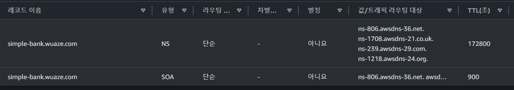

# 33. [BackEnd] 무료 도메인 Route53 사용

aws에 route53이 있습니다.

근데 돈을 내야 사용할 수 있습니다.

그래서 무료 도메인을 만들고 Route53으로 등록하는 방법을 선택합니다.

[여기](https://www.infinityfree.com/)에서 무료 도메인을 만들 수 있습니다.

## 방법
---

Route53 > 호스팅 영역 > 호스팅 영역 생성 > 도메인 이름(위에서 만든 무료 도메인 넣기) 그리고 생성하기 누르면 끝...

## simple bank를 위한 추가 설정

여기서 NS는 Name Server의 약자다.

SOA 는 Start Of Authority 다. 근데 이거말고 우리는 A라는 레코드 추가해야한다.

### 추가

레코드 생성 > 레코드 이름(api)설정 > 레코드유형(A) 설정 > IP는 Alias를 사용 > Alias to Network Load Balancer 설정 > 지역 : ap-어쩌구.. 설정한 지역으로 > 네트워크 load balancer에는 우리 Load Balancer URL로 설정 > 생성하기 버튼 클릭

근데 잘 안되서 쿠버네티스 AWS 관련 학습은 여기까지 하려 한다.