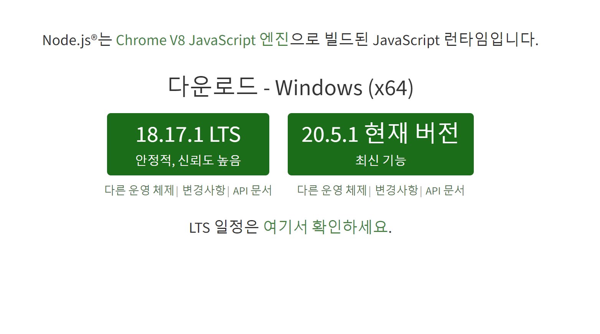

# 🚀Node JS + yarn 설치하기

## Node JS 설치
---

가장 먼저 할 일은 Node JS를 설치하는 것입니다.

Node JS 설치 URL은 **[여기로](https://nodejs.org/ko)** 들어가셔서 쉽게 설치하실 수 있습니다.

들어가보시면 아래와 같은 사진이 나오는데 LTS 버전을 다운로드 하시면 됩니다.



LST는 `Long Term Support`의 약자로 안정적인 버전을 의미합니다!

다운로드 받은 파일을 더블클릭하여 실행해서 계속 `Next`합니다. (중간에 체크해야할 것 같은 것도 그냥 넘깁니다.)

그렇게 `Install` 버튼이 나올 때까지 `Next`하고 `Install`버튼이 나오면 눌러서 설치해주면 설치 끝!!

마지막으로 `윈도우키(솔직히 이건 알잖아요)`를 누르고 `cmd`를 검색한 후 엔터를 눌러서 실행해줍니다.

```powershell title='cmd'
node -v
```
위 명령어를 입력하면

```
v18.17.1
```
이라고 나올겁니다 ! 그럼 Node JS 설치 완료🎉

설치 버전에 따라 숫자는 달라질 수 있습니다. 영어 문장으로 어쩌구 저쩌구하지만 않으면 첫 시작은 잘 마무리 됐습니다.

### 🧐Node JS를 설치한 이유

node js를 설치했다면 npm도 같이 설치되는데 이 툴을 통해서 다양한 라이브러리를 쉽게 설치할 수 있답니다!

```powersh title='cmd'
npm -v
```
위 명령어를 통해서 npm 설치 버전을 확인할 수 있답니다.


## yarn 설치하기
---

```powershell title='cmd'
npm install -g yarn
```

yarn 설치도 cmd 창에서 진행되는데요.

설치 확인 방법도 Node js 설치 확인 방법과 비슷합니다.

```powershell title='cmd'
yarn --version
```

cmd창에 위 명령어를 입력하시면 됩니다!

저는 1.22.19 버전을 사용하고 있다고 나오네요 !

### 🧐 yarn 설치 이유

yarn은 정말 여러가지로 사용합니다 !

npm과 같은 기능을 하면서 더 빠르고 보안 기능이 추가된 버전이라고 생각하시면 됩니다 !

앞으로의 글에서도 주로 yarn을 사용할 예정이니 꼭 설치해주세요~!  
(npm을 사용하시는 것을 말리진 않지만 난이도가 올라갑니다.)

