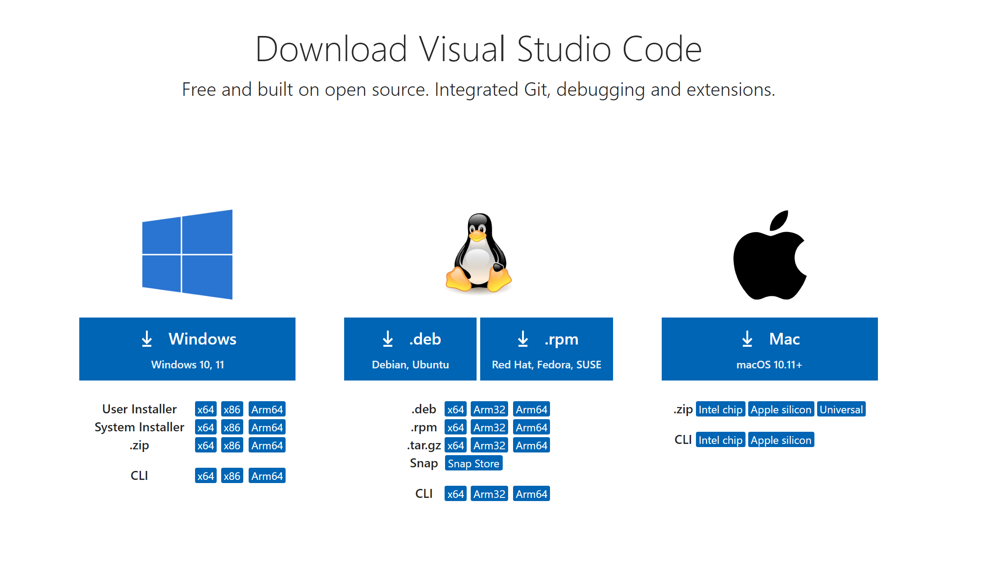
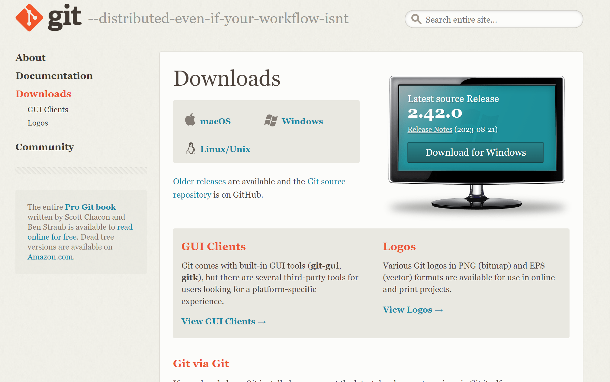
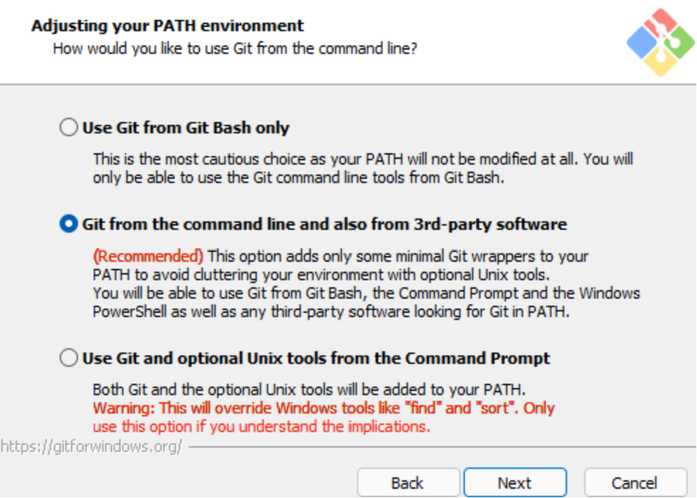

# 💻사용할 프로그램들 설치

## ViSual Studio Code 설치
---

**[여기로](https://code.visualstudio.com/download)** 들어가시면 쉽게 다운로드 하실 수 있습니다!

링크에 들어가시면 위 사진 같은 페이지가 나옵니다 !

컴퓨터 운영체제에 맞게 설치해주시면 됩니다~!

### 😎Visual Studio Code는 언제 사용할까?

Visual Studio Code는 IDE라고 `Integrated Development Environment`의 약자입니다.

근데 그냥 `코딩 툴`이라고 생각하시면 됩니다 !

코딩 안하는 걸로 알고 있었는데 왜 설치하냐구요?

코딩 하셔야해요😊 근데 다 알려드릴거에요.. 인터넷이 !!  
(코딩이라기 보다는 그냥 블로그 작성 정도로 생각하시면 됩니다. ㅎㅎ)

## Git Bash 설치
---

Git Bash는 **[여기에서](https://git-scm.com/downloads)** 설치하실 수 있으세요~

이런 화면이 나오실거에요 ! 역시 운영체제에 맞게 설치해주시면 됩니다.

설치된 파일을 더블 클릭하시고 계속 `Next` 하시다가 밑에 사진에서 멈춰주세요 !

저기 있는 Recommended를 꼭 체크✅해주세요 !

꼭 체크해주셔야 나중에 안 귀찮습니다!

### 😎Git Bash는 언제 사용해요?

Bash를 사용할 수 있도록 해주는 프로그램입니다 !

방금 전에 설치했던 yarn을 통해 build를 하거나 deploy 등을 하게 될텐데 bash를 통해서 해야 합니다!

그 때를 위하여 일단 미리 설치해 둡시다~  
(미리 설치해야 나중에 편해요 ㅎㅎ)