# 😺Git Hub로 배포하기 - 1

## 배포가 뭔데요?
---

배포란.. 전 게시물에서 도큐사우루스 설치한걸 `yarn start`로 실행하면 여러분은 볼 수 있잖아요?

근데 저는 그걸 못 봐요 !

블로그가 무슨 개인 일기장도 아니고 다른 사람들한테 자랑도 하고 소개도 하고 그러고 싶잖아요?

그래서 인터넷에 배포를 해줘야 다른 사람들도 볼 수 있습니다 !

단어적인 지식을 하나 드리자면 여러분의 도큐사우루스는 지금 `로컬에서 실행 중이다~`라고 할 수 있겠네요


## Git Hub란?
---

코드 저장소 및 개발자들 커뮤니티입니다^^

먼저 Git Hub 회원가입을 진행해주세요 !

이 **[링크](https://github.com/)**에서 `Sign up` 버튼을 누르고 진행하실 수 있습니다.

회원가입은 언제나 귀찮은 일이지만 그래도 꼭 해보세요 ! 간단합니다~

## Git Hub 저장소 만들기

회원가입을 다 하셨다면 배포할 코드를 담을 저장소를 만들겁니다 !

Git Hub에선 `Repository`라고 부르니 기억해주세요 !

<br/>

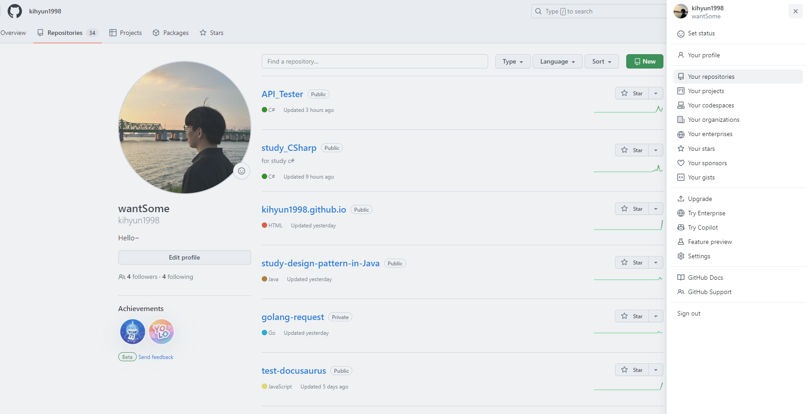
위 사진 처럼 우측 프로필을 누르시면 오른쪽 사이드바가 나옵니다.

그리고 `Your Repositories`를 클릭하여 여러분의 저장소가 있는 곳으로 이동해주세요!

그러면 저처럼 저런 화면이 나올겁니다. 저기서 초록색 `New`버튼을 클릭해주시면 저장소를 만들 수 있어요

<br/>

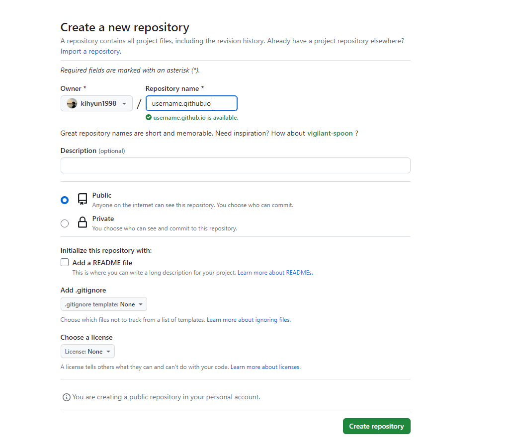

들어가면 위와 같은 화면이 나오는데 저장소 이름은
```bash title='저장소 이름'
[유저이름].github.io
```
로 작성해주시면 됩니다.

`유저이름(username)`을 모르겠시겠으면 옆에 Owner글씨 밑에 보이시죠?
제 경우에는 `kihyun1998`이라고 써있는데 이게 여러분의 유저 이름입니다.

저는 원래 `kihyun1998.github.io`로 만들었어야 하지만 이미 만들었기에 그리고 이해를 돕기 위해 `username.github.io`로 만든겁니다 ! 오해하지마세요 !!!

<br/>

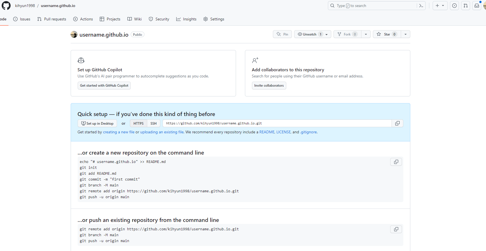
그러면 ~~~~ 짜잔 !! 이렇게 나오게 되는데요! 

첫 Git Hub Repository를 만드신 것을 축하드려요~😀

아직 아무런 코드도 넣지 않아서 코드를 넣는 방법에 대해 소개해주는 화면을 만났어요 ! 이제 코드를 넣어보러 갈까요?


<br/>

## Git Desktop 설치
---

여러분이 한 가지 더 설치해주셔야 할게 있습니다.

사실 없어도 되는데 있으면 아주 좋은 프로그램이에요.

**[여기에서](https://desktop.github.com/)** 다운로드 받으실 수 있습니다!

이제 이런거 자세히 안알려줘도 되죠? ㅎㅎ

<br/>

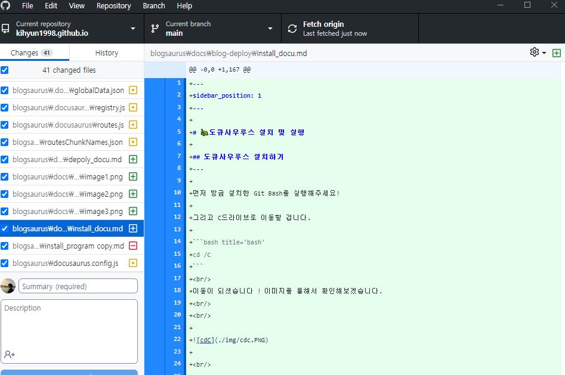
이런 비슷한 화면을 보실거에요!

## 저장소 Clone 하기
---

자 우리가 만든 저장소를 clone 해볼건데요~

clone한다는 것은 음... 연결한다? 사실 복사한다는 의미가 더 크긴한데 Git Hub 저장소와 내 파일 탐색기의 폴더와 연결한다고 생각하시면 됩니다 !

어떻게 하냐구요? 진짜 쉬워요.
<br/>

1. File > Clone repository 누르기
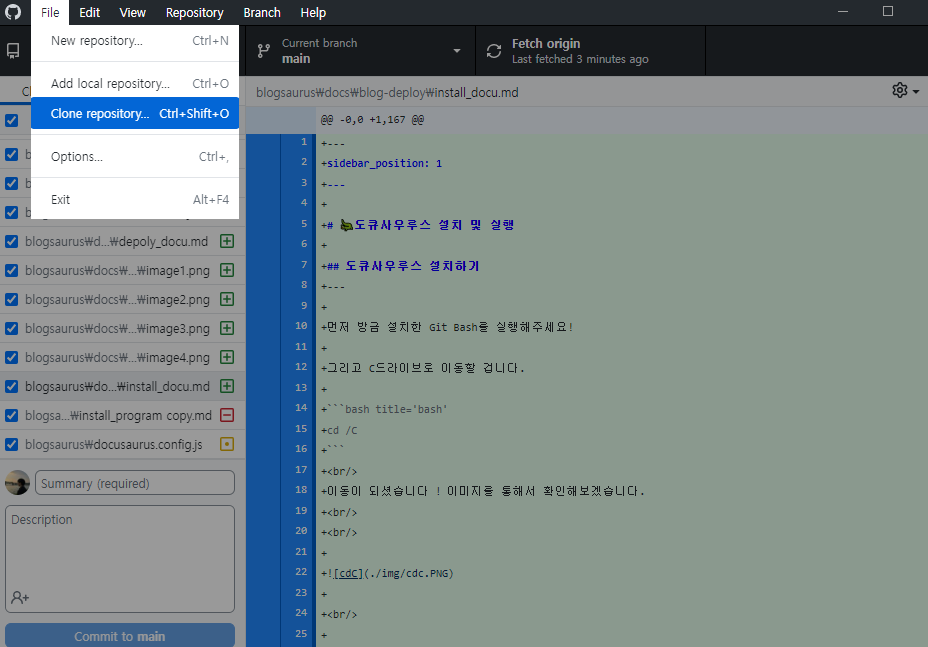
<br/>

2. 눌러서 나오는 화면에 아까 만든 저장소 찾아서 클릭하고
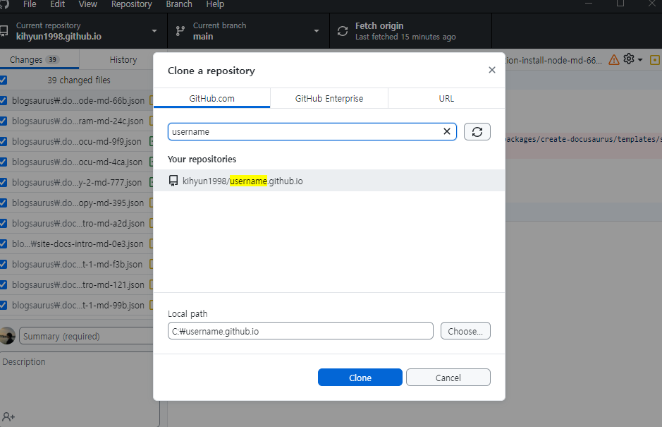
<br/>

3. 경로는 C드라이브 밑에 ! 하는게 간단해서 좋더라구요. 다하구 Clone버튼 클릭하면 끝.

해당 경로로 가보시면 만든 저장소 이름으로 하는 폴더가 생겼을거에요.
<br/>

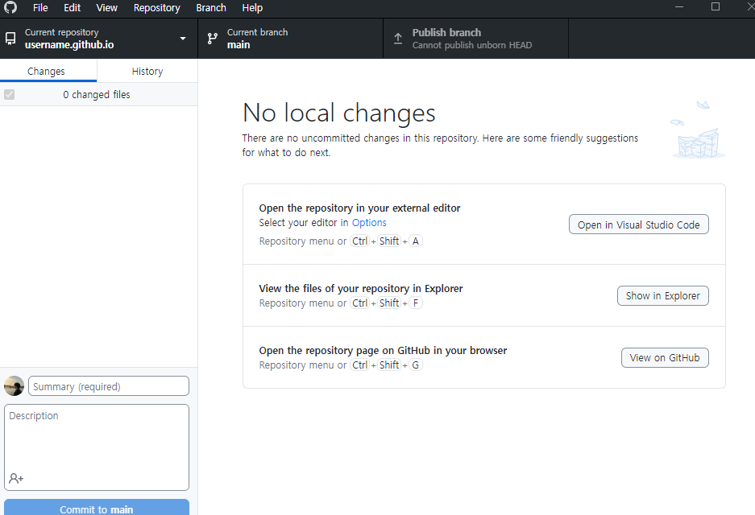
클론이 잘 됐다면 위 화면이 나올겁니다!

## 설치한 도큐사우루스 파일 push하기
---

저번 게시글에서 설치한 도큐사우루스 파일 기억하시죠?
<br/>

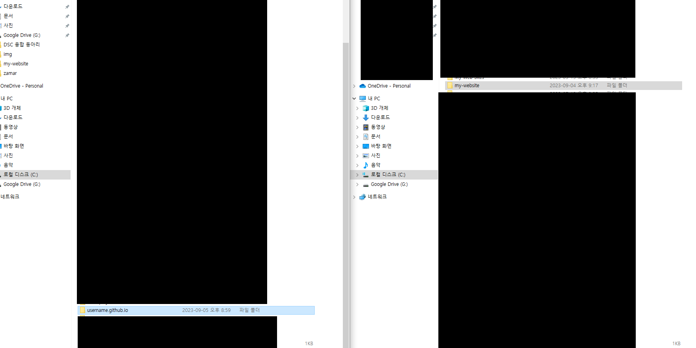
파일 탐색기 2개를 양 옆으로 띄우셔서 C드라이브로 가줍니다!

그러면 **도큐사우루스 설치한 폴더(오른쪽)** 그리고 방금 clone한 **Git Hub 저장소 폴더(왼쪽)**이 보이실텐데요 !

그냥 간단합니다. 

1. 도큐사우루스 폴더를 클릭

2. Ctrl + c **(복사)**

3. Git Hub 저장소 폴더 클릭

4. Ctrl + v **(붙여넣기)**

그러면 반은 왔어요 ! 복사 시간이 좀 오래걸릴 뿐이에요 ㅎㅎ
<br/>

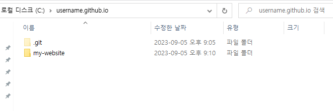


push하는 것도 간단합니다. Git Desktop을 보실까요?
<br/>

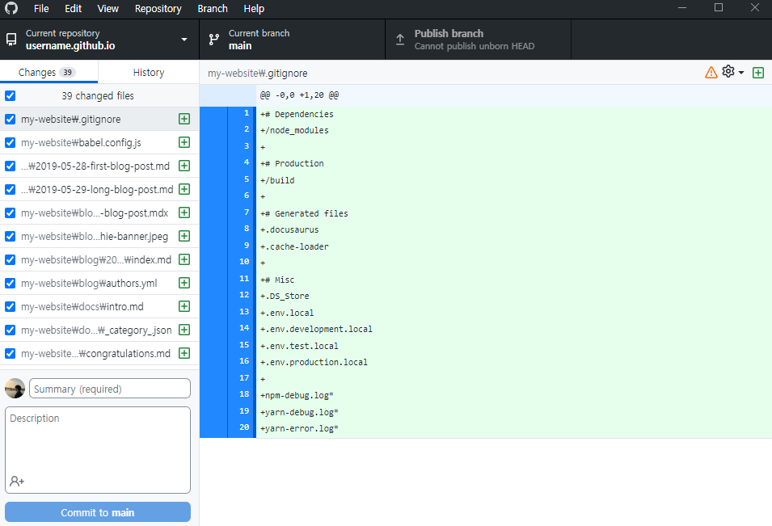
뭔가 겁나게 많아졌죠?

이제 여러분이 할거는 push하기전에 commit이란 걸 해야해요 !
<br/>

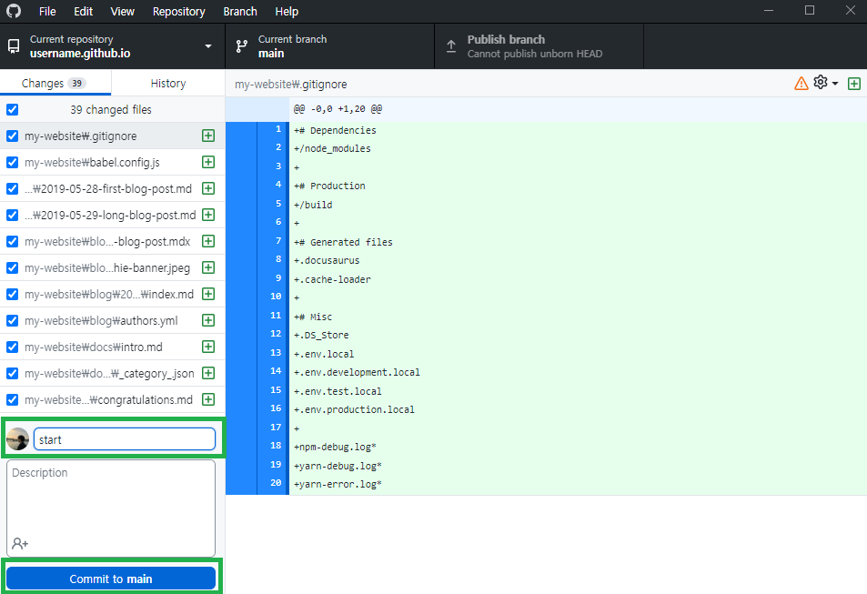
이미지를 통해 보시면 저기 위의 입력칸이 commit 메시지를 적는 칸이고 밑에 버튼을 누르면 commit이 됩니다.

<br/>

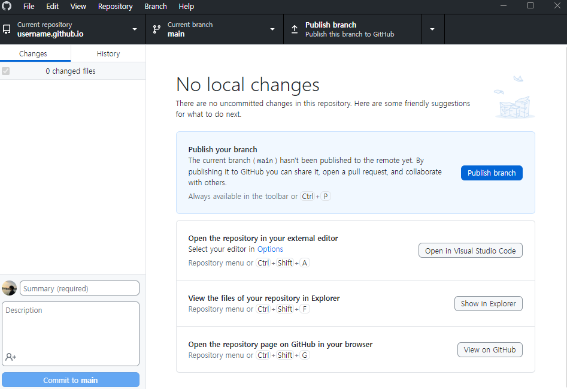
누르면 위처럼 Publish branch라는 버튼을 누르고 싶게 만들어놨는데 그걸 누르시면 됩니다.

누르면 `push`가 되는데요 첫 `push`만 `Publish branch`라고 알고 계시면 됩니다! 다음부턴 `push`라고 나올거에요

<br/>

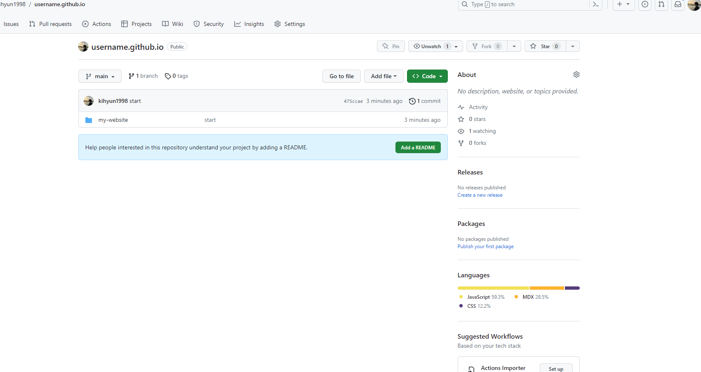
아까 만든 Git Hub 저장소 페이지에 가시면 이렇게 추가된 것을 볼 수 있답니다!

## 배포 끝?
---

배포가 끝났냐구요? 아니요~ 이제 시작이요 ㅎㅎ 

글이 너무 길어지니까 다음 게시글에서 배포 방법 마무리하도록 하겠습니다 !