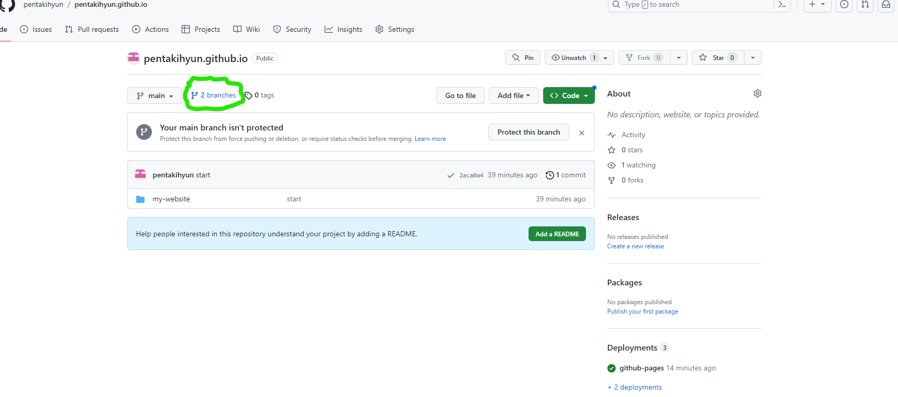
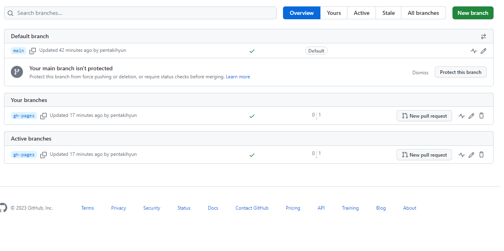
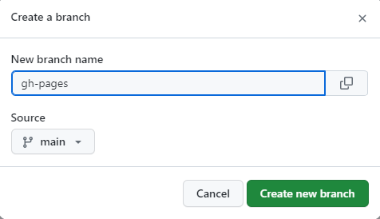
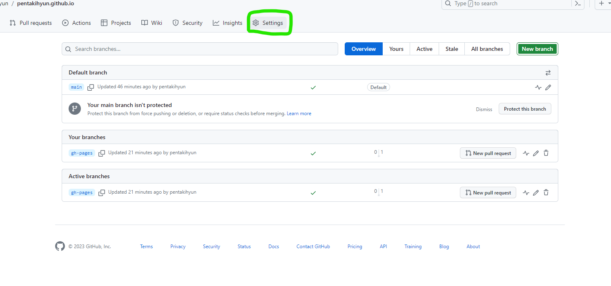
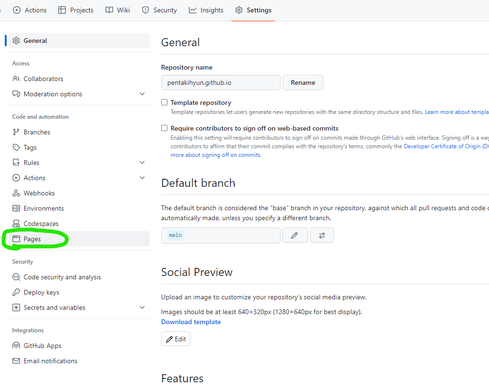
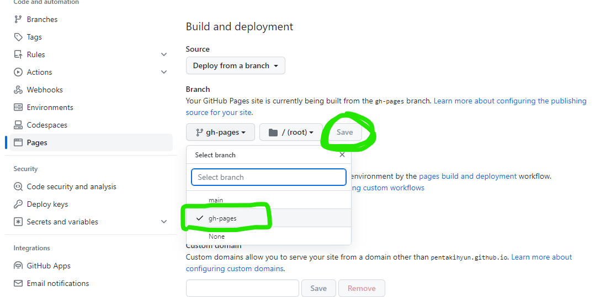

# 😸Git Hub로 배포하기 - 2

## 설정 파일 수정
---

배포하기 위한 첫 번째 시련입니다.

사실 어렵지 않구요.

저희가 설치한 docusaurus 폴더를 `VS Code`에서 열어볼까요?

`초기 환경 설정` > `사용할 프로그램들 설치` 게시글에서 설치하는 방법을 다뤄봤던 프로그램입니다 
<br/>


실행하시고 File > Open Folder 누르시면 폴더 선택할 수 있게 나옵니다 !

우리가 설치했던 폴더를 C드라이브 밑에서 찾아서 `열기` 하시면 됩니다!

따로 폴더명을 바꾸지 않으셨다면 `my-website`겠죠?
<br/>


그러면 왼쪽에 docusaurus.config.js라는 파일이 보이실텐데 열어보세요 !

(저는 지금 아이콘이 이뻐 보이잖아요 ! 이건 나중에 하는 법을 다루도록 할게요😄)

열어보시면 다 영어라서 당황학실텐데 걱정할 거 없습니다 !
<br/>


우린 저기 빨간 네모 부분만 볼거에요 ! (지금은요 !)

걱정 마세요 ! 밑에 자세히 알려드릴게요 !

<br/>

```js title='docusaurus.config.js'
    // 블로그 URL을 적는 곳인데요.
    // https://[username].github.io 를 적어주시면 됩니다.
    // username은.. 아시죠? 여러분의 유저 이름이요.
    url: 'https://[유저네임].github.io',

    // 그냥 '/' 이거 슬래시를 놔둡니다.
    baseUrl: '/',

    // organizationName에는 username 적어주세요! 아시죠?
    // 위에도 썼는데 여기도 또 쓰게 했네요 !
    organizationName: '[유저 네임]',

    // 여기에는 Git Hub 저장소 이름인데요~
    // 기억 안나시면 전 게시물들 둘러보세요.
    projectName: '[저장소 이름]', 

    // 이 밑에 2개는 없는거일텐데 추가해주세요
    // 복사 붙여넣기로요!
    trailingSlash: false,
    deploymentBranch: 'gh-pages',

    // 이 부분은 그냥 이렇게 넣어주세요 ! 있는 변수니까
    // 순서대로 돼있으니까.. 눈 잘 뜨시고 찾아보세요 !
    onBrokenLinks: 'throw',
    onBrokenMarkdownLinks: 'warn',
```
<br/>

짧은 지식을 전달해드리자면 `false` 빼고는 다 작은 따옴표나 큰 따옴표로 문자열을 묶어주셔야해요 !

잘 모르시겠으면 빨간 네모를 잘 보시면서 유추해보세요~

## 저장소에 Push 하기
---

자자 바뀐 내용들을 `commit` 하고 `push` 해주면 돼요!

어떻게???

Git Desktop으로 ~

들어가보시면 변경사항이 있을 거고 Commit할 수 있게 될거에요 !
<br/>


위 사진 처럼 많은 파일을 수정한건 아니지만 수정한 파일이 나올거에요 !
빨간 밑줄에 커밋 메시지를 적고 Commit to main 버튼을 누르면 `commit` 완료!

`push`는 한번 해보셨으니까 아시죠? 버튼 눌러서 `push` !


## gh-pages 브랜치 만들기
---

방금 우리가 설정한 파일 내용 보시면 deploymentBranch에 `gh-pages`라고 설정했잖아요 !

근데 우린 저게 없단 말이에요 !

그래서 추가해줘야한단 말이에요 !

<br/>



위 이미지처럼 우리 Repository로 와서 저기 연두색 테두리로 표시한 Branches 클릭해봅시다 !
<br/>



그러면 위 화면처럼 나올거에요 ! 우측 상단 `New branch` 클릭하고

<br/>



이름에 **gh-pages** 입력하고 `Create New branch` 클릭하면 됩니다 !

그리고 한 가지만 더 해주세요 !

말로 먼저 표현하자면 Settings > Pages > Build and deployment에서 Branch에서 main branch로 되어있는 것을 gh-pages로 변경하고 SAVE!!

밑에 사진으로 설명할게요~

- Settings로 이동



- Pages로 이동



- gh-pages로 설정하기
 


다 하셨다면 반 이상은 오셨습니다 !....

너무 글이 길어져서 다음 글에서 배포하도록 하겠습니다 !