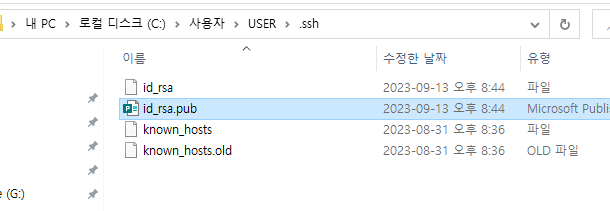
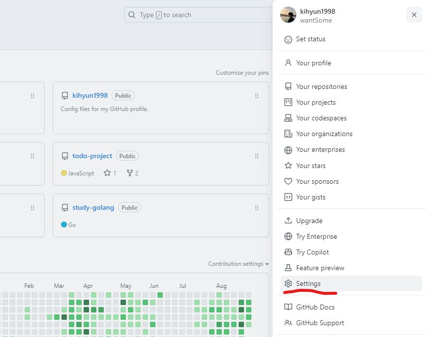
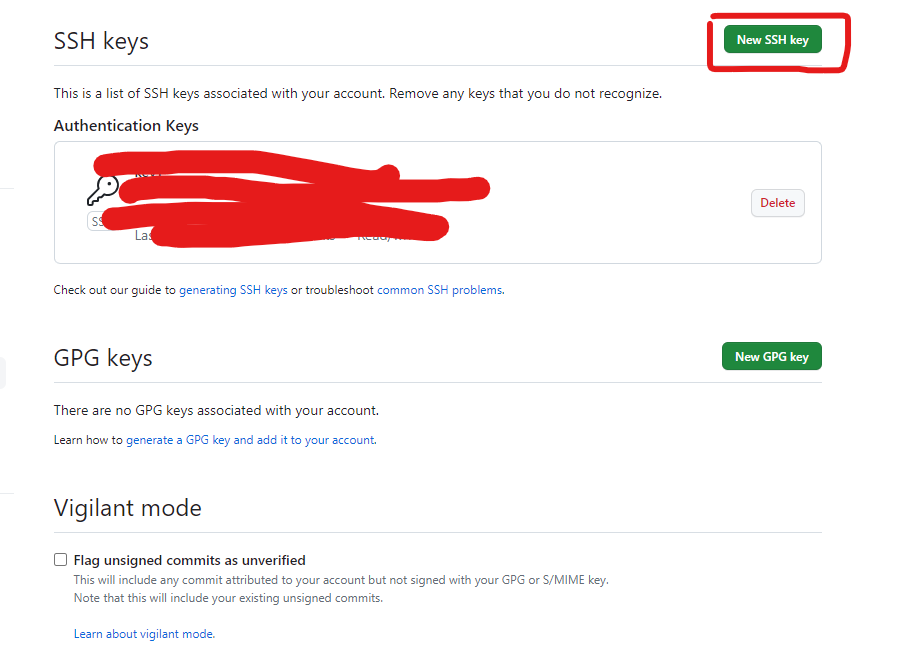
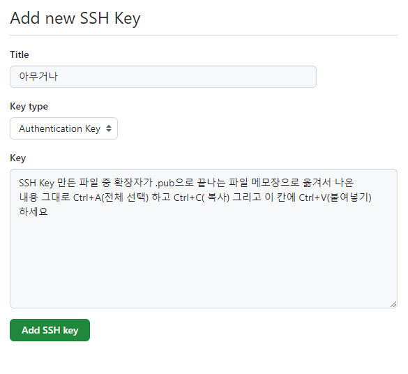
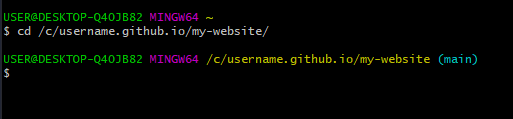
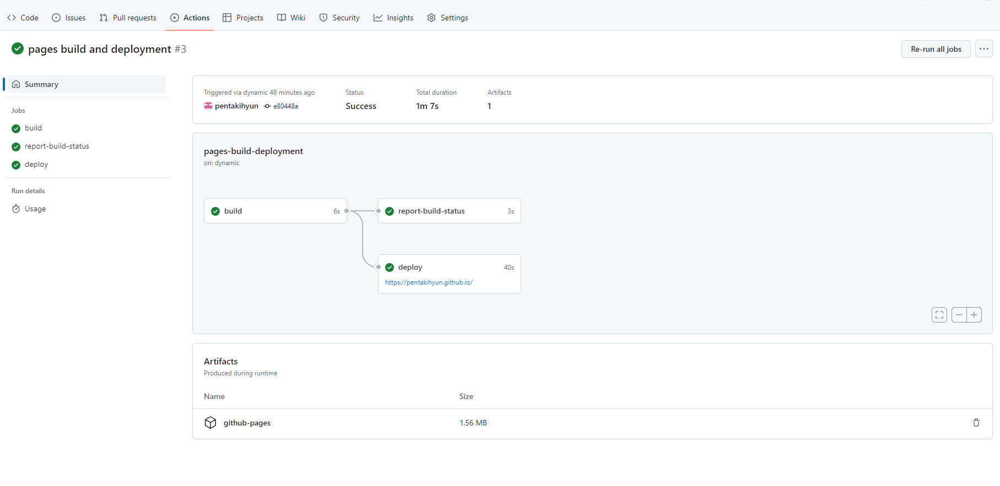

# 😸Git Hub로 배포하기 - 2

## 설정 파일 수정
---

배포하기 위한 첫 번째 시련입니다.

사실 어렵지 않구요.

저희가 설치한 docusaurus 폴더를 `VS Code`에서 열어볼까요?

`초기 환경 설정` > `사용할 프로그램들 설치` 게시글에서 설치하는 방법을 다뤄봤던 프로그램입니다 
<br/>


실행하시고 File > Open Folder 누르시면 폴더 선택할 수 있게 나옵니다 !

우리가 설치했던 폴더를 C드라이브 밑에서 찾아서 `열기` 하시면 됩니다!

따로 폴더명을 바꾸지 않으셨다면 `my-website`겠죠?
<br/>


그러면 왼쪽에 docusaurus.config.js라는 파일이 보이실텐데 열어보세요 !

(저는 지금 아이콘이 이뻐 보이잖아요 ! 이건 나중에 하는 법을 다루도록 할게요😄)

열어보시면 다 영어라서 당황학실텐데 걱정할 거 없습니다 !
<br/>


우린 저기 빨간 네모 부분만 볼거에요 ! (지금은요 !)

걱정 마세요 ! 밑에 자세히 알려드릴게요 !

<br/>

```js title='docusaurus.config.js'
    // 블로그 URL을 적는 곳인데요.
    // https://[username].github.io 를 적어주시면 됩니다.
    // username은.. 아시죠? 여러분의 유저 이름이요.
    url: 'https://[유저네임].github.io',

    // 그냥 '/' 이거 슬래시를 놔둡니다.
    baseUrl: '/',

    // organizationName에는 username 적어주세요! 아시죠?
    // 위에도 썼는데 여기도 또 쓰게 했네요 !
    organizationName: '[유저 네임]',

    // 여기에는 Git Hub 저장소 이름인데요~
    // 기억 안나시면 전 게시물들 둘러보세요.
    projectName: '[저장소 이름]', 

    // 이 밑에 2개는 없는거일텐데 추가해주세요
    // 복사 붙여넣기로요!
    trailingSlash: false,
    deploymentBranch: 'gh-pages',

    // 이 부분은 그냥 이렇게 넣어주세요 ! 있는 변수니까
    // 순서대로 돼있으니까.. 눈 잘 뜨시고 찾아보세요 !
    onBrokenLinks: 'throw',
    onBrokenMarkdownLinks: 'warn',
```
<br/>

짧은 지식을 전달해드리자면 `false` 빼고는 다 작은 따옴표나 큰 따옴표로 문자열을 묶어주셔야해요 !

잘 모르시겠으면 빨간 네모를 잘 보시면서 유추해보세요~


## 저장소에 Push 하기
---

자자 바뀐 내용들을 `commit` 하고 `push` 해주면 돼요!

어떻게???

Git Desktop으로 ~

들어가보시면 변경사항이 있을 거고 Commit할 수 있게 될거에요 !
<br/>


위 사진 처럼 많은 파일을 수정한건 아니지만 수정한 파일이 나올거에요 !
빨간 밑줄에 커밋 메시지를 적고 Commit to main 버튼을 누르면 `commit` 완료!

`push`는 한번 해보셨으니까 아시죠? 버튼 눌러서 `push` !

## SSH Key 발급받기
---

거의 다 왔어요 진짜 !!!

이거랑 다음꺼만 하면 배포를 할 수 있답니다 !!!

Git Bash를 빨리 열어보세요 !

```bash title='bash'
ssh-keygen -t ed25519 -C "당신의 Git Hub 계정 이메일"
```

그리고 위 명령어를 치시면 ssh-key가 생성됩니다!

Git Hub 이메일을 모르시겠다고요?
<br/>


가입할 때 했던 이메일이시구요 Git Dekstop 들어가보시면 위 사진처럼 확인하실 수도 있으세요 ! (아마도?)

같이 따라해볼까요?
<br/>


우선 여기가 어딘지 확인하기 위해서 `pwd`를 쳐서 어딘지 확인해줍니다 !

저는 C드라이브 밑에 사용자 밑에 user 폴더에 들어있군요!
<br/>


그리고 위에서 소개했던 밑에 명령어 !!!

```bash title='bash'
ssh-keygen -t ed25519 -C "당신의 Git Hub 계정 이메일"
```

입력하시구 빨간색 체크 표시에 엔터 빵!

총 엔터 3번 치시면 완료입니다!

보안을 위해서 키 부분은 가렸구요~ 

저기 어디에 저장돼있는지 써있죠? 가볼까요?

저는 저기 가로로 긴 초록색 네모 바로 위에 영어로
**`Your public key has been saved in /c/Users/USER/.ssh/id_ed25519.pub`**이라고 돼있네요 가봅시다 !

<br/>



잘 있네요 ! 만약 여러분들은 `.ssh` 폴더가 갔는데 안보이신다구요?

숨김 폴더 보이기를 하셔야 보입니다~

## Git Hub에 SSh Key 등록하기

자자 거의 다 왔죠 등록하러 가요~

어디서 하는지 빠르게 알려드릴게요 

1. Git Hub 페이지에서 오른쪽 위 프로필 아이콘 누르고 `Settings`
<br/>



2. 좌측 사이드바에서 SSH and GPG keys 메뉴로 들어가주세요 !
<br/>


3. SSH keys 옆에 New SSH key 누르시면 되요 
<br/>



4. Title엔 아무거나 Key에는 써놓은대로 하시면 됩니다. 그리고 Add SSH Key !!!!
<br/>




## 배포하기
---

자자 진짜 찐찐막

Git Bash 틀었잖아요? 껏다면 다시 틀어봐요.

전에 폴더 이동하는 방법 알려드렸죠?
<br/>



`cd` 하고 폴더 경로인데 언제 다 치고 있나요
/c 까지 치고

username 좀 치다가 키보드에서 `Tab`키 누르면 자동 완성돼요

이 자동 완성 기능을 이용하시면 보다 빠르게 도달 할 수 있어요 !

잘 하신 분들은 저처럼 폴더 경로 옆에 **(main)**이 나올거구요 !

안 나오면 폴더 잘못들어오신거니까 다시 확인해보세요 !

여러분은 이제 딱 3개 명령어만 치시면 됩니다 !

1. 첫 번째
```bash title='bash'
yarn install
```

2. 두 번째
```bash title='bash'
yarn build
```

3. 마지막.. 은 좀 길어요
```bash title='bash'
GIT_USER=[USERNAME] USE_SSH=true yarn deploy
```

이제 아시죠?... 제발.. username = 유저 네임 !!!

띄어쓰기 유의하시구 저 명령어를 입력하셨다면 여러분은 빨리 여러분 Git Hub 저장소로 가보세요 !!
<br/>


Actions 탭을 클릭하면 `pagees build and deployment`가 주황색으로 실행되고 있을거에요 ! 벌써 초록색이 됐을 수도 있구요 !

뭐 누군가는 빨간색이 됐을 수도 있겠죠...

인생이 참 그래요~ 같은 글을 보고 따라 했는데 누구는 되고 누구는 안되고... 코딩도 인생과 같아요 !

초록색이 되신 분들은 https://[username].github.io 로 들어가보시면 잘 나올겁니다 !
<br/>




++ 넣어야할 내용`[git-pages]`만드는 과정이 빠졌음