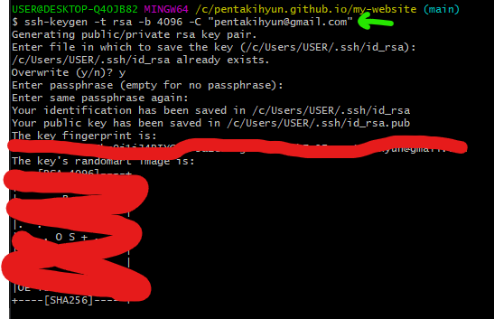
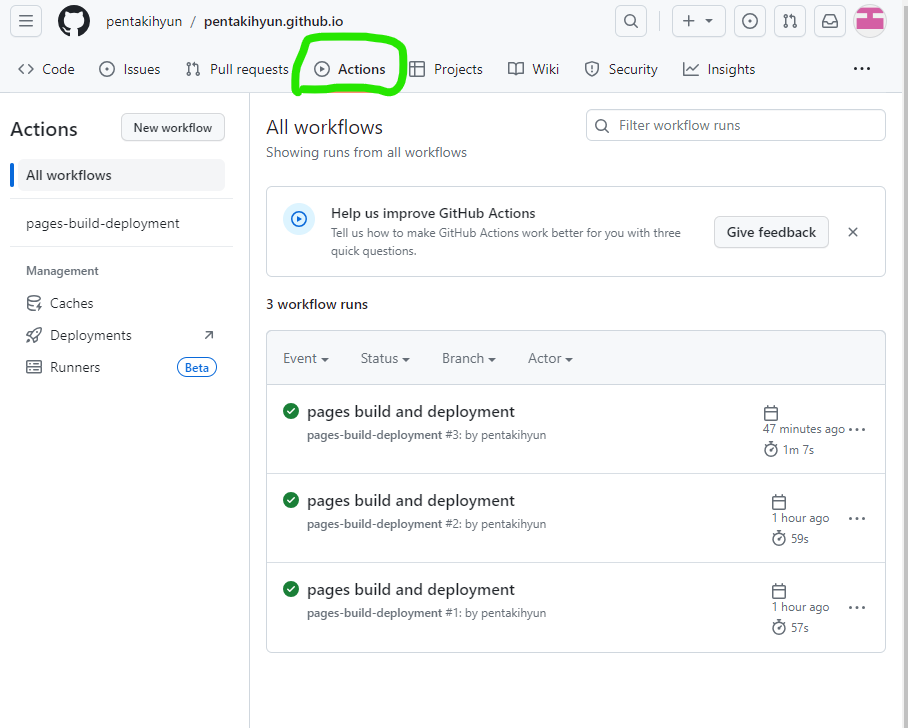

# 😸Git Hub로 배포하기 - 3


## SSH Key 발급받기
---

거의 다 왔어요 진짜 !!!

이거랑 다음꺼만 하면 배포를 할 수 있답니다 !!!

Git Bash를 빨리 열어보세요 !

```bash title='bash'
ssh-keygen -t rsa -b 4096 -C "당신의 Git Hub 계정 이메일"
```

그리고 위 명령어를 치시면 ssh-key가 생성됩니다!

Git Hub 이메일을 모르시겠다고요?
<br/>


가입할 때 했던 이메일이시구요 Git Dekstop 들어가보시면 위 사진처럼 확인하실 수도 있으세요 ! (아마도?)

같이 따라해볼까요?
<br/>

```bash title='bash'
ssh-keygen -t rsa -b 4096 -C "당신의 Git Hub 계정 이메일"
```

입력하시구 빨간색 체크 표시에 엔터 빵!

총 엔터 3번 치시면 완료입니다!
<br/>



:::tip
복사하시구 붙여넣기를 원하시면 Git Bash 창에서 우클릭을 해서 `paste`를 클릭하시거나 `Shift+Insert` 키를 눌러서 붙여넣기를 해주시면 됩니다 !
:::


보안을 위해서 키 부분은 가렸구요~ 

저기 어디에 저장돼있는지 써있죠? 가볼까요?

제가 빨간색 줄로 가린 SSH Key 위에 영어로
**`Your public key has been saved in /c/Users/USER/.ssh/id_rsa.pub`**이라고 돼있는거 보이시죠? 거기에 저장 됐습니다 !

<br/>


잘 있네요 ! 만약 여러분들은 `.ssh` 폴더가 갔는데 안보이신다구요?

숨김 폴더 보이기를 하셔야 보입니다~

## Git Hub에 SSh Key 등록하기

SSH Key를 왜 만들었을까요? 바로 등록하려구요 !

어디서 하는지 빠르게 알려드릴게요 

1. Git Hub 페이지에서 오른쪽 위 프로필 아이콘 누르고 `Settings`
<br/>


2. 좌측 사이드바에서 SSH and GPG keys 메뉴로 들어가주세요 !
<br/>


3. SSH keys 옆에 New SSH key 누르시면 되요 
<br/>


4. Title엔 아무거나 Key에는 써놓은대로 하시면 됩니다. 그리고 Add SSH Key !!!!
<br/>


4번을 좀더 자세히 말씀드리면

- 아까 경로로 가셔서 `id_rsa.pub`파일을 우클릭 하고 연결 프로그램 클릭 !


- 연결 프로그램에서 추가앱 찾기 누르고 메모장 찾아서 확인 !


- 나오는 문자열 모두 복사해가지구 위에 Key 칸에 넣으시면 됩니다 !


## 배포하기
---

자자 진짜 찐찐막

Git Bash 틀었잖아요? 껏다면 다시 틀어봐요.

전에 폴더 이동하는 방법 알려드렸죠?
<br/>


`cd` 하고 폴더 경로인데 언제 다 치고 있나요
/c 까지 치고

username 좀 치다가 키보드에서 `Tab`키 누르면 자동 완성돼요

이 자동 완성 기능을 이용하시면 보다 빠르게 도달 할 수 있어요 !

잘 하신 분들은 저처럼 폴더 경로 옆에 **(main)**이 나올거구요 !

안 나오면 폴더 잘못들어오신거니까 다시 확인해보세요 !

여러분은 이제 딱 3개 명령어만 치시면 됩니다 !

1. 첫 번째
```bash title='bash'
yarn install
```

2. 두 번째
```bash title='bash'
yarn build
```

3. 마지막.. 은 좀 길어요
```bash title='bash'
GIT_USER=유저이름 USE_SSH=true DEPLOYMENT_BRANCH=gh-pages yarn deploy
```


띄어쓰기 유의하시구 저 명령어를 입력하셨다면 이걸 확인해주세요 !


만약 위처럼 Done으로 끝나는게 아니라


이렇게 ERROR !! 어쩌구 저쩌구 ! 이러면.. 키 설정을 잘못하신거에요 ! rsa로 한게 맞는지 확인해주세요~

자 그럼~~~~~ 아까 우리의 Repository로 가볼까요??
<br/>




Actions 탭을 클릭하면 `pagees build and deployment`가 주황색으로 실행되고 있을거에요 ! 벌써 초록색이 됐을 수도 있구요 !

뭐 누군가는 빨간색이 됐을 수도 있겠죠...

인생이 참 그래요~ 같은 글을 보고 따라 했는데 누구는 되고 누구는 안되고... 코딩도 인생과 같아요 !

초록색이 되신 분들은 https://[username].github.io 로 들어가보시면 잘 나올겁니다 !
<br/>


이렇게 depoly 밑에 url이 나올거구요!  
(안나오셨다구요? 실망하셔도 되요! 잘못하신거거든요)

클릭을 하면  
.  
.  
.


짜잔 ~~~~ 나만의 블로그를 만드는 첫 번째 발걸음을 뛰신걸 축하드려요 ✨

그러나 여러분은 글을 쓸 때마다 yarn install... yarn build.. yarn deploy..  하실건가요? 이를 자동화하는 방법을 다음 글에서 소개하겠습니다 !

