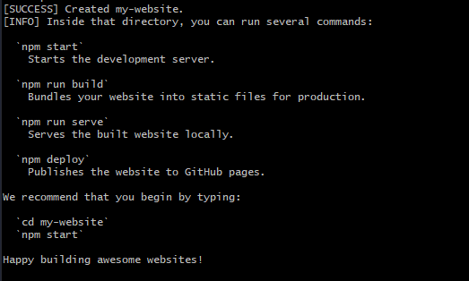
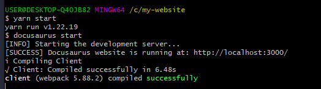
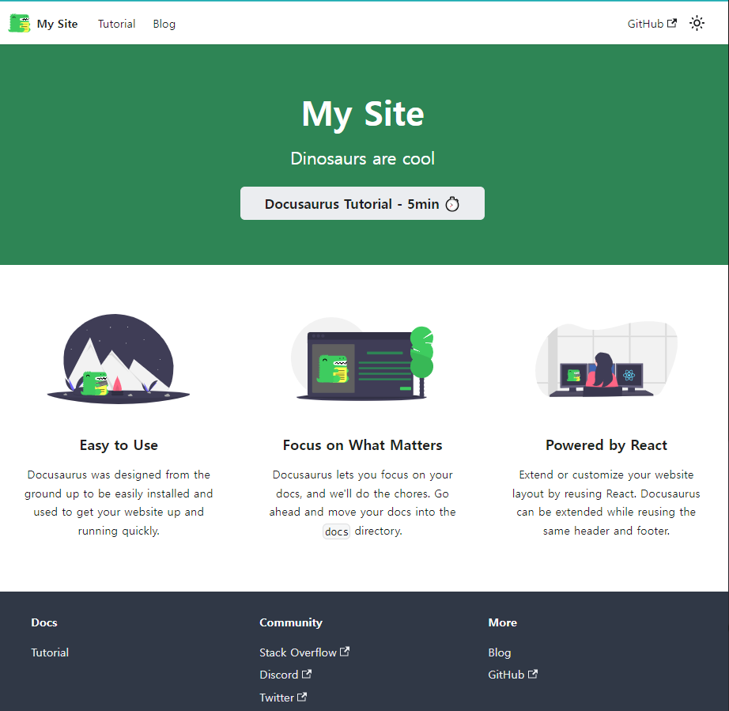

# 🐊도큐사우루스 설치 및 실행

## 도큐사우루스 설치하기
---

먼저 방금 설치한 Git Bash를 실행해주세요!

그리고 C드라이브로 이동할 겁니다.

```bash title='bash'
cd /C
```
<br/>
이동이 되셨습니다 ! 이미지를 통해서 확인해보겠습니다. 
<br/>
<br/>


<br/>

이제 이곳에 도큐사우루스를 설치할 것입니다.

```bash title='bash'
npx create-docusaurus@latest my-website classic
```

위의 명령어를 치면 되는데요~ 코드를 해석해보면

```bash title='bash'
npx create-docusaurus@latest [폴더명] [테마명]
```
위와 같습니다!

제가 소개해드린 명령어를 그대로 작성하셨다면 my-website 폴더에 classic테마 도큐사우루스를 설치한 것입니다.

잘 하셨다면 밑에처럼 영어 쏼라쏼라 하다가 `Succesfully!` 할겁니다.


추가적으로 밑에 내용을 보시면 



이런 화면이 나오시죠? (안나오시면 잘 못하신겁니다!)

나오셨다면 설치를 잘 하신겁니다!

이제 실행하는 방법에 대해서 알아보러 가겠습니다 !

<br/>

## 도큐사우루스 실행하기
---

### 폴더 이동
---

```bash title='bash'
ls | grep my-website
```
위 명령어를 쳐보실까요?


<br/>

입력하고 엔터를 누르시면 my-website 폴더가 보일 것입니다!

눈치 채신 분들도 계시겠지만 만약 npx로 도큐사우루스를 설치할 때 제가 말씀드린 코드로 하지 않고 폴더명을 바꾸신 분들은 `my-website`가 들어가는 부분에 `바꾼 폴더명`을 넣어주시면 되겠죠?
<br/>

```bash title='bash'
cd my-website
```
이제 우리가 만든 폴더로 이동할 겁니다. 위 명령어로 이동하실 수 있어요.

이제 실행하기 전에 패키지 설치를 해봅시다 !
<br/>

### 패키지 설치
---

```bash title='bash'
yarn install
```
<br/>


겁먹지 마시구 입력한 명령어와 마지막에서 두번째 줄만 유심히 봐주세요!
`yarn install`을 하신다면 위처럼 좀 설치하다가 Success Saved lockfile이 나와야 합니다!
<br/>


혹시 위와 같은 증상을 겪고 있다구요?

걱정마세요 ! 한 가지 실수를 하신겁니다~ 바로~~~~~~

설치한 폴더로 이동을 해주셔야해요 ! 위에서 말씀드린 것 처럼 `cd [폴더명]`을 통해서 이동해주세요!

정확한 경로에서 명령어를 입력하셨다면 잘 되실겁니다 !

### 도큐사우루스 실행하기
---

자 드디어 설치한 도큐사우루스를 실행할 수 있는 환경을 갖췄습니다 !

```bash title='bash'
yarn start
```

위의 명령어를 입력하시면
<br/>



이렇게 시작하는 것처럼 나오면서 자동으로 창이 띄어집니다 !
<br/>


축하해요👍 여러분들은 블로그 만들기의 첫 걸음을 시작하신 겁니다🚀

이제 깃허브를 통해서 `배포하는 과정`과 `배포 자동화 과정`이 있는데 꼭 끝까지 포기하지 말구 다음 게시물에서 만나요~~~~

<br/>

<br/>

### 리눅스 명령어 맛보기 정리
---

<br/>

```bash title='bash'
ls
```

ls 명령어는 하위 폴더를 보여주는 명령어고
<br/>

```bash title='bash'
grep ["찾고 싶은 문자열"]
```

grep하고 뒤에 영어를 치시면 그 영어가 들어가는 결과만 찾아서 출력합니다.
<br/>

```bash title='bash'
ls | grep my-website
```

즉 위의 명령어는 **하위 폴더중에 폴더명이 `my-website`인 폴더를 찾아서 보여줘** 입니다 !

<br/>

```bash title='bash'
cd [폴더명]
```

`cd`는 많이 사용하셨으니 익숙하시겠죠?

해당 경로(또는 폴더)로 이동입니다!