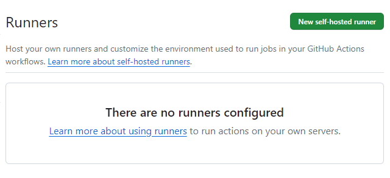
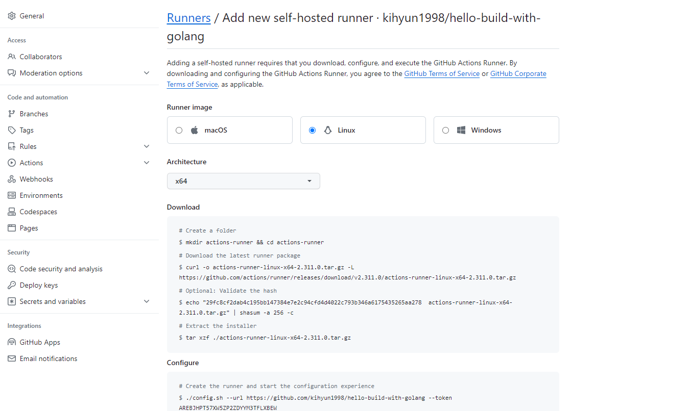
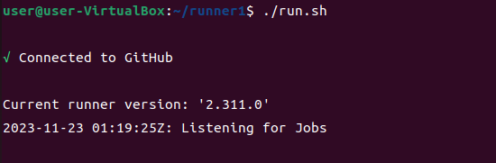
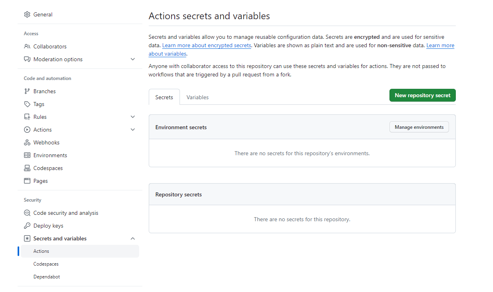

# [GitHub Actions] self-host runner 사용하기 in Ubuntu

사용하기 전에 먼저 환경 설정을 합니다.

## 환경설정
---

### Ubuntu 설치

[이곳에서](https://ubuntu.com/download/desktop) 우분투 22.04.3 LTS 버전 desktop을 다운로드 합니다.

그리고 Virtual Box를 사용해서 설치합니다.

### Git 설치

```bash
sudo apt-get update
```

```bash
sudo apt-get install git
```

### Go 설치

다른 사람의 깃허브 저장소를 이용해서 설치합니다.

아니면 그냥 wget을 해서 설치하는 방법도 있습니다.

```bash
git clone https://github.com/udhos/update-golang
cd update-golang
sudo ./update-golang.sh
```

그러면 /usr/local/go에 설치가 됐고 환경변수 추가를 해줍니다.

```bash
vi ~/.bashrc
```
환경변수 편집 파일에 들어가서

```bash
export PATH=$PATH:/usr/local/go/bin
```

위 내용을 추가해주고

```bash
source ~/.bashrc
```

확인하려면

```bash
go version
```

하면 golang 버전이 나옵니다.


### Runner 다운로드

사용하려는 저장소에서 `Settings` > `Actions` > `Runners`로 이동합니다.



우측 상단에 `New self-hosted runner`를 눌릅니다.



다운로드와 설정 절차에 따라 진행을 합니다.

### Runner 다운로드 절차

중요한건 여기서부터 root로 진행할 수 없습니다.

```bash
apt install curl
```

밑에 부분은 나와있는대로 설치하면 됩니다.

```bash
curl -o actions-runner-linux-x64-2.311.0.tar.gz -L https://github.com/actions/runner/releases/download/v2.311.0/actions-runner-linux-x64-2.311.0.tar.gz
```

```bash
mkdir runner1
tar -xvf action-runner-linux-* -C /home/user/runner1
cd /home/user/runner1
```

압축해제 하시면 `config.sh`과 `run.sh`이 나옵니다.


### Runner 설정

```bash
./config.sh --url https://github.com/<유저이름>/<저장소이름> --token <토큰>
```

그 페이지에 있는거 복사 붙여넣기 하는데 중요한 점은 `새로고침`을 하고 해야한다. 왜냐하면 이게 토큰이 만료가 되기 때문이다.


```bash
./run.sh
```



이러면 Runner 실행까지 됐습니다.


## yaml파일 설정
---

저장소 루트 경로에

`.github/workflow` 폴더를 만듭니다.

```yaml
name: Go

on:
  push:
    tags:
      - 'V*'

jobs:

  test:
    name: 🦾 Unit Test & Build
    runs-on: self-hosted

    steps:

    - name: ✅ Check out code into the Go module directory
      uses: actions/checkout@v3

    - name: Extract Tag name
      run:  echo "TAG_NAME=$(echo ${{ github.ref }} | sed 's|refs/tags/||')" >> $GITHUB_ENV

    - name: Use Tag Name
      run:  echo "Tag Name is $TAG_NAME"

    - name: 🔥 Get dependencies
      run: go mod download

    - name: 🛠️ Build
      run: make build

    - name: 💽 Test
      run: make test
```

이런식으로 태그가 Create 되면 Run 하도록 했습니다.

신기하게도 잘 작동합니다.


## sftp로 파일 이동
---

### SSH key 발급 및 등록

```bash
ssh-keygen -t rsa -b 4096 -C "Git Hub 계정 이메일"
```

발급 받은 공개키(`id_rsa.pub`)를 옮길 대상 서버의 ~/.ssh/authorized_keys 파일에 추가합니다.

```bash
vim ~/.ssh/authorized_keys
```

### Github Secrets 등록

`Github repository` > `Settings` > `Secrets and variables` > `Actions` > `New repository secret`



`Name`에 SSH_KEY라고 적고 `Secret`에 발급 받은 개인키(`id_rsa`)의 내용을 넣으면 됩니다.

### yaml 파일 작성

```yaml
    - name: 🚚 Transfer files use SFTP
      uses: appleboy/scp-action@master
      with:
        host: <대상 IP>
        username: <접속 계정>
        key: ${{ secrets.SSH_KEY }}
        source: <옮길 파일>
        target: <옮길 위치>
```


### self-hosted VM에 Docker 설치

appleboy 저걸 사용하려면 Docker가 설치돼있어야 합니다.

1. apt update

```bash
sudo apt-get update
```

2. 필요한 패키지 설치

```bash
sudo apt-get install apt-transport-https ca-certificates curl gnupg-agent software-properties-common
```

3. Docker의 GPG 키 추가

```bash
curl -fsSL https://download.docker.com/linux/ubuntu/gpg | sudo apt-key add -
```

4. Docker의 공식 apt 저장소 추가

```bash
sudo add-apt-repository "deb [arch=amd64] https://download.docker.com/linux/ubuntu $(lsb_release -cs) stable"
```

5. apt update

```bash
sudo apt-get update
```

6. Docker 설치

```bash
sudo apt-get install docker-ce docker-ce-cli containerd.io
```

7. 실행 확인

```bash
sudo systemctl status docker
```

8. docker.sock 권한 변경


```bash
sudo chmod 666 /run/docker.sock
```

권한 변경하지 않으면 Permission denied 나옵니다.


## 파일 전송 후 저장소 clean하기
---

보안을 위해서 저장소를 비워줘야 하는 경우가 있습니다.

```yaml
    - name: 🧹 Clean up local directory
      run: rm -rf <저장소 위치>/<저장소 이름>/*
```

이렇게 안하면 에러난다.

저장소가 test라고 한다면

```bash
rm -rf /home/user/runner1/_work/test/test/*
```

위와같이 해야한다.


## 추가정리
---

### 1. workspace

```yaml
${{ github.workspace }}
```

위와 같이 사용한다면 /home/../runner/repo/repo 경로를 사용할 수 있다.

### 2. 환경변수 사용

```yaml
${{ env.TEST_VAL }}
```

환경변수를 등록했다면위처럼 활용할 수 있다.

### 3. appleboy/scp-action의 기능

```yaml
    - name: 🚚 Transfer files use SFTP
      uses: appleboy/scp-action@master
      with:
        host: IP
        username: root
        key: ${{ secrets.SSH_KEY }}
        source: "${{ github.workspace }}/*
        target: "~/build/${{ 없는 폴더 }}"
```

없는 폴더를 넣으면 알아서 만들어준다.

단점은 만들어줘도 github.workspace 경로는 자동 추가라 어쩔 수 없음